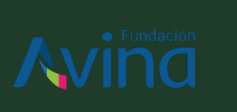
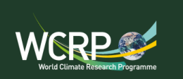

# Who are we?

## Core author team

We are a team of climate researchers from different disciplines, brought together by the WCRP lighthouse activity My Climate Risk:

- **Julia Mindlin** is a physical climate scientist with a master's in geophysics from the University of La Plata and a PhD from the Department of Atmospheric and Oceanic Sciences at the University of Buenos Aires. She currently works as a post-doctoral researcher at the University of Leipzig on storylines of future climate change.
- **Fiona Spuler** is a physical climate scientist with a master's in Mathematical Physics and Environmental Change and Management, who is currently completing her PhD at the University of Reading in England. Her research focuses on climate teleconnections and climate model biases.
- **Michel Valette** is an interdisciplinary fire scientist with a PhD from Imperial College London and a master's from the University of Montpellier, working on the relationship between climate change and fire use and management in the Brazilian Amazon, using a mixed-method approach.
- **Rodrigo Estévez** is a sociologist with a master's in biology and a PhD from the University of Melbourne. Currently, Rodrigo is an Associate Professor at the Faculty of Science at the Universidad Santo Tomás and principal researcher in the Millennium Institute on Coastal Socio-Ecology. His research focuses on the study of social-ecological systems in marine and terrestrial environments.

## Fundación Avina & BASE initiative

{ width="160" }

Fundación Avina, in its role as Secretariat of the BASE Initiative, originated the concept of the climate toolkit and entrusted its development to the core team. Victoria Matusevich, Program Manager at Fundación Avina and Head of the BASE Initiative Secretariat, led the review and co‑design of the toolkit. Andrés Mogro, Program Manager at Fundación Avina, provided support during the final review stage.

The initiative's main goal is to generate evidence, through the implementation of a diverse range of grantmaking schemes, on how the development of the climate rationale of projects can be simplified and serve as a proof-of-concept of alternative, community-led approaches to labelling this type of finance as 'climate finance' and then take these learnings to advocate in the climate funding landscape. BASE is organised in a tri-pillar strategy: Fund, Learn and Scale. In the first track of grants, BASE supported the implementation of eight climate projects in tropical forests of the Global South, while working alongside local researchers to develop a new approach to develop the projects' climate evidence (Lessons learned can be accessed [here](https://biblioteca.avina.net/biblioteca/bases-first-grant-scheme/)). Furthermore, the initiative is implementing a second grant scheme aimed at supporting Loss & Damage caused by climate induced wildfires in the Amazon and Pantanal biomes, in Brazil. BASE supported two Brazilian organizations with flexible grants, working with volunteer fire brigades. In parallel, the Initiative proposed a new approach to develop the climate case bringing together physical climate evidence in the form of wildfire attribution analysis with local knowledge (see information [here](https://baseinitiative.net/integrating-wildfire-impacts-into-the-loss-damage-agenda-for-climate-justice/), [here](https://baseinitiative.net/co-producing-climate-evidence-for-loss-and-damage-lessons-from-the-brasilia-workshop/) and [here](https://www.nature.com/articles/s43247-025-02968-w)).

The work accomplished by BASE to date has been made possible thanks to the support of the [Skoll Foundation](https://skoll.org/) and Fundación Avina.

## WCRP Lighthouse Activity My Climate Risk (MCR)

{ width="160" }

[MCR](https://www.wcrp-climate.org/my-climate-risk) is an activity under the [World Climate Research Programme](https://www.wcrp-climate.org/about-wcrp/wcrp-overview), which coordinates and facilitates international climate research. MCR is rooted in the belief that climate science can and should be conducted in a more equitable, bottom-up, and people-centred way and aims to develop and mainstream such an approach to regional climate risk. To facilitate this 'bottom-up' approach, and break down existing disciplinary barriers in science, MCR is structured in non-hierarchical way through an informal ecosystem of [regional hubs](https://www.wcrp-climate.org/mcr-hubs). Together, the regional hubs, each an existing locally-based institution, support a 'mycorrhizal network' of communities of practice, sharing knowledge and resources. Each hub works with local stakeholders on specific projects (see examples [here](https://www.sciencedirect.com/science/article/pii/S1462901124001825), [here](https://www.wcrp-climate.org/images/StrategicScientificPlan_v1.pdf) and [here](https://www.frontiersin.org/journals/climate/articles/10.3389/fclim.2025.1538123/full)), in addition to cross-working groups on [decolonising climate education](https://www.mcreducationworkinggroup.org/), philosophy of science, and [co-funding the development of evidence for losses and damages from wildfires in Brazil](https://www.wcrp-climate.org/mcr-events-opportunities/mcr-brazil-25), in collaboration with the BASE initiative.
