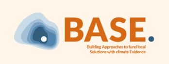
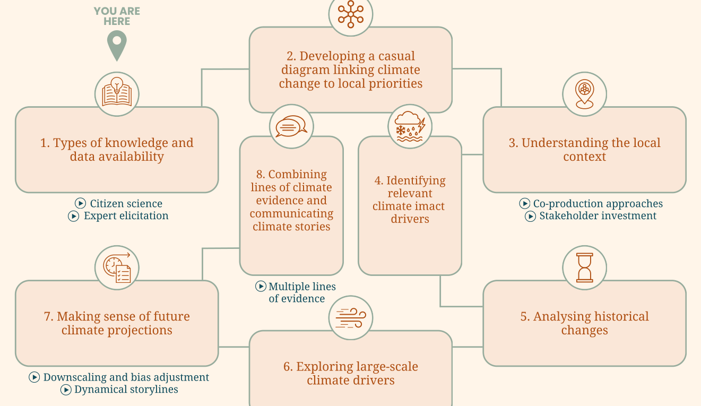

---
hide:
  - navigation
  - toc
---

# Climate Toolkit

On bottom-up approaches to climate evidence: a practical guide to generating climate knowledge that is both scientifically robust and locally meaningful for adaptation planning.

  
  
  

[Start with Module 1](modules/module-1.md){ .md-button .md-button--primary }
[Download the PDF](assets/downloads/climate-toolkit-base.pdf){ .md-button }

## The modules

  <a class="tk-card" href="modules/module-1/">Module 1<strong>Understanding knowledge types, data scales and uncertainty</strong>Citizen science · Expert elicitation</a>
  <a class="tk-card" href="modules/module-2/">Module 2<strong>Constructing causal diagrams linking climate change to local priorities</strong>A framework that ties the toolkit together</a>
  <a class="tk-card" href="modules/module-3/">Module 3<strong>Defining the starting point: understanding the local context</strong>Co-production approaches · Stakeholder involvement</a>
  <a class="tk-card" href="modules/module-4/">Module 4<strong>Identifying local climatic impact-drivers</strong>From local concerns to measurable climate variables</a>
  <a class="tk-card" href="modules/module-5/">Module 5<strong>Bridging observations and climate models and analysing historical changes</strong>IPCC · Copernicus Atlas · Python notebook · Attribution</a>
  <a class="tk-card" href="modules/module-6/">Module 6<strong>Using large-scale climate drivers and their teleconnections</strong>El Niño · Indian Ocean Dipole · Seasonal forecasts</a>
  <a class="tk-card" href="modules/module-7/">Module 7<strong>Making sense of future climate projections</strong>Downscaling and bias adjustment · Dynamical storylines</a>
  <a class="tk-card" href="modules/module-8/">Module 8<strong>Building and communicating climate stories</strong>Combining multiple lines of evidence</a>

## 1. Introduction

The impacts of climate change are already experienced around the world, particularly by local and Indigenous communities in countries of the Global South who have contributed least to greenhouse gas emissions, yet play a crucial role in preserving traditional knowledge and generating innovative solutions for reducing emissions and building resilience. However, despite their significance, locally led projects face significant challenges in accessing climate funds, with currently less than 17% of adaptation finance reaching the local level (Adaptation Gap Report, 2023). Whilst there have been positive developments to address this issue, many local actors still face substantial barriers. One such obstacle involves the collection of climate evidence and the development of a 'climate rationale', which is crucial for accessing certain climate funds. Developing this climate rationale is conventionally a technical process and requires expertise not only in the local adaptation context and specific guidelines required by the funding body, but also in analysing physical climate information to assess possible future impacts of climate change and attribute observed changes to human emissions.

However, a great part of physical climate science, meaning the study of the climate system (atmosphere, oceans, land and cryosphere) and climate change through natural sciences, is presently conducted in a top-down manner, which prioritises global assessments and models over the production of locally robust information. This leads to a gap between openly and easily available physical climate knowledge and information that is useful for local communities to make sense of their own climate future (Rodrigues and Shepherd, 2022). While some climate data is openly available (for example, through the IPCC), it is often not produced at the spatial or temporal scales required to produce climate evidence for local adaptation, and is targeted to other audiences such as governments, researchers and policy makers. Also, the interpretation of the uncertainty in future climate projections is not straightforward, and the information mostly concerns climate variables such as mean temperature and precipitation changes, or the climatic impact-drivers rather than the impacts experienced by the communities, which often require a more detailed understanding of the local context and vulnerabilities. For researchers, consultants and other organisations seeking to ensure that climate finance effectively reaches local communities, engaging with climate scientists and local knowledge holders is therefore essential to develop relevant and context-specific evidence.

Despite these challenges, there are growing examples of researchers and communities working together to produce climate science that is meaningful and actionable at the local level. Across different regions, collaborative and participatory approaches are helping translate global climate knowledge into information that supports community decision-making and strengthens local adaptation strategies. At the same time, educational initiatives are expanding efforts to make climate science more accessible to a wider public, enabling communities, practitioners, and decision-makers to better understand and use climate information. Recognising the need to mainstream these bottom-up approaches to climate evidence, the World Climate Research Programme launched the My Climate Risk lighthouse activity in 2022 to connect physical climate science and scientists with adaptation practitioners, as well as local knowledge and decision-making (Rodrigues and Shepherd, 2022, [Strategic Plan of the MCR hub in Argentina](https://www.wcrp-climate.org/images/StrategicScientificPlan_v1.pdf)). In parallel, the BASE initiative, coordinated by Fundación Avina, developed two tracks of grants to develop proofs-of-concept for funding community-led adaptation through an innovative bottom-up climate evidence process, and connected initiatives to mainstream these approaches in the climate finance ecosystem.

The present toolkit builds on this momentum and is the result of a collaboration between researchers involved in My Climate Risk and the Avina team coordinating the BASE initiative, with the aim of supporting practitioners in generating and using climate knowledge that is both scientifically robust and locally meaningful for adaptation planning.

## 2. Background: importance of local knowledge on climatic changes

From the Arctic to the Tropics, Indigenous people and local communities are observing changes in their local climates that are not only consistent with data from climate models but also include detailed observations of the impact of climate change on local ecosystems (Savo et al. 2016, Reyes-Garcia et al. 2024). These local observations of climate change present different advantages. They are grounded in observations of local meteorological events and ecosystems, which can overcome model limitations in data-deficient regions or places with fine-scale ecological and climatic variations (Chanza and Musakwa 2022). For example, while modelling approaches give us a good understanding of the impact of climate change on wildfire risk associated with meteorological conditions, models do not accurately represent how plant communities adapt to new fire regimes (Archibald et al. 2018). In contrast, Indigenous peoples and local communities across the globe have integrated detailed knowledge about feedback between vegetation and fire in their knowledge and management systems (Huffman 2013).

Furthermore, local knowledge about climate change, and more broadly about local ecosystems, originates from constant observations and experimentations with local ecosystems that are accumulated, shared amongst the community and collectively interpreted (Turner et al. 2006). This dynamic aspect of local knowledge can be critical for adaptation to a quickly changing climate and improve the adaptive capacity of the community as they can experiment and invest in different adaptation strategies (Folke et al. 2009). The accumulation of this knowledge about climate change is very dependent on the local livelihood strategies of communities: for example, farming communities observe more change related to precipitation, temperature and impact on soils, while pastoralists observe more change related to land degradation and impact on grasslands (Reyes Garcia et al. 2024).

Faced with the harmful impacts of climate change on livelihood systems, Indigenous people and local communities have engaged in a wide variety of changes to local livelihood systems globally (Zant et al. 2023). While many of these adaptations consist of gradual modifications to certain elements of their livelihood systems, local communities are frequently engaging in transformative changes of their livelihood systems that do not go without risk (Zant et al. 2023). For example, after the Sahel droughts in the Plateau Central region of Burkina Faso, farmers expanded their agricultural land into pastoral areas, creating conflicts between farmers and herders (West et al. 2008).

Climate change frequently occurs simultaneously with other environmental and social changes that can indirectly impact the resilience and adaptivity of the community. For example, in Bolivia, the opening of a road and increased exposure to market and governmental institutions can improve the adaptive capacity of Tsimane communities (Ruiz-Mallen et al. 2017). However, inhabitants of villages closer to the road also hold less traditional ecological knowledge about plant use, which can be important for adaptation strategies to a changing climate (Reyes-Garcia et al. 2014). Understanding these compounding influences is important for understanding how they shape exposure and vulnerability, as well as for distinguishing the impact of climate change from other drivers of environmental change.

## 3. Structure of the climate toolkit

Bottom-up approaches to climate information are diverse and can be integrated into existing practices in different ways, depending on your use case. In this toolkit, we have designed a possible structure to guide you through the different stages of assembling climate evidence for a project. The graphic below lists and illustrates the toolkit modules in the order in which they are presented.

<figure markdown="span">
  
</figure>

The first module provides an introduction to important considerations when working with different types of knowledge, and discusses data availability issues for bottom-up climate evidence (1). We then introduce the use of causal diagrams as a practical learning tool for exploring how climate change connects to locally defined priorities and concerns (2). Then, to start populating this causal diagram with information, the climate evidence has to be co-produced with local actors in order to serve real needs and impacts (3). Based on the information from the local context, relevant climate-impact drivers, impacts and seasons of major interest can be identified and used to establish the link to physical climate evidence in the causal diagram (4). Based on the climate impact drivers identified, historical changes can be reviewed and possibly analysed statistically (5), while information on large-scale climate drivers can link present-day extremes to future changes and build understanding of possible changes (6). Finally, future climate projections will be introduced, including approaches to build storylines of future change, correct for model biases, and improve the resolution of the climate model data (7). The final steps of the toolkit summarise how to combine these different lines of evidence, as well as summarise and communicate them effectively (8).

## 4. Who is this climate toolkit designed for and how to use it?

The aim of this climate toolkit is to provide an entry point for connecting the emerging changes experienced in a local context to changes in climate variables and anthropogenic climate change. Whether you are a member of a local community looking to understand changes in your area or region, a climate fund seeking to identify links to climate adaptation in your existing projects, or a researcher from physical or social science trying to gain a more interdisciplinary understanding of local climate evidence, this toolkit provides you with an introduction, resources and guidance. Depending on who you are, you might use this toolkit in different ways: you may already be more familiar with some modules, whereas others might be completely new to you. Don't worry - first of all, you are in good company! Second, we have designed the toolkit in such a way that every module includes different 'levels' that you can access depending on the time and resources you have available, as well as your experience.

Each module consists of an introduction to the question or approach, a) an entry-level (i.e. not requiring specific technical knowledge) overview of available methods and resources to approach this question b) a how-to guide on how to develop a part of the climate evidence and c) a case-study (or studies) illustrating its implementation drawn either from MCR projects, or - if appropriate - projects supported by BASE in its first track of grants. In addition, many modules are accompanied by a seminar from the [MCR seminar series](https://www.youtube.com/@WCRPAcademy2021), as illustrated in the graphic above ([https://www.yess-community.org/yess-mcr-webinarseries/](https://www.yess-community.org/yess-mcr-webinarseries/)).

In some cases, we introduce more than one approach or tool to address the same part of the climate evidence process. Most of the time these approaches offer ways of working that have different levels of complexity. In many cases, the approaches are complementary and you will decide how to approach the work based on the time that you have as well as the experience and resources that you have. We hope that the guides and examples are sufficiently clear for you to be able to choose your approach using some of the tools that we propose.

In addition, you can find all the highlighted technical terms in the [Glossary](https://drive.google.com/drive/folders/1xhes_v6NbMJ-loJe17Yrcy6wfbSImE74?usp=drive_link).

Each module is organised into the same types of sections, shown on this website as colour-coded boxes:

Background Definitions Frequently asked questions How-To guide Examples

??? background "References for this introduction"

    

    Archibald, S., C. E. R. Lehmann, C. M. Belcher, W. J. Bond, R. A. Bradstock, A.-L. Daniau, K. G. Dexter, E. J. Forrestel, et al. 2018. Biological and geophysical feedbacks with fire in the Earth system. Environmental Research Letters 13. doi:10.1088/1748-9326/aa9ead.

    Chanza, N., and W. Musakwa. 2022. Indigenous local observations and experiences can give useful indicators of climate change in data-deficient regions. Journal of Environmental Studies and Sciences 12: 534–546. doi:10.1007/s13412-022-00757-x.

    Folke, C., J. Colding, and F. Berkes. 2009. Building resilience and adaptive capacity in social-ecological systems. In Navigating Social-Ecological System, Cambridge University Press.

    Huffman, M. R. 2013. The Many Elements of Traditional Fire Knowledge: Synthesis, Classification, and Aids to Cross-cultural Problem Solving in Fire-dependent Systems Around the World. Ecology and Society 18. doi:10.5751/ES-05843-180403.

    Reyes-García, V., J. Paneque-Gálvez, A. C. Luz, M. Gueze, M. J. Macía, M. Orta-Martínez, and J. Pino. 2014. Cultural Change and Traditional Ecological Knowledge: An Empirical Analysis from the Tsimane' in the Bolivian Amazon. Human Organization 73: 162–173. doi:10.17730/humo.73.2.31nl363qgr30n017.

    Reyes-García, V., D. García-del-Amo, S. Álvarez-Fernández, P. Benyei, L. Calvet-Mir, A. B. Junqueira, V. Labeyrie, X. Li, et al. 2024. Indigenous Peoples and local communities report ongoing and widespread climate change impacts on local social-ecological systems. Communications Earth & Environment 5. doi:10.1038/s43247-023-01164-y.

    Ruiz-Mallén, I., Á. Fernández-Llamazares, and V. Reyes-García. 2017. Unravelling local adaptive capacity to climate change in the Bolivian Amazon: the interlinkages between assets, conservation and markets. Climatic Change 140: 227–242. doi:10.1007/s10584-016-1831-x.

    Savo, V., D. Lepofsky, J. P. Benner, K. E. Kohfeld, J. Bailey, and K. Lertzman. 2016. Observations of climate change among subsistence-oriented communities around the world. Nature Climate Change 6: 462–473. doi:10.1038/nclimate2958.

    Turner, N. J., and F. Berkes. 2006. Coming to Understanding: Developing Conservation through Incremental Learning in the Pacific Northwest. Human Ecology 34: 495–513. doi:10.1007/s10745-006-9042-0.

    West, C. T., C. Roncoli, and F. Ouattara. 2008. Local perceptions and regional climate trends on the Central Plateau of Burkina Faso. Land Degradation & Development 19: 289–304. doi:10.1002/ldr.842.

    Zant, M., A. Schlingmann, V. Reyes-García, and D. García-del-Amo. 2023. Incremental and transformational adaptation to climate change among Indigenous Peoples and local communities: a global review. Mitigation and Adaptation Strategies for Global Change 28: 57. doi:10.1007/s11027-023-10095-0.

    

