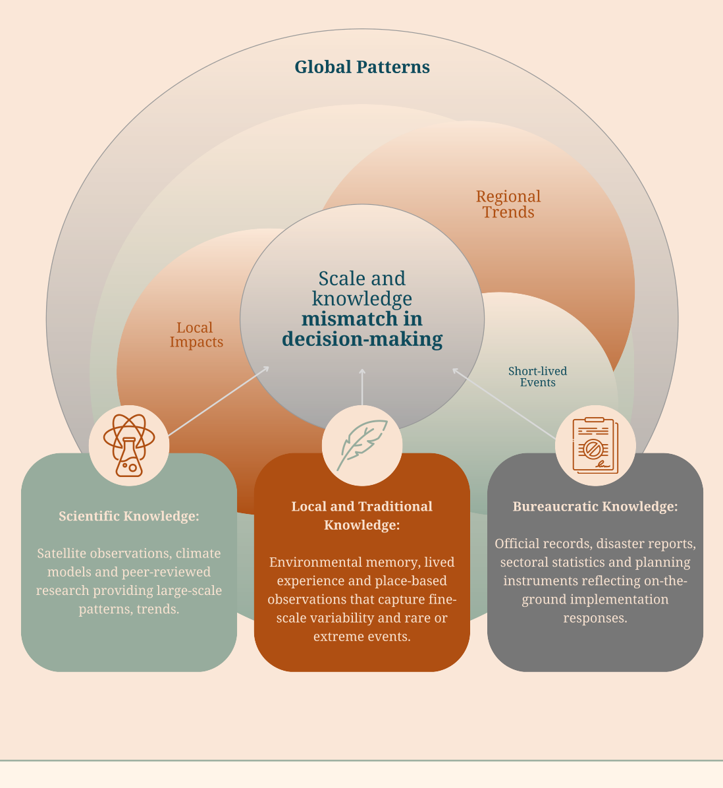
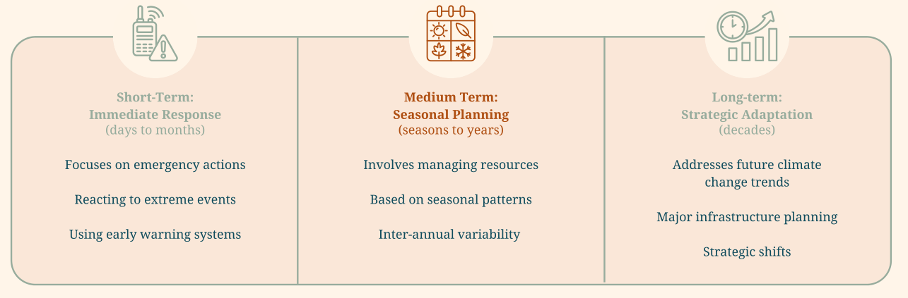
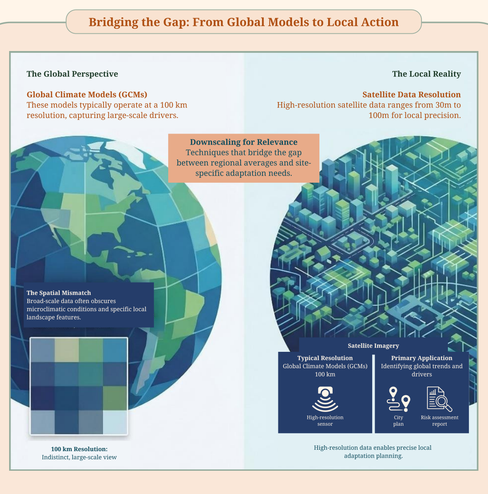
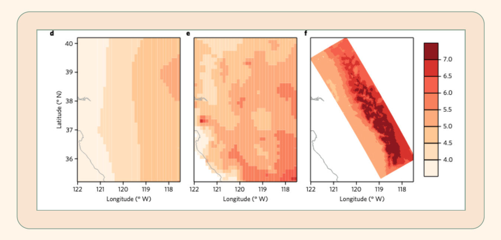
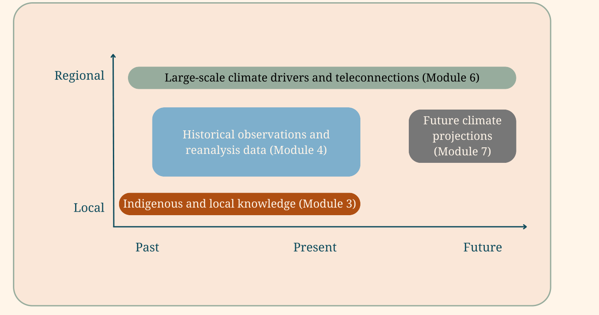
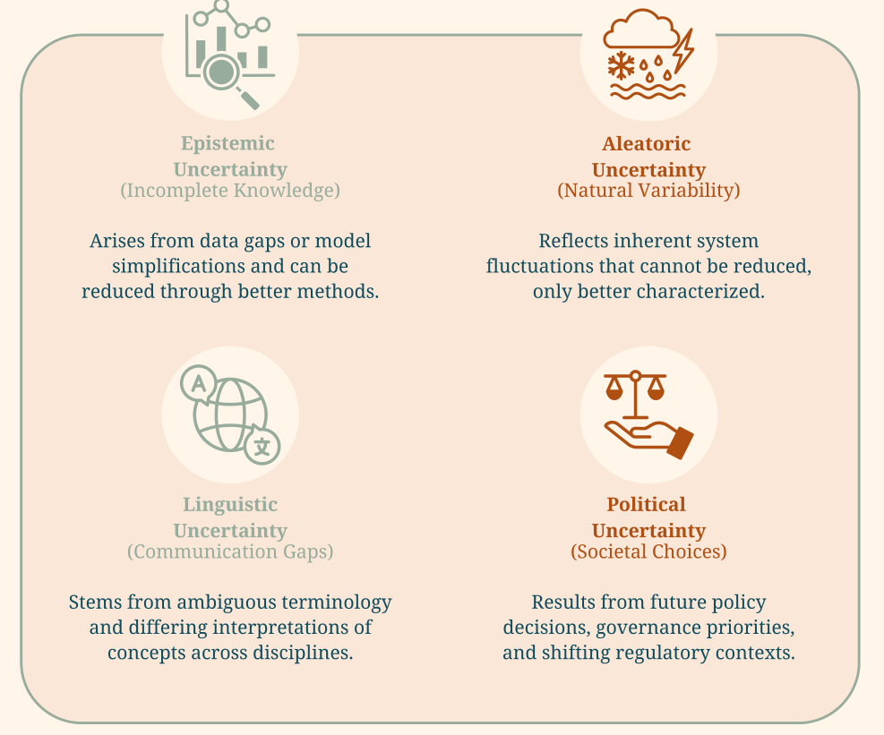

# Module 1 Understanding knowledge types, data scales and uncertainty

## 1. Introduction

Throughout this toolkit, you will draw on different types of knowledge and data to gather the necessary climate evidence for your context. However, it is important to recognise that such information is never complete or evenly distributed. Data and knowledge are often partial, uneven in quality and coverage, and shaped by the contexts in which they are produced and used. Acknowledging these characteristics from the beginning improves the robustness of the climate evidence and helps you acknowledge and navigate the resulting uncertainties.

The purpose of this module is therefore to support you in systematically mapping the information landscape that will inform later stages of the process. You can use it to identify what information is available, recognise different types of knowledge that may contribute to understanding climate-related issues, and examine how temporal and spatial scales, uncertainty, and data limitations shape the interpretation and use of available evidence. The module also introduces a practical guide to expert elicitation as one way of addressing data scarcity when empirical information is limited or incomplete.

## 2. Background: Types of knowledge and information sources

Adaptation processes draw on a wide range of information and ways of knowing, rather than relying on a single source of evidence. Information that is relevant to understanding climate-related risks, impacts, and response options is produced in different contexts, for different purposes, and according to different validation practices. Treating all information as equivalent or interchangeable can obscure important differences in how knowledge is generated, what it represents, and how it can be used. Distinguishing between types of knowledge is therefore an analytical step for you to make a transparent and effective use of available information. Different types of knowledge inform different aspects of the process, from identifying relevant climate drivers to interpreting local impacts and feasible adaptation responses. The purpose of this section is therefore not to rank or privilege forms of knowledge, but to clarify their characteristics, strengths, and limitations in relation to adaptation planning and to help you make transparent and effective use of available information.

<figure markdown="span">
  
  <figcaption><strong>Figure 1.</strong> Building decision-relevant climate evidence across scales</figcaption>
</figure>

!!! definitions "Definitions"

    **Traditional and local knowledge:** Traditional and local knowledge refer to understandings derived from sustained interactions between people and their environment, differing mainly in their temporal depth and cultural embedding. Traditional knowledge is developed and maintained by Indigenous peoples through long-term relationships with specific environments and transmitted across generations through cultural traditions. It is typically holistic, place-based, and closely linked to cultural identity, values, and collective memories of environmental change. Local knowledge, in contrast, emerges through more recent and ongoing observation, practice, and experience within a particular place or system. While not necessarily rooted in long-standing traditions, it is highly contextual and practice-oriented, reflecting the lived experience of environmental variability, livelihoods, and risks. Together, these forms of knowledge provide critical insights into local impacts and responses that may not be captured by formal datasets.

    **Bureaucratic/administrative knowledge:** Bureaucratic or administrative knowledge refers to knowledge generated through institutional processes of governance, management, and regulation. This includes information produced through monitoring systems, reporting requirements, policy implementation, technical guidelines, and administrative records. Such knowledge is often formalized, standardized, and oriented toward decision-making, compliance, and accountability. While it may draw on scientific evidence, bureaucratic knowledge is shaped by institutional mandates, regulatory frameworks, and organizational priorities.

    **Scientific knowledge:** Scientific knowledge refers to knowledge produced using scientific methods - formalized and systematic processes which are transparent and reproducible. It is typically codified in written, numerical, or graphical forms and generated through research designs that aim to test hypotheses, identify patterns, or explain causal mechanisms. Scientific knowledge can take many forms, and what counts as valid evidence depends on disciplinary standards and epistemological assumptions.

## 3. Understanding temporal and spatial scales for climate change adaptation

Information used for adaptation planning is always produced at specific temporal and spatial scales, and these scales strongly influence how data can be interpreted and applied. Climate, environmental, and socio-economic processes operate across multiple timescales and geographic levels, from short-lived events to long-term trends, and from local impacts to broader regional patterns. Problems often arise when information generated at one scale is assumed to be directly applicable to decisions made at another, without considering how scale shapes what the data can represent.

Recognizing the importance of scale does not require technical expertise in data production, but it does require critical reflection on how information aligns with the questions being addressed. Decisions related to immediate risk management, seasonal planning, or long-term adaptation may each require information on different temporal horizons and spatial resolutions. In practice, the most readily available data often does not match the scale of local priorities, making it important to work explicitly with these mismatches rather than overlooking them. This section introduces key considerations for assessing temporal and spatial scale in available information before it is used in subsequent analytical steps.

### Temporal scale: Matching data with decision horizons

Temporal scale refers to the time horizon over which information is collected, analyzed, and used. Climate-related decisions are made over different timeframes, ranging from immediate responses to extreme events, to seasonal planning, to long-term strategies addressing structural change. Each of these decision horizons requires information that captures processes operating over compatible timescales. Understanding temporal scale therefore involves recognizing how the timing and duration of available data align with the decisions being supported.

Figure 3 illustrates how different types of decisions require information at different temporal scales. Immediate response to extreme events relies on high-frequency data and early warning systems, often based on real-time or near-real-time monitoring. Seasonal planning depends on historical observations and patterns on daily to monthly timescales, allowing decision-makers to anticipate variability across seasons. Long-term adaptation planning draws on longer time series and projections over years to decades, supporting decisions related to structural change, infrastructure, or long-term risk management. Considering these distinctions helps ensure that available information is used in ways that are consistent with the temporal scope of the decision and its associated uncertainties.

<figure markdown="span">
  
  <figcaption><strong>Figure 2.</strong> Adaptation planning: A matter of time</figcaption>
</figure>

### Spatial scale: From global data to local relevance

Spatial scale refers to the geographic extent and resolution at which information is produced and analyzed, and it strongly shapes how data can be interpreted for adaptation planning. Climate and environmental data are often generated at global or regional scales, while many adaptation decisions are made at national, subnational, or local levels. This mismatch can create challenges when broad-scale information is applied to specific places, systems, or communities. Understanding spatial scale is therefore essential for assessing whether available data meaningfully reflects the conditions experienced at the level where decisions are being taken.

A common pitfall is assuming that spatial data with coarse resolution can be directly translated into local impacts without considering how spatial aggregation affects variability and detail. Regional averages may obscure important local differences, such as microclimatic conditions, landscape features, or uneven exposure of people and assets. Techniques such as downscaling can help bridge some of these gaps. Although they do not eliminate all sources of uncertainty or context-specific variation, you need to be aware of their limitations.

<figure markdown="span">
  
  <figcaption><strong>Figure 3.</strong> Bridging spatial scales in climate information: from global models to local relevance. Global climate models capture large-scale processes at coarse spatial resolutions, which are often insufficient to represent local conditions relevant for adaptation planning. Downscaling and high-resolution data can help translate regional patterns into locally meaningful information, but do not fully resolve fine-scale variability or uncertainty. The figure illustrates how mismatches between data resolution and decision scales can affect the interpretation and application of climate information.</figcaption>
</figure>

!!! examples "Examples of scale mismatch and common pitfalls"

    **Example 1: Using long-term averages to analyse impacts driven by short-term extreme events**

    Analysing changes in annual temperature or rainfall averages may suggest relatively stable or slowly changing conditions, while overlooking short-lived heatwaves, floods, or storms that cause the most significant damage. While averages can be useful for identifying general trends, they may mask critical conditions that cause the most significant damage or disruption. In such cases, the temporal scale of the data does not match the driving risk process, leading to incomplete or misleading interpretations.

    **Example 2: Using regional datasets or climate models to inform local decisions**

    A similar challenge arises in relation to spatial scale, when for example regional or coarse-resolution datasets are often used to inform decisions in highly localized contexts, such as specific ecosystems, infrastructure, or communities. However, these datasets may overlook fine-scale variability related to topography, land use, or local exposure, resulting in conclusions that do not fully reflect on-the-ground conditions. As an example, the following figure shows the difference between future and present-day mean temperatures over the Sierra Nevada in California, produced by a global climate model at a coarse resolution on the far left, and a regional climate model at higher resolution on the far right. Because the coarse resolution model does not 'see' the mountain range, it produces a much lower change in temperature, whereas the regional climate model shows that much higher temperature increases can be expected under climate change. The map in the middle shows the climate change signal simulated by the coarse-resolution model when it is 'bias corrected' to observations, without accounting for differences in the spatial scale, which again does not 'see' the mountain range, highlighting the importance of considering spatial mismatches.

    <figure markdown="span">
      
      <figcaption><strong>Figure 4.</strong> Towards process-informed bias correction of climate change simulations. Figure shows simulated change in spring (March-May) daily mean temperature (2081-2100 minus 1981-2000, RCP scenario, GFDL-CM3 global climate model) in the Sierra Nevada and Central Valley, California, USA. d bilinearly interpolated 8 km grid, e Bias corrected GCM, f Regional downscaling of GFDL-CM3 with the WRF regional climate model. The regional climate model simulates plausible strong elevation-dependent warming while the bias correction modulates the GCM change unsystematically and not related to elevation. (Source: Maraun et al 2017).</figcaption>
    </figure>

The figure below gives you an overview of the spatial and temporal scales of the different types of information collected as part of this climate evidence process. Taken together, these different types of knowledge can complement each other, providing more robust climate evidence. In each module, we mention and discuss the caveats related to the scale of this particular information.

<figure markdown="span">
  
  <figcaption><strong>Figure 5.</strong> Scales of the knowledge and information collected in this toolkit</figcaption>
</figure>

## 4. Understanding uncertainty and limits of available information

Uncertainty refers to situations involving imperfect, incomplete or ambiguous information, which are an unavoidable part of adaptation planning. Climate, environmental, and socio-economic data and knowledge are influenced by limitations in observation and measurement, natural variability in the system studied, and the simplifications required to represent complex systems as quantitative models to predict possible future changes. As a result, available information does not provide a complete or fully certain picture of current conditions or future changes and is always associated with some degree of uncertainty.

In addition, data is produced and used within specific contexts, using concepts, categories, and language that may not be shared across disciplines, institutions, or communities. Differences in interpretation, ambiguous terminology, or missing contextual detail can introduce additional limits to how information is understood and applied. Distinguishing these sources of uncertainty helps clarify whether limitations stem from gaps in knowledge, from the way information is framed, or from both.

Recognising the inherent uncertainty in the climate evidence does not mean that the information cannot be used. Rather, it highlights the importance of recognising it from the beginning of the process: Acknowledging uncertainty can help you interpret data in ways that are more consistent with the limitations, help you combine sources of evidence that have complementary strengths and weaknesses and support you in working realistically with evidence and avoiding false expectations. Overall, this can provide a more robust and transparent foundation for subsequent analysis and decision-making in adaptation planning.

!!! definitions "Definitions"

    **Epistemic uncertainty:** Refers to incomplete or imperfect knowledge. This includes limitations in data availability, short or fragmented observational records, measurement errors, and simplifications in models or indicators. Within scientific knowledge, epistemic uncertainty is often associated with model structure, parameterization, and data limitations, and may be partially reduced through additional data, improved methods, or triangulation across knowledge types.

    **Aleatoric uncertainty:** Reflects natural variability in the system, such as climate fluctuations, extreme events, or inherently stochastic processes. Unlike epistemic uncertainty, it cannot be reduced through better knowledge, but only better characterized.

    **Linguistic uncertainty:** Arises from the way information is described, interpreted, and communicated. This includes ambiguity in terminology, differences in meaning across disciplines or institutions, and the use of concepts that may be understood differently by different actors.

    **Political uncertainty:** refers to uncertainty arising from future societal choices and institutional dynamics that shape climate outcomes and adaptation pathways. This includes uncertainty related to emission trajectories, policy decisions, governance priorities, and changes in political or regulatory contexts that influence both future climate conditions and the implementation of adaptation measures.

<figure markdown="span">
  
  <figcaption><strong>Figure 5:</strong> Four dimensions of uncertainty in climate information and decision-making. Uncertainty arises from different sources that affect how information is produced, interpreted, and used. Epistemic uncertainty relates to incomplete knowledge and data limitations; aleatoric uncertainty reflects natural variability; linguistic uncertainty emerges from ambiguity in communication and interpretation; and political uncertainty arises from societal choices and institutional dynamics that shape future climate and adaptation pathways.</figcaption>
</figure>

### Uncertainty in local climate information

In practice, uncertainty becomes particularly visible when information is used at local scales. For example, short observational records can constrain the assessment of long-term variability and increase uncertainty when estimating rare or extreme events. Similarly, regional climate data may not capture local microclimatic conditions shaped by elevation, proximity to the coast, or land use. Linguistic uncertainty can also emerge when terms such as "normal rainfall" or "extreme heat" are interpreted differently by different users, or when probabilistic climate projections are translated into local decision contexts. These examples illustrate that uncertainty does not arise only from lack of data, but also from how information is framed, communicated, and applied.

Examples of each of these sources of uncertainty exist in all three forms of knowledge introduced earlier in this module: Scientific knowledge, for example, is affected by epistemic and aleatoric uncertainty when making projections about plausible future climate change, which will be discussed later on in [module 7](module-7.md), and by linguistic uncertainty when information is communicated to other disciplines or non-academic audiences. Administrative or bureaucratic knowledge, on the other hand, can introduce additional uncertainty through classification systems, reporting practices, or institutional framing. Traditional and local knowledge can help interpret fine-scale variability and contextualize broader patterns but may also involve linguistic uncertainty when concepts are translated across knowledge systems.

## How-To guide: expert elicitation { #how-to-expert-elicitation }

!!! howto "How-To guide: expert elicitation"

    In many adaptation contexts, decision-making must proceed despite limited, incomplete, or unevenly distributed data. Expert elicitation provides a structured approach to systematically gather and synthesize knowledge from individuals with relevant expertise, allowing practitioners to complement available data, explore uncertainty, and inform decision-making. Rather than replacing empirical data, expert elicitation helps make the best possible use of existing knowledge, especially in contexts where observations are sparse, fragmented, or difficult to obtain.

    Expert elicitation can support several stages of the climate evidence process presented in this toolkit. In [module 7](module-7.md), for example, expert elicitation is used to identify and prioritize large-scale climate drivers and to develop plausible future storylines under uncertainty.

    This guide outlines a structured process for conducting expert elicitation, adapted from established protocols such as IDEA (Investigate–Discuss–Estimate–Aggregate), and illustrates how it can be used to support climate-related analysis under data scarcity). The steps outlined here provide a general approach that can be adapted to those applications, as well as to other modules where data limitations require structured integration of expert knowledge.

### Step 1. Define the decision context and information gap

The first step is to clearly define the purpose of the elicitation by identifying the decision to be informed and the specific information that is missing or uncertain. This may include, for example, estimating the likelihood of extreme events, identifying key climate drivers, or assessing the sensitivity of a system to environmental change. Clearly articulating the information gap ensures that the elicitation remains focused and relevant to the adaptation context.

### Step 2. Identify and select experts

Select a group of experts with complementary forms of knowledge relevant to the problem. This may include scientific experts, practitioners, and individuals with local or sector-specific experience. Diversity in expertise is important to capture different perspectives and reduce bias. The selection process should be transparent and aligned with the objectives defined in Step 1.

### Step 3. Frame the elicitation questions

Translate the identified information gaps into clear and structured questions. These may involve quantitative estimates (e.g. ranges, probabilities, thresholds) or qualitative assessments (e.g. ranking of drivers, identification of plausible scenarios). Questions should be formulated in a way that is understandable across different knowledge types, minimising ambiguity and linguistic uncertainty.

### Step 4. Conduct individual elicitation (first round)

Experts provide their judgments independently, without interaction with others. This step is critical to avoid groupthink and anchoring effects. Participants may be asked to provide best estimates, ranges of plausible values, and associated confidence levels. Capturing uncertainty explicitly at this stage is essential.

### Step 5. Facilitate structured discussion and revision

Results from the first round are shared in an anonymized form, and a facilitated discussion is used to explore differences in judgments. Experts are encouraged to explain their reasoning, highlight assumptions, and reflect on contrasting perspectives. Following this discussion, participants are given the opportunity to revise their estimates in light of new insights.

### Step 6. Aggregate and document results

Individual estimates are combined using transparent aggregation methods, which may include statistical summaries or structured aggregation techniques. It is important to document not only the aggregated results, but also the range of responses, underlying assumptions, and sources of uncertainty identified during the process. This ensures that the outputs remain interpretable and traceable.

## References

Burgman, M. 2005. Risks and Decisions for Conservation and Environmental Management. Cambridge University Press.

Cumming, G. S., Cumming, D. H. M., & Redman, C. L. (2006). Scale mismatches in social–ecological systems: Causes, consequences, and solutions. Ecology and Society, 11(1), 14

F. Berkes, J. Colding, C. Folke (2000) Rediscovery of traditional ecological knowledge as adaptive management Ecological Applications, 10 (5): 1251-1262.

Hemming, V., et al. (2017). "A practical guide to structured expert elicitation using the IDEA protocol." Methods in Ecology and Evolution 9(1): 169-180.

I. Fazey, J.G. Salisbury, D.B. Lindenmayer, D. Maindonald, R. Douglas. (2004). Can methods applied in medicine be used to summarize and disseminate conservation research? Environmental Conservation, 31 (2004), pp. 190-198

J. Hunt & S. Shackley (1999) Academic, Fiducial and Bureaucratic Knowledge. Minerva 37(2): 141-164.

M. Gadgil, P. Olsson, F. Berkes, C. Folke. Exploring the role of local ecological knowledge for ecosystem management: three case studies. F. Berkes, J. Codling, C. Folke (Eds.), Navigating Social–ecological Systems: Building Resilience for Complexity and Change, Cambridge University Press, Cambridge, UK (2003), pp. 189-209.

Seneviratne, S. I., Zhang, X., Adnan, M., Badi, W., Dereczynski, C., Di Luca, A., Ghosh, S., Iskandar, I., Kossin, J., Lewis, S., Otto, F., Pinto, I., Satoh, M., Vicente-Serrano, S. M., Wehner, M., & Zhou, B. (2021). Weather and Climate Extreme Events in a Changing Climate. In Climate Change 2021: The Physical Science Basis. Contribution of Working Group I to the Sixth Assessment Report of the Intergovernmental Panel on Climate Change (IPCC). Cambridge University Press, Cambridge, United Kingdom and New York, NY, USA, pp. 1513–1766

