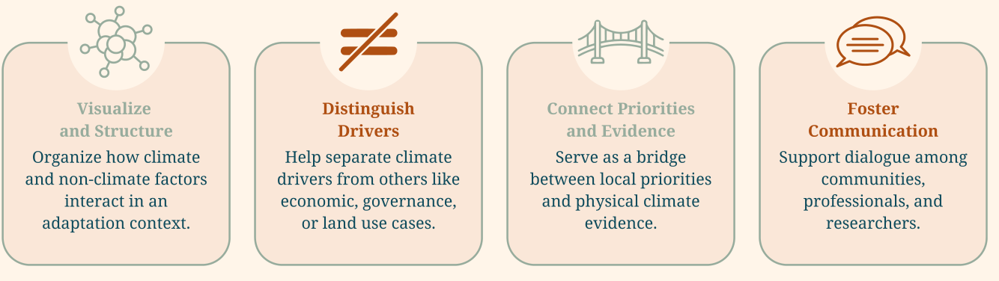
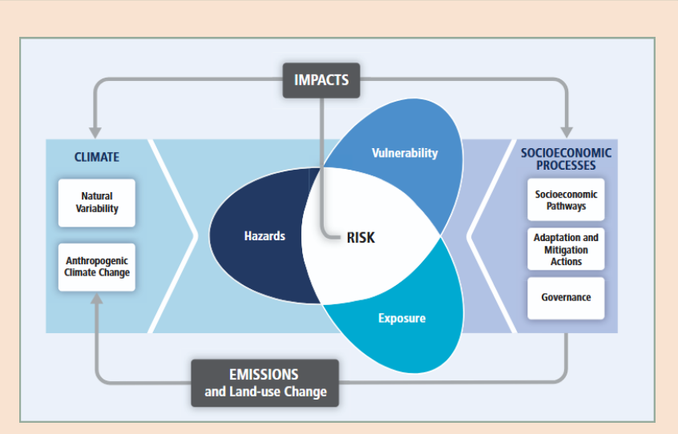
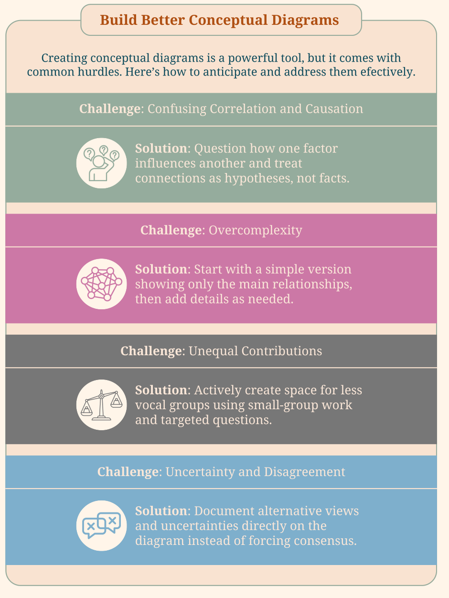
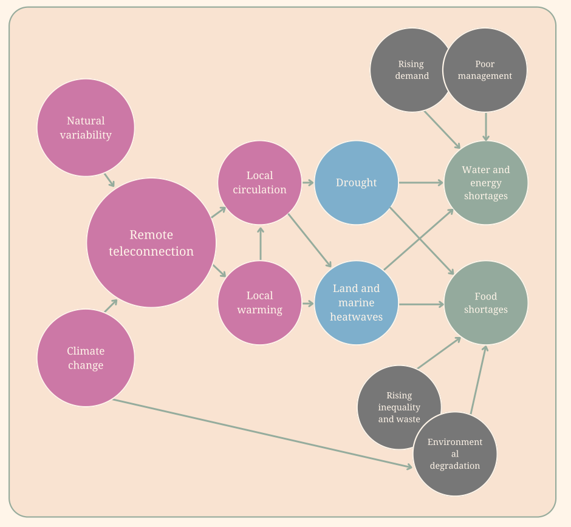

# Module 2 Constructing causal diagrams linking climate change to local priorities

This module introduces the use of causal diagrams as a practical learning tool for exploring how climate change connects to locally defined priorities and concerns. Rather than focusing on producing a final model or technical output, the emphasis is on developing the skills needed to think systematically about how climate change relates to local contexts. By learning how to build the diagram step by step, you will be able to address the complexity of analyzing regional climate change and communicate the collected climate evidence.

Throughout this toolkit, the causal diagram acts as a framework that ties the different modules together: you will begin by identifying local priorities and values, recognizing that adaptation processes are shaped by how people interpret changes in their environment and the implications these changes have for everyday activities and decisions ([Module 3](module-3.md)). These local priorities are linked to climate change first by identifying local climatic impact-drivers relevant to these local priorities ([Module 4](module-4.md)), and then analysing their past and future changes under climate change (Modules [5](module-5.md)-[7](module-7.md)). Finally, [Module 8](module-8.md) describes how to use the causal diagram to build and communicate a climate story from the evidence gathered.

## 1. Background and definitions: introducing causal diagrams

A causal diagram is a visual representation of cause - effect relationships. In the context of this toolkit, it will help organise the understanding of how climate-related and non-climatic factors influence impacts and adaptation responses. By making these relationships explicit, the diagram provides a simplified view of how different variables interact within a given context. Rather than aiming to capture all system dynamics in detail, causal diagrams are used to support learning and shared understanding by focusing on the most relevant pathways linking drivers, impacts, and responses. These diagrams are particularly useful to engage with complexity because they focus on key relationships and pathways, and do not require detailed modelling expertise or comprehensive data.

Causal diagrams not only structure complexity, but also connect local priorities with physical climate evidence and help to distinguish climatic and non-climatic drivers of risk. Moreover, building qualitative causal diagrams is a way of integrating scientific, local, traditional, and administrative or bureaucratic knowledge ([module 1](module-1.md)).

<figure markdown="span">
  
  <figcaption><strong>Figure 1.</strong> How do causal diagrams support putting climate evidence processes into action?</figcaption>
</figure>

To begin with, we define some key terms around climate risk and their usage throughout this toolkit.

!!! definitions "Definitions"

    **Disaster risks:** "Likelihood over a specified time period of severe alterations in the normal functioning of a community or a society due to hazardous physical events interacting with vulnerable social conditions, leading to widespread adverse human, material, economic, or environmental effects that require immediate emergency response to satisfy critical human needs and that may require external support for recovery." (Lavell et al. 2012). Disaster risk results from the combination of physical hazards of climatic impact-drivers and the vulnerabilities of exposed elements.

    **Hazards:** The potentially damaging climate-related events or processes that arise from the interaction of climate-physical drivers with environmental conditions and that can disrupt ecological and socio-economic systems. Examples include wildfire, marine heatwaves, agricultural droughts, or flooding events. Importantly, hazards should be distinguished from their consequences: impacts associated with hazards emerge only when they interact with specific contexts of exposure and vulnerability.

    **Impacts:** The observed or potential consequences of climate-related hazards on ecological, social, and economic systems, resulting from the interaction between hazards, exposure, and vulnerability. This could, for example, include loss of crop yields and associated reduction in food security, ecosystem degradation and biodiversity loss, health impacts from air pollution, or other forms of livelihood disruption. These impacts, in certain cases, correspond to losses and damages.

    **Exposure:** Presence of people, livelihoods, environmental services and resources, infrastructure, or economic, social, or cultural assets in places that could be adversely affected by physical events and which, thereby, are subject to potential future harm, loss, or damage. This could, for example, be the presence of crops in areas regularly flooded, orchards in fire-prone areas, settlements in flood-prone areas, coastal infrastructure exposed to storm surges, or livelihoods located in drought-prone regions.

    **Vulnerability:** The degree to which exposed elements are susceptible to harm and lack the capacity to anticipate, cope with, recover from, or adapt to hazards. Vulnerability reflects social, economic, institutional, and environmental conditions that shape differential impacts among actors (e.g., limited financial resources, restricted access to services, weak governance, or dependence on climate-sensitive livelihoods).

    <figure markdown="span">
      
      <figcaption><strong>Figure 3.1.</strong> Figure from the IPCC AR5 showing the link between hazards, vulnerability, exposure and risk from the IPCC AR5 report on Impacts, Adaptation and Vulnerability (Field et al. 2014).</figcaption>
    </figure>

    **Socio-economic processes or drivers:** The social, economic, institutional, and political processes that shape how societies use resources, organize production and livelihoods, and make decisions, thereby influencing both exposure and vulnerability.

    **Climatic impact-drivers:** Explained in detail in [Module 4](module-4.md), the climatic impact-drivers are a way of characterizing the climatic processes that determine the background environmental conditions of a system and shape the emergence of climate-related hazards, independently of local management or decision-making. These can include heavy rainfall, high temperatures, strong winds, or sea level rise. In this toolkit, we distinguish between local climatic impact-drivers (module 4), such as local drought indices, fire weather indices, maximum daily temperatures and so on, and large-scale climate drivers such as the El Niño Southern Oscillation (module 6) that influence local climate on more local timescales.

    **Adaptive responses:** The actions, strategies, or adjustments undertaken by individuals, communities, organizations, or institutions to reduce risk, cope with impacts, or take advantage of emerging opportunities under changing climatic conditions (e.g. livelihood diversification, technological adaptation, institutional change)

## 2. How-To guide: Constructing a causal diagram { #how-to }

!!! howto "How-To guide"

    In the following guide, we will present the development of the causal diagram as a list of sequential steps. However, the process is usually iterative, and the more we understand the problem, the better we can map the problem. In this way, be ready to go back and forth between steps until the causal diagram is a robust representation of the problem.

    | Steps for constructing a causal diagram | Where to find more information |
    |---|---|
    | Step 1. Identify impacts of concern to the community | [Module 3](module-3.md) |
    | Step 2. Identify climate-related hazards | |
    | Step 3. Identify the relevant Climate-Impact Drivers | Modules [4](module-4.md) and [6](module-6.md) |
    | Step 4. Map the influence of climate change | Modules [5](module-5.md), [6](module-6.md) and [7](module-7.md) |
    | Step 5. Map exposure and vulnerability and their socio-economic drivers | [Module 3](module-3.md) |
    | Step 6. Add adaptation levers and opportunities | |
    | Step 7. Revisiting impacts | |

### Step 1. Identify impacts of concern to the community

The first step is to define the core of the analysis by identifying focal impacts of concern, associated with priorities, or values that anchor the causal diagram. This impact of concern represents the system or resource that is potentially affected by climate change, and that people consider important to protect or sustain. Clearly articulating this focus is essential, as it sets the scope of the analysis and ensures that the diagram remains relevant and useful.

In [Module 3](module-3.md), you will learn how to identify priorities and values, as well as impacts of concern together with local communities, which provides practical guidance on understanding local context through initial visits and participatory engagement.

Identifying the focal impacts is most effective when treated as a participatory choice rather than a predefined technical decision. Different actors may prioritise different values or interpret the same concern in distinct ways, depending on their experiences and forms of knowledge. Making these differences explicit helps clarify what the diagram is centred on and whose priorities are represented. Establishing a shared focal impacts at this stage provides a clear reference for the subsequent steps, guiding the identification of drivers, impact pathways, and adaptation responses.

### Step 2. Identify climate-related hazards

The second step focuses on identifying the hazards that give rise to the impacts identified in the previous step. Examples of hazards identified at this stage include fast-spreading fires, coastal storm surges, or increased variability in rainfall impacting crop planting and harvest.

Communities have a clear understanding of which are the potential hazards. Reflecting on past experiences or impacts and the climate conditions which led to such impacts is a way of defining hazards. For example, increased seasonal temperatures may constitute a hazard only when they exceed thresholds relevant for crop growth, human health, or ecosystem functioning. This is usually detailed knowledge that comes from experiences and combined understanding of the climate in a given location as well as the impacted system. Similarly, changes in precipitation may become hazardous when they result in prolonged droughts or extreme rainfall events that overwhelm local coping capacities. Identifying hazards in this way helps avoid treating climate drivers as inherently negative, and instead situates risk in relation to locally defined priorities and sensitivities.

### Step 3. Identify the relevant Climate-Impact Drivers

Based on the hazards identified in the previous step, this step involves identifying the climate-related conditions that lead to the hazards of interest, as well as climate drivers that influence the impacts directly, without necessarily being linked to negative hazards (an example would be days during which it is warm enough to grow crops). The aim is to clarify which aspects of climate variability or change are most relevant for understanding how climate affects locally defined priorities, rather than to compile an exhaustive list of climate variables. At this stage, the focus is on local impact-relevant drivers (i.e. heavy precipitation, heat wave intensity)—that is, climate conditions that initiate or shape impact pathways—rather than on large-scale climate phenomena (i.e. a positive phase of El Nino southern Oscillation causing the local precipitation or temperature).

In [module 4](module-4.md), you will find detailed guidance on how to define and analyse climatic impact-drivers, including examples and methods for translating local observations into impact-relevant indicators.

If the analysis is more advanced, or a scientist with climate knowledge is involved, large-scale phenomena that cause the local impacts can be included in the diagram. These large-scale teleconnections are introduced and explained in [module 6](module-6.md). Identifying relevant climate drivers benefits from combining different types of knowledge. Scientific knowledge, including climate data, reports, or expert input, helps ensure that identified drivers are consistent with observed trends and plausible future changes. At the same time, local and traditional knowledge contributes insights into which climate conditions are perceived as most disruptive or consequential, and how these have changed over time. Facilitated discussion can also help distinguish primary climate drivers from secondary effects, supporting a clearer and more focused causal diagram.

### Step 4. Map the influence of climate change

This step focuses on adding nodes to the causal diagram that show the influence of climate change on the climatic impact-drivers and hazards identified. In modules 5, 6 and 7, you will learn how to analyse the influence of climate change in recent years ([module 5](module-5.md)) and in the future ([module 7](module-7.md)), as well as the influence of large-scale climate drivers such as the El Niño Southern Oscillation ([module 6](module-6.md)). This will later help you add adaptation levers and opportunities to the causal diagram.

### Step 5. Map exposure and vulnerability and their socio-economic drivers

This step focuses on identifying the elements that are exposed to the hazards identified in Step 3, and on understanding the factors that shape their vulnerability. Exposure refers to the presence of people, livelihoods, ecosystems, infrastructure, or valued activities in places where hazardous events or processes may occur, while vulnerability reflects the characteristics that make these exposed elements more or less susceptible to harm.

Mapping exposure and vulnerability is most effective when approached as a participatory and exploratory exercise. Participants can draw on local and traditional knowledge to identify exposed elements and to explain how past events have affected different people, livelihoods, or ecosystems. Facilitated discussion helps make visible differences in vulnerability within the same system, supporting a more nuanced understanding of how hazards identified through climate-impact drivers (module 4) lead to uneven impacts.

[Module 3](module-3.md) will provide you with guidance on how to approach exploring these dimensions as a participatory exercise with a local community. At this stage, the aim is to clarify how hazards translate into impacts through the interaction of exposure and vulnerability. This involves identifying which elements are affected when a hazard occurs, under what conditions, and why impacts may differ across groups, locations, or activities.

We then focus on identifying the social, economic, institutional, and governance-related conditions that interact with climate drivers and shape how impacts are experienced. Climate impacts do not occur in isolation; their severity and distribution are strongly influenced by contextual factors that can either amplify vulnerability or enhance the capacity to respond. Incorporating these interacting drivers adds depth and realism to the causal diagram, helping move beyond climate-centric explanations toward a more integrated understanding of risk. At this stage, impacts become visible as the concrete consequences experienced by the focal concern when hazards interact with exposure and vulnerability.

This step benefits from close engagement with local and sectoral knowledge, as many socio-economic drivers are context-specific and may not be captured in climate datasets. Participatory discussion can help identify which factors most strongly influence exposure and sensitivity, and how these have changed over time. Examples of commonly identified socio-economic drivers include market price volatility, institutional and governance capacity, land-use changes, and access to technology or financing. Making these drivers explicit supports a more nuanced interpretation of impact pathways and provides an essential bridge toward identifying feasible and context-appropriate adaptation responses in the next step.

### Step 6. Add adaptation levers and opportunities

The sixth step focuses on identifying where and how it may be possible to intervene in order to reduce climate-related impacts or strengthen resilience. Building on the causal relationships identified in previous steps—linking climate drivers, hazards, exposure, vulnerability, and non-climatic stressors—this stage shifts attention toward potential points of action within the system. Adaptation levers refer to interventions that can influence exposure, vulnerability, or response capacity, and may operate at different levels, from household practices to collective arrangements, institutions, or policy frameworks.

This step includes both existing responses that are already in place and could be reinforced, as well as gaps where new actions may be required. Existing responses may include practices such as early warning systems, changes in resource management, or informal coping strategies that have proven effective under certain conditions. Gaps may involve the absence of mechanisms such as insurance, limited access to climate-resilient technologies, or insufficient institutional support. Through participatory discussion, these levers and opportunities are linked back to specific pathways in the diagram, helping ensure that proposed adaptation responses are grounded in local realities and clearly connected to the causal dynamics identified earlier.

### Step 7. Revisiting impacts

This final step focuses on identifying the impacts that emerge from the interaction between hazards and the specific conditions of exposure and vulnerability mapped in previous steps. Impacts refer to the observed or potential consequences of climate-related hazards on ecological systems, livelihoods, infrastructure, and human well-being, and represent the point at which climate-related risks become tangible for the focal concern.

At this stage, the aim is to make explicit how and why hazards translate into concrete outcomes. The same hazard may lead to very different impacts depending on who or what is exposed, and on the capacity to anticipate, cope with, and recover from the event. For example, drought and heatwaves may result in food shortages when they affect agricultural production systems that are highly exposed and lack buffering capacity, or in water and energy shortages when infrastructure systems are stressed by increased demand and limited management capacity.

### Participatory approaches for causal diagram construction

We suggest approaching the construction of the causal diagram as a collaborative process. Jointly developing the diagram with participants and using it as a shared analytical space in which observations are contributed, causal relationships are discussed, and underlying assumptions and differences in interpretation are made explicit. Working in this way allows the diagram to reflect multiple perspectives while supporting a clearer and more transparent understanding of climate–impact pathways in the local context.

The causal diagram functions as a boundary object that facilitates participation by providing a shared visual reference for discussion. The visual format helps reduce asymmetries between types of knowledge by placing experiential, scientific, and administrative inputs on equal footing within the same analytical space. The aim is not to reach full consensus, but to achieve clarity and traceability of perspectives, so that different viewpoints and uncertainties remain visible and can inform subsequent learning and decision-making.

Effective participation in causal diagram construction depends on active and attentive facilitation. The facilitator plays a key role in balancing contributions, ensuring that no single technical, institutional, or expert perspective dominates the discussion. This includes recognising and managing disagreements, as well as creating space for contributions that may emerge more slowly or remain implicit. Simple facilitation strategies—such as structured turn-taking, small-group discussions, or targeted prompts linked to specific parts of the diagram—can support inclusive engagement while keeping the focus on the joint development of the diagram.

Participation in the construction of the causal diagram is inherently iterative, and validation is understood as an ongoing process rather than a final step. As new ideas emerge, relationships are clarified, or additional voices are incorporated, the diagram is revisited and adjusted accordingly. The iterative approach allows the diagram to evolve over time, supporting continuous learning and ensuring that it remains responsive to changing understandings, contexts, and priorities.

<figure markdown="span">
  
  <figcaption><strong>Figure 3.</strong> Common challenges and how to address them</figcaption>
</figure>

**Confusing correlation with causation:** When constructing a causal diagram, it is common to assume that variables connected in time are causally related. To address this, encourage participants to ask how and through which mechanisms one factor influences another. Use arrows to represent hypothesized relationships and treat them as assumptions to be discussed and refined rather than as established facts.

**Overcomplexity:** Causal diagrams can quickly become crowded as more factors and connections are added. A practical approach is to start with a simple version that captures the main relationships and progressively add detail only where it supports understanding or decision-making. Simplicity helps maintain focus and makes the diagram easier to discuss and revise.

**Missing or unequal knowledge contributions:** Some perspectives—particularly those of marginalized or less vocal groups—may be underrepresented in group discussions. Actively creating space for these voices is essential. This can include using small-group work, targeted questions, or facilitation techniques that ensure different forms of knowledge and experience are reflected in the diagram.

**Uncertainty and disagreement:** Differences in interpretation and uncertainty are a normal part of working with complex systems. Rather than trying to resolve all disagreements, it is often more productive to document alternative views, assumptions, or areas of uncertainty directly in the diagram or in accompanying notes. Making these differences explicit supports transparency and ongoing learning.

## 3. Example

!!! examples "Example: a causal diagram for drought and heatwaves"

    <figure markdown="span">
      
      <figcaption><strong>Figure 4.</strong> Causal diagram example. Source: Rodrigues, R.R. &amp; Shepherd, T.G. 2022. Small is beautiful: climate-change science as if people mattered. PNAS Nexus, 1, 1-9.</figcaption>
    </figure>

    This example illustrates how a causal diagram can be used to structure the relationships between climate drivers, hazards, and their consequences in a specific regional context. The elements shown in purple represent physical climate drivers operating across scales, including natural variability and climate change, as well as large-scale processes such as remote teleconnections. These drivers influence regional conditions through climate-impact drivers such as local circulation and local warming. From these conditions emerge the hazards (blue), in this case drought and land and marine heatwaves, which represent potentially damaging events affecting the system.

    The impacts (green), such as water and energy shortages and food shortages, arise when these hazards interact with specific socio-economic conditions (gray). In this example, factors such as rising demand, poor management, and environmental degradation shape exposure, while rising inequality reflects underlying vulnerability. Together, these conditions determine how severely the hazards affect different systems and populations. This example also highlights that impacts are not produced by climate drivers alone, but by their interaction with exposure and vulnerability, and that in some cases no explicit adaptation responses are yet in place, making these underlying conditions critical entry points for intervention.

## References

Rodrigues, R. R. and T. G. Shepherd (2022). "Small is beautiful: climate-change science as if people mattered." PNAS Nexus 1:1-9.

