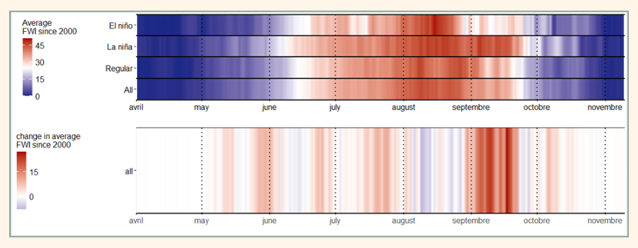
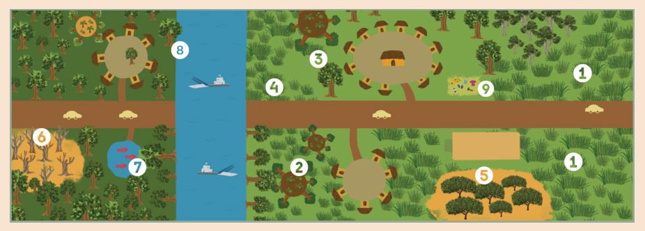

# Module 3 Defining the starting point: understanding the local context

The relationship between the livelihood systems of local communities and their environment is essential for understanding how climate change affects the community, how they perceive these changes and impacts, and what possible adaptation strategies could be. Thus, it is important to ground the bottom-up climate evidence process in an understanding of key contextual elements, such as the livelihood systems of local communities, their dependency on weather and climate conditions or the integration of the community in different supply chains.

In this module, we introduce an approach for understanding these key contextual elements. This understanding of the local context can help us identify relevant links to include in the causal diagram developed in [module 2](module-2.md) in order to connect local impacts with climatic changes and identify relevant analyses for generating climate evidence.

## 1. Background and definitions

Exploring the local context allows us to understand how the vulnerability of a community to different climate impact drivers is not uniform. For example, gender can determine access to daily-wage jobs, which in turn can reduce vulnerability to drought thanks to the alternative sources of income they represent. Understanding who might be more vulnerable or excluded from ongoing adaptation efforts is important for identifying effective adaptation strategies for everyone and for providing adequate support.

In this module, we outline a practical approach for exploring contextual elements, such as livelihood systems and the drivers of exposure and vulnerability to climate change, during an initial visit to the community. We propose this particular approach because talking with community members and experiencing their daily life will give you crucial insights to design, interpret and communicate other aspects of the climate evidence. However, if you don't have the opportunity to visit, we encourage you to conduct bibliographic research and organise a few interviews using phone or video-conferencing. This understanding of the local context will inform the construction of causal diagrams described in the previous module and guide other analyses and their interpretation during the bottom-up climate evidence process.

!!! faq "What is Free, Prior and Informed Consent (FPIC) and why is it important?"

    Free, Prior and Informed Consent (FPIC) are ethical and legal principles guiding researchers working with local communities to ensure participants are aware of planned research activities and consent to them (ISE 2008). FPIC should be obtained without any form of coercion (free), sufficiently in advance to allow discussion and reflection (prior), and should inform participants in an appropriate format about the planned activities and their impacts. The form of consent should be determined by the community and be adapted to the local governance structure.

## 2. How-To guide: Understanding local context through an initial visit to the affected community { #how-to }

!!! howto "How-To guide"

    In the following section, we provide guidelines for structuring the initial phase of a project aiming to build bottom-up climate evidence, centred on the organisation of a first visit to the community you are working with. The initial phase of a project should be adapted depending on factors such as the type of climatic impact investigated, the time and resources available for the project, and the preexisting relationship with the community.

    Nevertheless, we identify steps that can guide the first few weeks of a new project and provide the reader with key information for the next module of the climate evidence process. For each step of the guideline, we will propose an example based on a project examining the impact of climate change on wildfire risks in an Indigenous land of the Brazilian Amazon (Valette et al. 2026).

### Step 1: Bibliography research

When starting to work with a community, it is important to look for bibliographic references from past projects and research. This helps you understand the local context before your first visit and ensures that your work builds on, rather than duplicates, previous initiatives. Avoiding questions that have already been answered reduces research fatigue among participants and encourages engagement.

First, look for a wide range of accessible references, including master's and doctoral theses, monographs, grey literature from NGOs or governmental projects, as well as newspapers and blogs. Grey literature, such as government or NGO reports, can be particularly useful for identifying key challenges and summarising past interventions.

You can use classic search engines, such as Google or Ecosia, specialized search engines such as Google Scholar or Web of Science (the last option is behind a paywall but can be accessed through university/institutions subscriptions). Use multiple search queries and, when relevant, several languages to identify as much relevant literature as possible. Compile all documents in a single folder.

After this initial compilation, read through the documents and condense them into notes. If time is limited, focus on the introduction and methodology sections of scientific publication, which often provide crucial information about the study site and local communities, as well as the results section if relevant. While reading, organise your notes in a single document around key themes, such as the history of the community, past interventions and research projects, social organisation, experience of extreme climate-related events, and other pressures on local communities and ecosystems. Where relevant, extract key figures, such as maps of the landscape or local climate indicators. If a study seems particularly relevant to your case study, feel free to send an email with follow-up questions to the corresponding authors to get in touch with the research team.

!!! examples "Example"

    In the project on climate change and wildfire risk in the Capoto/Jarina Indigenous land, Brazilian Amazon, the research team identified three key resources during the initial literature review:

    - The master's thesis from Oliveira (2017) gives a historical perspective of the movement of local communities in the region and fights to access to secure land rights in Capoto/Jarina territory
    - The master's thesis from Rodrigues (2022) provides a detailed account of Metyktire cosmology related to fires and the history of the local fire brigades, drawing on 20 years of work with the community.
    - KremKrem collective video: participatory video that shows how the local community is managing fires and how this is part of larger landscape management practices.

### (Optional) Step 2: Exploratory analysis of local climate and its change

Depending on the time available for the bottom-up climate evidence process and the preparation of the first visit, you might want to do some simple analysis of the current climate and the impact of climate change. For looking at the current climate conditions, you could consult either previous work or data from local weather stations for understanding the seasonality of rainfall, temperature and wind. In [Module 5](module-5.md) you will find detailed guidelines for this, including open-access sources of information available for your analysis.

If time allows and it seems relevant for understanding drivers of environmental change, you can complement these steps with other data visualisations. For example, you could use Google Earth Engine to visualise real-colour satellite images to observe change in the landscape, such as construction of infrastructures, deforestation or opening of mining sites that could indicate change in economic activities of the community and impact on ecosystems surrounding them. You can also rely on more specialised products, such as [Global Forest Watch](https://www.globalforestwatch.org/) to accurately monitor forest cover, or [Mapbiomas](https://brasil.mapbiomas.org/en/iniciativas-mapbiomas/) for assessing land use changes.

!!! examples "Example"

    In the project on climate change and wildfire risk in the Brazilian Amazon, the research team did two analyses before the first visit:

    - Creating two land use maps between 1985 and 2023 to see the change in landscape, highlighting a similar land cover within the territory but large-scale deforestation for pasture and soy cultivation outside the territory
    - Analysis of trends in Fire Weather Index, showing a generally riskier fire season, especially during the month of September and La Niña climatic events (Figure 3.2).

    <figure markdown="span">
      
      <figcaption><strong>Figure 3.1.</strong> Banplot showing the daily wildfires risks through the fire season and over different phases of El Niño cycle over Capoto/Jarina territory, as well as the average change in daily FWI between 2000 and 2023.</figcaption>
    </figure>

### Step 3: Plan initial visit

For planning your first visit, identify the key questions and methods needed to understand observed climatic changes, their impacts, and existing adaptation strategies. An effective strategy for doing this could be to:

- Define the key questions and information needed to complete the causal diagram developed in the previous module (see Example of key questions below)
- For each question/information required, identify one or more suitable research activities (see Appendix for a summary of common methods). For example, to identify areas vulnerable to flooding, you might conduct semi-structured interviews, use participatory mapping, or organise field walks to vulnerable locations. In the Appendix of this toolkit, we have included a table with some of the most common research methods, as well as their advantages and challenges and material required.
- For each question/information, determine who might have the information. Also consider how different groups within the community can give you complementary information on the same phenomena. Per example, men and women from the community can have different yet equally valuable views on the impact of climate change on agriculture due to gender segregation of agricultural tasks. Interviewing both groups will allow you to consider climate impact drivers impacting both groups in your bottom-up climate evidence process.
- Make a tentative schedule to see how you could organise different activities and ensure your plan aligns with the time available during the visit.

If for any reason you can't visit the community for a few days, we propose to arrange some remote interviews instead, using either phone calls or video communications platforms such as Google Meet or Zoom. The online format will severely limit the methods available, and you will likely mostly rely on semi-structured interviews.

Once research questions and methods are defined, develop a tentative timeline based on the number of days available and the potential participants. The first day is usually dedicated to introducing the bottom-up climate evidence process and meeting the key members of the local community. In the following days, plan no more than one group activity per half-day, as discussions often take longer than expected. While individual interviews are relatively easy to reschedule, group activities require greater coordination. Each activity requires specific preparation, and most will require a facilitation guide. Allow sufficient time to prepare these materials and, where possible, seek peer feedback.

You must ensure that free, prior, and informed consent is respected. Before the visit, discuss with community representatives the project objectives, methods, data collection and analysis, how results will be shared within and beyond the community, and the consent process for participants.

!!! examples "Example of key questions"

    Here are a few examples of questions that are likely to be relevant for understanding the local context. Bear in mind that every bottom-up climate evidence process will be different, and needs to have:

    - What changes in climate have the community observed over the past decades?
    - What are the impacts of these changes on the local forest/river/wetlands/savanna/other types of important vegetation?
    - Is there any indicator of seasonality you used in the past that became unreliable? (e.g: flowering of trees, song of a bird or insect…)
    - Is there one part of the landscape particularly affected by climate change? Or a part of the landscape that remained unchanged?
    - What are the impacts of these changes on the local community?
    - Did these changes affect agriculture or any other important economic activity? (e.g: forestry, fisheries, tourism, etc…)
    - Does the community adapt to the changes in climate and their impact on the local communities? How?
    - Does the community experience some difficulties in enforcing its adaptation strategies?
    - Do all people adopt the same adaptation strategies? If not, why?

    In the project on climate change and wildfire risk in the Brazilian Amazon, the research team planned with the partner organisation an initial visit. The methodology revolved around semi-structured interviews, focus group discussions, a seasonal calendar and participatory mapping (see Figure 3.2).

### Step 4. Piloting the study

If time and resources permit, conduct a pilot study by testing your methods with a limited number of participants before or at the beginning of the first visit. This helps you identify possible issues in your questions or chosen method before involving a larger group, and therefore improves the final results of your visit. Ideally, pilot participants should represent the different groups involved to ensure methods are suitable for all participants: for example, tools such as computers or satellite images may be intuitive for younger participants but challenging for elders. Follow Step 5 for guidance on the pilot visit, as it follows the same process on a smaller scale. If the adjustments you make to the questions or activities after the pilot are major, pilot data might have to be excluded from the final evidence.

!!! examples "Example"

    In the project on climate change and wildfire risk in the Brazilian Amazon, the research team identified two key issues during the pilot study:

    - It is challenging to create a detailed seasonal calendar, as many activities are not organised by months but by bioindicators indicating the appropriate time to burn. While we retained this activity, we also added follow-up questions on signs used to determine the timing of different activities.
    - Participatory mapping sessions are very useful for understanding spatial aspects of wildfires, but freehand mapping was required to include women participants, as they often had difficulty locating themselves on satellite images of the landscape.

### Step 5. Visiting the community

A good preparation of the first visit is crucial, as it allows you to focus on research activities and exchanges with participants. Bring spare materials, such as printed maps, consent forms and snacks for participants, to accommodate higher-than-expected participation. If possible, arrange locations in advance for group activities, ensuring they are sheltered from the weather and equipped with basic seating. Upon arrival, introduce yourself and the project clearly, and explain the planned activities and the broader bottom-up climate evidence process. After the introduction, discuss preferred time slots with participants or confirmed previously agreed agenda and adapt your schedule accordingly. Flexibility is essential: while some planned activities should be prioritised, it is equally important to respect participants' constraints and remain open to unplanned opportunities.

Capturing diverse perspectives requires engaging participants from a wide range of groups within the community. Knowledge, impacts, and perceptions of climate change vary according to gender, age, ethnicity, and involvement with external initiatives, among many other factors.

Carry out the different research activities that you had planned, making sure that you present the activity and ask the consent of participants before starting to record each activity, an important aspect of the FPIC (see box 3.1). Throughout data collection, ensure rigorous documentation. Always carry multiple voice recorders or phones, along with spare batteries or power banks. Even during individual interviews, use at least two voice recorders to have a backup in case of failure. For group discussion, use several voice recorders and distribute them across the space where the research activity is held to record voices from different locations. At the end of each session, save recordings and research materials in several locations and, whenever possible, back them up online.

!!! examples "Example"

    In the project on climate change and wildfire risk in the Brazilian Amazon, the research team engaged with different groups of participants. Each group expressed distinct perspectives regarding fire use and wildfire risk management. Men were strongly involved in fire brigade initiatives, supporting fire use and fighting, and had detailed knowledge of areas several kilometres away from villages through hunting and fishing expeditions. Women tended to use fewer fires and focused on areas close to village centres and swidden agriculture. Elders contributed extensive knowledge of observed climatic changes, as well as the impacts of other compounding environmental disturbances, such as regional deforestation.

    <figure markdown="span">
      
      <figcaption><strong>Figure 3.2.</strong> Illustration developed from the participatory mapping during the initial visit, including different places that are important for fire management.</figcaption>
    </figure>

### Step 6. Data analysis

After returning from the field, compile all notes and, if that is the approach you picked, transcribe all of the recordings for further analysis. Compile fieldnotes, pictures and complementary material in a folder and ensure they are backed up online. Always link transcriptions and notes to the corresponding recording, in case you need to get back to them later. The analytical approach to follow will depend on each method, and you should refer to specific guidance.

After analysing results from each research activity, synthesise your initial results into a short presentation or a written report, along with key contextual elements explored during the literature review. This will serve as a foundation for your analysis and allow you to get feedback on these early results from peers, who can connect these with climate change impact in other communities, and with participants themselves, to ensure your initial diagnosis is accurate and identify missing elements.

!!! examples "Example"

    In the project on climate change and wildfire risk in the Brazilian Amazon, the research team undertook a thematic analysis of the transcripts of research activities. Some of the key themes that emerged were the change in rainfall predictability during the onset of the rain seasons, when members of the local community set fire to their swiddens, the existence of adaptation relying on individual changes in fire use and the fire brigade, impact of wildfires on livelihoods, as well as the importance of invasive grasses. When we presented these results to the community a few months later, the main feedback was that the wildfire risks and impact of climate change were well understood for this community, but other, more remote communities experienced different changes that needed to be investigated.

!!! faq "Full transcription or note-taking?"

    While full transcription gives you the best quality of data possible, it is a time-consuming process, and you should plan for about 3 to 4 hours of transcription for every hour of interview (even though some AI tools can significantly speed up this process). The choice of the methods depends on the opportunity to visit the community, the number of research activities conducted, and the time available. If you decide to do an integral transcription of your research activities, it is important to accurately transcribe all the words said by the researcher and participants during the activity, as some details that sound insignificant when you started the analysis might reveal importance in the end.

## Resources and references

Book on social sciences methods used in conservation biology, with some short chapter describing the use of different social sciences methods relevant for the bottom-up climate evidence process: Newing, H., C. Eagle, P. Rajindra, and C. Watson. 2011. Conducting research in conservation: social science methods and practice. New York: Routledge. doi:10.4324/9780203846452.

Code of ethics of the International Society of Ethnobiology, providing guidance around ethical questions related to the work with traditional and local ecological knowledge: <https://www.ethnobiology.net/what-we-do/core-programs/ise-ethics-program/code-of-ethics/>

Google Scholar, the most comprehensive open-access search engine for scientific literature: <https://scholar.google.com>

Global Forest Watch, a platform to monitor forest cover and identify deforestation or reforestation hotspots in your landscape or access aggregated statistics on forest cover: <https://www.globalforestwatch.org/>

Mapbiomas, a platform developed first in Brazil and now expanding across the tropics that provide database and visualisation of the evolution of land use as well as complementary datasets, depending on the country (e.g: in brazil you can monitor fires regimes and pastures degradation): <https://brasil.mapbiomas.org/en/iniciativas-mapbiomas/>

Cardona, O.-D., M. K. Van Aalst, J. Birkmann, M. Fordham, G. McGregor, R. Perez, R. S. Pulwarty, E. L. F. Schipper, et al. 2012. Determinants of Risk: Exposure and Vulnerability. In Managing the Risks of Extreme Events and Disasters to Advance Climate Change Adaptation, ed. C. B. Field, V. Barros, T. F. Stocker, and Q. Dahe, 1st ed., 65–108. Cambridge University Press. doi:10.1017/CBO9781139177245.005.

Food and Agricultural Organisation. 2016. Free Prior and Informed Consent: An indigenous peoples' right and a good practice for local communities. Manual for Project Partitioners. Rome, Italy.

Field, C. B., and V. R. Barros. 2014. Climate change 2014: impacts, adaptation, and vulnerability Working Group II contribution to the fifth assessment report of the Intergovernmental panel on climate change. New York: Cambridge university press.

International Society of Ethnobiology. 2006. International Society of Ethnobiology Code of Ethics (with 2008 additions).

Lavell, A., M. Oppenheimer, C. Diop, J. Hess, R. Lempert, J. Li, R. Muir-Wood, S. Myeong, et al. 2012. Climate Change: New Dimensions in Disaster Risk, Exposure, Vulnerability, and Resilience. In Managing the Risks of Extreme Events and Disasters to Advance Climate Change Adaptation, ed. C. B. Field, V. Barros, T. F. Stocker, and Q. Dahe, 1st ed., 25–64. Cambridge University Press. doi:10.1017/CBO9781139177245.004.

Miara, M. D., M. Negadi, S. Tabak, H. Bendif, W. Dahmani, M. Ait Hammou, T. Sahnoun, J. Snorek, et al. 2022. Climate Change Impacts Can Be Differentially Perceived Across Time Scales: A Study Among the Tuareg of the Algerian Sahara. GeoHealth 6: e2022GH000620. doi:10.1029/2022GH000620.

Oliveira, E. D. S. 2017. A terra (vivida) em movimento : nomeação de lugares e a luta Mẽtyktire-Mẽbêngôkre (Kayapó). Master, Universidade de Brasília. doi:10.26512/2017.09.D.31300.

Rodrigues, A. M. 2022. O Kayapó (Mẽtyktire) e o fogo: narrativas e práticas observadas no tempo e no espaço. 1st ed. Atena Editora. doi:10.22533/at.ed.395221609.

