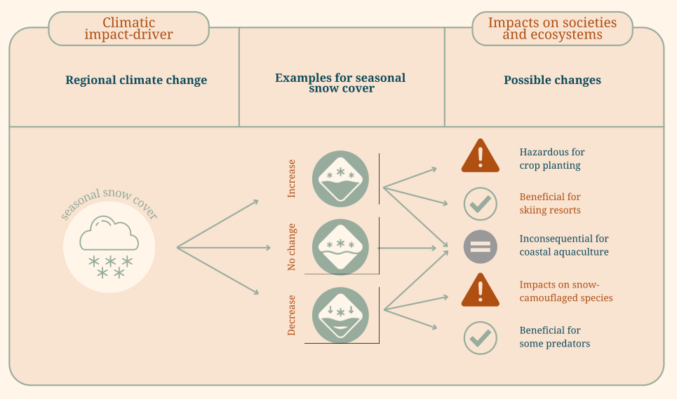
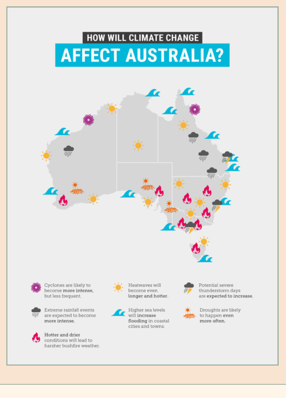
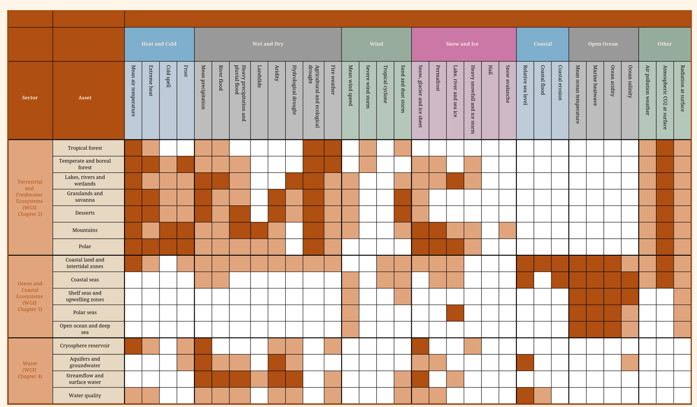
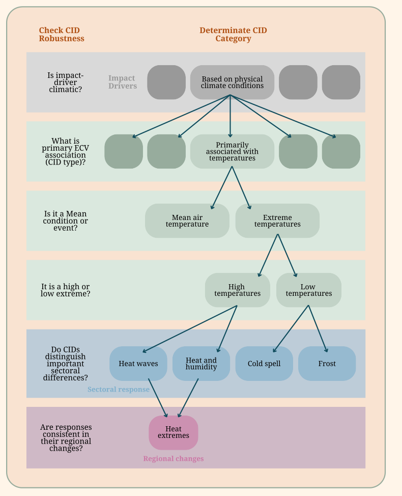

# Module 4 Identifying local Climatic Impact-Drivers

In the previous sections, you have learned about methods and tools for understanding the local context and priorities. In this module, you will connect physical climate information to local impacts and possible adaptation responses by defining climatic impact-drivers (CIDs). CIDs are climate conditions that can lead to hazards, affecting nature and society. For example, impacts on forest ecosystems that are highly sensitive to drought during the dry season would be connected to a CID defined as "rainfall deficit during June, July, and August", in a particular region. Likewise, a crop susceptible to heat stress may be linked to a CID defined by "temperature exceedance above a specific threshold".

After defining CIDs, in [module 5](module-5.md) you will learn how to work with real observations to evaluate CIDs and past hazards. Then, in [module 7](module-7.md) you will evaluate how these CIDs change in future climates to produce relevant information tailored to the needs of a community or sector. We will also present an example that illustrates how qualitative information can be translated into quantitative CIDs through a case study. The accompanying practical guides demonstrate how to develop CIDs based on stakeholder interviews and participatory processes, and how to validate the defined CIDs and their associated thresholds using observations or records of historical events.

## 1. Background

While a community is often aware of the climate impacts they face, if your task is understanding the past, the future, and the potential risks of today, you must now link such impacts to physical climate information, such as future climate projections or historical trends. To do this, you have to identify a meteorological variable that relates to this impact and the corresponding thresholds that make different meteorological or climate conditions potentially risky or beneficial. The Climatic Impact-Driver (CID) framework, introduced in IPCC AR6 and described in detail in Ruane et al., 2022, enables scientists and practitioners to work with impact and risk experts to identify tolerance thresholds that are system- and sector-specific to support targeted, decision-relevant risk evaluation. Importantly, the CID framework places the affected communities and ecosystems at the center of the analysis, which avoids labeling climate conditions as inherently "hazardous", recognizing that the same change may be detrimental for some and beneficial for others.

We will introduce two options for identifying relevant CIDs. **Option one:** Select a CID from the literature, for example, previous studies in similar systems. Chapter 12 in the Working Group I Assessment Report 6 and the Working Group II Assessment Report of the IPCC serve as good go-to documents to find references. To help you with this task, we summarize key concepts and a list of extensively used CIDs in this module. **Option 2:** Start by studying the system, understanding the local needs, which can derive into using an existing CID or defining a new one. This requires field work and a process of validation of the selected CIDs to ensure their relevance. The two approaches are complementary, and you might identify an index from the literature but adapt the thresholds or the definitions to better adjust to the needs of your case study.

!!! definitions "Definitions"

    **Climatic impact-drivers (CIDs)** are climate conditions that affect the things we care about in nature and society. In the 6th Assessment report of the IPCC, the use of CIDs was introduced to bridge between physical variables and relevant indices most appropriate for the impact of interest. CIDs and their changes can be beneficial or positive, detrimental or negative, neutral, or a mixture of each across interacting system elements and regions. This will depend on the impacted system.

    <figure markdown="span">
      
      <figcaption><strong>Figure 4.1.</strong> Climatic impact-drivers (CID) capture select characteristics of climate conditions (e.g., means, events, and extremes) that are relevant for impacts and risk management. CIDs emerge from the combination of climate phenomena with information on vulnerability and exposure determining assets' climatic responses, which allows translation of CIDs into hazards (associated with risk) or boons (associated with benefits or opportunities) for stakeholder management. Adapted from Ruane et al. (2022).</figcaption>
    </figure>

## 2. Option 1: Selecting Climatic Impact-Drivers from the IPCC report or literature related to the sector

A **CID category** is a classification within the CID Framework that groups related CIDs based on the dominant physical climate conditions affecting systems and assets. Each category is analysed using tailored indices to evaluate system- and sector-specific thresholds, supporting adaptation, mitigation, and risk management while avoiding assumptions that any condition is inherently hazardous. CID categories center impacts on affected communities and ecosystems and include groups such as heat and cold, wet and dry, wind, coastal, and ice and snow, allowing consistent analysis across diverse risks and benefits. Table 4.1 summarizes the most commonly used CIDs, their corresponding categories and their regions of relevance. Among the most widely used CIDs associated with impacts are:

**Heat and Cold CIDs** focus on temperature-related conditions that influence human health, ecosystems, and infrastructure, ranging from long-term mean temperature changes to episodic extremes such as heatwaves and cold spells. Quantitatively, these CIDs are often expressed using metrics such as changes in mean surface air temperature (e.g., °C) or the frequency, duration, and intensity of extreme heat events exceeding sector-specific thresholds (for example, number of days above a critical temperature relevant for health or labor productivity).

**Wet and Dry CIDs** encompass precipitation, flooding, drought, and related hydrological processes that regulate water availability and hazards across landscapes. These CIDs are commonly quantified using indices such as total seasonal precipitation, maximum multi-day rainfall, soil moisture anomalies, or runoff deficits, enabling assessments of flood risk, water scarcity, and agricultural stress across regions and time periods.

Some CID categories are more specific, and their definition may depend strongly on regional geography and system characteristics, such as coastal settings. For example, Coastal CIDs address climate drivers affecting coastlines, including relative sea level rise, coastal flooding, and erosion, and are often quantified using metrics such as rates of sea level rise (e.g., mm yr⁻¹) or the frequency of extreme coastal water levels. These CIDs integrate oceanic and atmospheric processes and are particularly relevant for low-lying coastal communities, infrastructure, and ecosystems sensitive to changing water levels and storm dynamics.

**Table 4.1.** List of relevant Climatic Impact-Drivers (CIDs) (see more exhaustive list in Appendix)

| CID Type | CID Category | Brief Description | Physical Description of Phenomena | Regions of Relevance |
|---|---|---|---|---|
| Heat and Cold | Extreme heat | Episodic high temperatures | Episodic high surface air temperature events potentially exacerbated by humidity. | Global, continental regions |
| Heat and Cold | Cold spell | Episodic cold events | Episodic cold surface air temperature events potentially exacerbated by wind. | Mid- to high-latitude regions, continental interiors |
| Heat and Cold | Frost | Freeze–thaw events | Freeze and thaw events near the land surface and their seasonality. | Mid- to high-latitude regions, agricultural and mountainous areas |
| Wet and Dry | Heavy precipitation and pluvial flood | Intense rainfall and surface flooding | High rates of precipitation and resulting episodic, localized flooding of streams and flat lands. | Global, especially urban and low-lying regions |
| Wet and Dry | Agricultural and ecological drought | Soil moisture deficit | Episodic combination of soil moisture supply deficit and atmospheric demand that challenges vegetation water needs for transpiration and growth. | Agricultural regions and natural ecosystems worldwide |
| Wet and Dry | Fire weather | Wildfire-conducive weather | Weather conditions conducive to triggering and sustaining wildfires, based on indicators such as temperature, soil moisture, humidity and wind (excluding fuel load). | Fire-prone regions globally |
| Wind | Severe wind storm | Extreme wind events | Episodic severe storms including extratropical cyclones, thunderstorms, wind gusts, derechos and tornadoes. | Mid-latitude and convective storm regions |
| Wind | Tropical cyclone | Tropical storm systems | Strong, rotating storms originating over tropical oceans with high winds, rainfall and storm surge. | Tropical and subtropical ocean basins and adjacent coastlines |
| Snow and Ice | Snow avalanche | Snow mass movement | Cryospheric mass movements caused by collapsing snowpack. | Mountain regions |
| Coastal | Relative sea level | Sea level change | Local mean sea surface height relative to the local solid surface. | Global coastlines |
| Coastal | Coastal erosion | Shoreline change | Long-term or episodic shoreline position change caused by sea level rise, waves, currents and storm surge. | Global coastlines |
| Open Ocean | Marine heatwave | Extreme ocean warmth | Episodic extreme ocean temperature events. | Global oceans |
| Other | Air pollution weather | Pollution-favorable conditions | Atmospheric conditions increase the likelihood of high particulate matter or ozone concentrations. | Urban and industrial regions |
| Other | Radiation at surface | Surface radiation balance | Net shortwave, longwave and ultraviolet radiation balance at Earth's surface and its diurnal and seasonal patterns. | Global |

Many CIDs are relevant to multiple sectors, while others are more firmly established within specific applications such as health, agriculture, water resources, or coastal systems. Several of these CIDs are widely used in the IPCC Working Group II (WGII) report and in numerous research studies assessing future changes and projections; Table 4.2 highlights selected CIDs by sector and indicates those most commonly applied.

<figure markdown="span">
  { width="360" }
  <figcaption><strong>Figure 4.2.</strong> CID categories and their spatial relevance. Adapted from the Australian Climate Council.</figcaption>
</figure>

<figure markdown="span">
  
  <figcaption><strong>Table 4.2.</strong> Relevance of key CIDs (and their respective changes in intensity, frequency, duration, timing, etc.) for major categories of systems or ecosystems. The color code shows the "confidence level", which indicates how many studies have focused on the connection between the CID and the system. Adapted from the IPCC.</figcaption>
</figure>

!!! faq "Frequently Asked Questions about Climatic Impact-Drivers"

    **How are CIDs different from climate hazards?** CIDs describe the climate conditions themselves, while hazards refer to potentially damaging events that may result from those conditions (e.g. Heavy precipitation (CID) vs. flooding (hazard)).

    **Are CIDs the same everywhere?** No. While many CIDs are globally defined, their relevance, thresholds, and seasons vary by region.

    **Are CIDs only climate variables?** CIDs are evaluated from physical climate variables, but their definition is sometimes a combination of variables, or is a very particular way of quantifying such variables in a way that it relates to the system (i.e. how many consecutive days does the variable exceed a threshold).

    **Does a CID need to be linked to physical measures of the described phenomena, or can it be only a qualitative description?** As they are defined, CIDs are linked to physical measures.

    **Can stakeholder knowledge be used to define CIDs?** Yes. Interviews and participatory processes help identify which climate drivers matter most locally.

    **Are CIDs always related to negative impacts?** No. CIDs can be related to both hazards (which can lead to risks) or "boons", which can lead to benefits. Interviews and participatory processes help identify which climate drivers matter most locally.

    **How many CIDs should be analysed?** There is no fixed number. Toolkits often prioritise a small set of key drivers to maintain clarity and usability.

    **How do CIDs support communication?** CIDs provide a common language between scientists, practitioners, and decision-makers by focusing on impact-relevant climate conditions.

## 3. Option 2: Defining Climatic Impact-Drivers based on knowledge about a specific community or sector

The CID framework is intentionally flexible and can be further developed by practitioners or researchers to better reflect the priorities, knowledge, and lived experiences of a community. By refining the selection process through local data, stakeholder input, or sector-specific expertise, users can ensure that identified CIDs directly align with community needs, enabling more targeted, effective, and equitable adaptation planning. The following "How-to-guide" presents a step-by-step guide and the example included after shows how this can be done.

## How-To guide: Translating qualitative interview information into Climatic Impact-Drivers { #how-to }

!!! howto "How-To guide"

    This section outlines the process for translating qualitative interview information (left column, Table 4.1) into quantitative measures for each identified CID. In [module 3](module-3.md), you learned about different methods to learn about the local context. One of such methods are interviews, here we will take statements from interviews as a starting point, but this guide could be adapted to other types of information from the local context.

### Step 1: Extract climate signals from information about the local context

Revise the interview transcripts, being aware of and highlighting statements that can be linked to one or more CIDs. To do this, search to identify statements related to (a) climate variables (temperature, water-precipitation, frost), (b) temporal characteristics (seasonal changes, extreme events, long-term trends and (c) impacts linked to climate phenomena (e.g. flooding, crop stress, landslides). Associated with each statement, identify the (1) climate variables can be explicitly or implicitly mentioned (e.g. rainfall intensity, drought frequency, heat). Alternatively, identify (2) impacts that are mentioned; in this case, infer the variable or variables (i.e. drying crops may be associated with low precipitation but also heavy precipitation in the harvest season or frost after bud bursts). The latter case might require further inquiry to clarify the identified variables leading to impacts.

<figure markdown="span">
  { width="420" }
  <figcaption><strong>Figure 4.3.</strong> The example shows the "heat and cold" category of CIDs that are primarily associated with the air temperature essential climate variable. Adapted from Ruane et al. 2022</figcaption>
</figure>

### Step 2: Match interview insights to Climatic Impact-Drivers

For each identified statement:

- Assign the most relevant CID category (e.g. mean precipitation, heavy precipitation, hydrological drought)
- Note whether the concern relates to mean conditions, or events (extremes), or variability (unpredictability, variable year-to-year behaviour)
- Record the temporal (days/seasons) and spatial (local, regional, national) scale implied

### Step 3: Select observable climate variables and quantitative thresholds or measures that capture relevant impacts

For each CID, identify a corresponding measurable, physically observable or modelled variable and the frequency of the data required for quantification. At this stage, do not restrain your definition of the CID to the available information. First try to define which information would be relevant to address the impact. In [module 5](module-5.md) and [module 6](module-6.md) we will introduce sources of climate information. First, translate variables into quantitative indicators by specifying the:

- Aggregation periods (daily, monthly, seasonal)
- Statistical metrics (mean, frequency, duration, intensity) and thresholds (e.g. rainfall above the 95th percentile)

For example, "increased flooding" may be quantified as the annual number of days exceeding a high-precipitation threshold, and is related to an extreme event. "Harvest needs to be done earlier" is a change in a mean condition, the seasonal cycle.

**Mean conditions:**

- Mean precipitation → seasonal or annual rainfall totals (monthly data)
- Mean temperatures → mean conditions (monthly data)
- Seasonal shift in precipitation or temperature → onset and offset dates of the rainy or warm season (daily data)

**Extremes:**

- Heavy precipitation → multiply ways of quantifying (daily or sub-daily rainfall maxima, frequency of threshold exceedance) - (daily data)
- Hydrological drought → multiple quantification methods: streamflow, runoff, or standardised drought indices (SPI, SPEI). (precipitation and evapotranspiration) (monthly data)
- Extreme heat → maximum temperature or heat indices (daily data)

Once the Climatic Impact-Drivers have been defined you can engage in the analysis of data ([Module 5](module-5.md)), the comparison with observed and modeled climate and perceived climate changes (Modules 2, 5 and 7), include them in a causal diagram as mediators between physical climate change and impacts (Module 8) and engage in the communication of results (Module 9). Next we outline how these steps would work and refer to the corresponding toolkit module.

### Step 5: Choose data sources (see Modules 5 and 7)

Identify appropriate national datasets, such as:

- National meteorological station records
- Gridded observational or reanalysis products
- Regional or global climate model simulations

### Step 6: Compute historical and projected metrics (see Modules 5 and 7)

From the interviews, the baseline periods can also be inferred. If trends have been more pronounced in recent years, the baseline period should be defined accordingly.

### Step 7: Validate against interview insights (see Module 9)

Ideally, compare quantitative results with qualitative interview findings: Do trends align with stakeholder perceptions? Are key seasons or extremes captured by the indicators?

Discrepancies can reveal knowledge gaps, scale mismatches, or the need for refined indicators. Misalignment can be symptomatic of different issues rather than "local communities not being right".

### Step 8: Synthesise for decision-making

Summarise results in a format useful for practitioners:

- Tables or dashboards showing CID relevance and magnitude
- Clear explanations linking quantitative metrics back to interview-identified concerns.

This synthesis ensures that climate data analysis remains grounded in stakeholder experience.

## Resources and references

Chapter 12 of the IPCC AR6 report (WG I): <https://www.ipcc.ch/report/ar6/wg1/downloads/report/IPCC_AR6_WGI_Chapter12.pdf>

Regional and sectoral fact sheets from IPCC: <https://www.ipcc.ch/report/ar6/wg1/resources/factsheets/>

Access data for climate indices related to extremes and the associated definitions and references: <https://www.climdex.org/learn/indices/>

Pulkkinen, K., Undorf, S., Bender, F., Wikman-Svahn, P., Doblas-Reyes, F., Flynn, C., Hegerl, G. C., Jönsson, A., Leung, G.-K., Roussos, J., Shepherd, T. G., & Thompson, E. (2022). The value of values in climate science. Nature Climate Change, 12(1), 4–6. <https://doi.org/10.1038/s41558-021-01238-9>

Ruane, A. C., Vautard, R., Ranasinghe, R., Sillmann, J., Coppola, E., Arnell, N., Cruz, F. A., Dessai, S., Iles, C. E., Islam, A. K. M. S., Jones, R. G., Rahimi, M., Carrascal, D. R., Seneviratne, S. I., Servonnat, J., Sörensson, A. A., Sylla, M. B., Tebaldi, C., Wang, W., & Zaaboul, R. (2022). The Climatic Impact‐Driver Framework for Assessment of Risk‐Relevant Climate Information. Earth's Future, 10(11), e2022EF002803.

