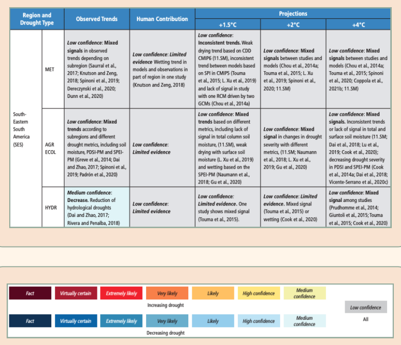
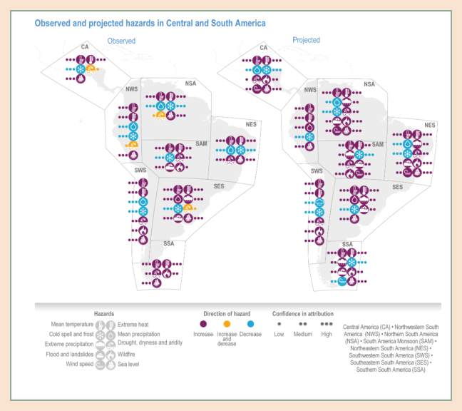
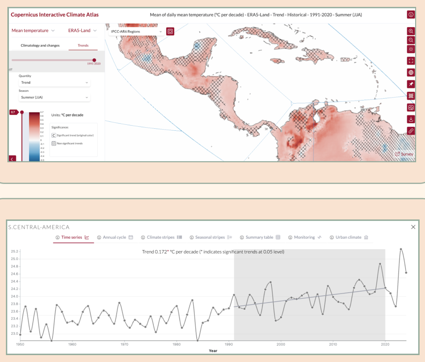
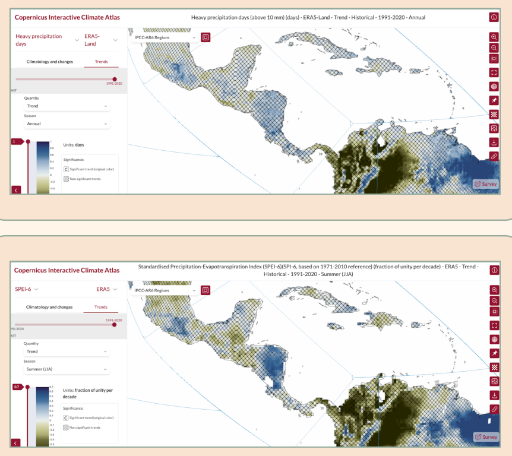
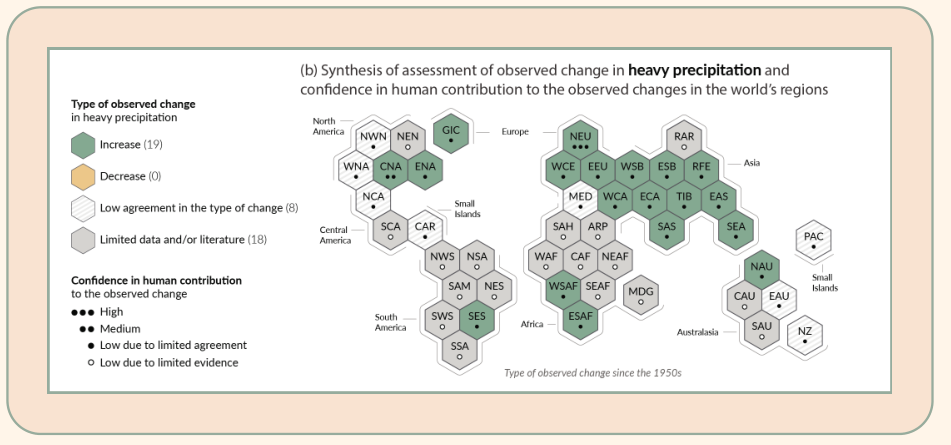

# Module 5 Bridging observations and climate models and analysing historical changes

## 1. Introduction: detection and attribution of climate change

We now arrive at a key question for this climate evidence process: how can we tell whether the chosen climatic impact-drivers for our region have been changing, and how do we know whether this was caused by climate change? In this module, you will learn about trend detection and attribution developed in physical climate science to help you answer these questions. We first introduce some key concepts - climate change, climate variability, detection and attribution - and answer frequently asked questions. We then present three options for detecting historical changes in climate data accessible to anyone with a computer and an internet connection:

- **A.** [Reviewing the regional results summarised in the IPCC](#option-a) (accessible).
- **B.** [Extracting information on trends in reanalysis data using the Copernicus Interactive Climate Atlas](#option-b) (medium difficulty).
- **C.** [Analysing data from a local weather station or other observational dataset yourself using a Google Colab notebook](#option-c) (advanced).

Through practical examples and discussion, we discuss what can, and what cannot be concluded based on these lines of evidence. For the interested reader, we also give an overview of methods for extreme event attribution and illustrate this using the example of the attribution of extreme wildfires in the Amazon and Pantanal region.

!!! definitions "Definitions"

    **(Anthropogenic) Climate change:** (paraphrased from the IPCC Glossary) Climate change is defined as a change in the climate system that persists for an extended period, typically decades or longer. This can be a change in the average temperature, precipitation, or another climatic impact-driver, or a change in the variability or extremes of these variables. Climate change can occur for a number of reasons: changes in the solar cycle, volcanic eruptions, human activities or variability internal to the climate system. Anthropogenic climate change is defined as "a change of climate which is attributed directly or indirectly to human activity [...] which is in addition to natural climate variability observed over comparable time periods" (quoted from Article 1 of the UNFCCC, defined there simply as climate change). It is always important to distinguish whether we are talking about climate change, which can simply be detected from observations, or anthropogenic climate change, which requires attributing this change. Detection and Attribution are defined below.

    **Climate variability:** (paraphrased from the IPCC Glossary) Variability in observed climate at all spatial and temporal scales beyond that of individual weather events. This variability can be internal to the climate system, driven, for example, by large-scale climate drivers such as the El Niño Southern Oscillation introduced in [module 6](module-6.md), in which case it is called internal variability.

    **Trend detection:** (paraphrased from the IPCC Glossary) Detection of change means showing that a climatic impact-driver has changed from one period of time to another in some statistical sense, without providing a reason for that change.

    **Attribution:** (Paraphrased from the Technical Summary of IPCC AR6 WG1) In simple terms, attribution tries to understand the question of why the climate is changing. More formally, attribution is the process of evaluating the contributions of different causal factors to an observed change in a climate variable or climatic impact-driver (trend attribution) or the occurrence of a single extreme climate-related event (extreme event attribution). Possible factors that trends or events can be attributed to include human activities such as land-use change, greenhouse gas or other emissions, but also natural drivers such as volcanic eruptions or internal variability of the climate system. Trend attribution has been used to, for example, understand the causes of the rise in global surface temperature in recent decades - the basis for global climate action - while extreme event attribution has been used to, for example, investigate whether individual extreme events would have played out differently, had they happened in a different climate - say 100 years into the future or past. You can find more details on attribution in [Section 5](#outlook) of this module, as well as Cross-Working Group Box 1.1 of the IPCC AR6.

!!! faq "Frequently asked questions on detection and attribution"

    **Why is it more difficult to detect changes in some climate variables than others, and attribute them to anthropogenic climate change?**

    Changes in some climate variables - for example, surface temperature averaged over the entire globe - have been attributed to human emissions a long time ago, and constitute the basis of climate mitigation action. In general, climate variables mainly driven by dynamical changes and small-scale processes, such as precipitation, have more uncertainties associated with their response to climate change than climate variables driven by thermodynamic changes and at larger spatial scales, such as temperature. (see Shepherd (2014), and also IPCC Box 11.1 | Thermodynamic and Dynamic Changes in Extremes Across Scales). The response of variables driven by thermodynamic changes is often similar in multiple regions, because they are all related to the globally increasing temperatures. For example, maximum temperatures, the frequency and length of heat waves and the amounts of rainfall that can precipitate in an extreme event (a warm atmosphere can hold more moisture), depend on Earth's mean temperature and local radiative balance. If global temperature increases, all of these increase.

    Other variables, such as mean precipitation at the regional scale or droughts, depend on large-scale drivers that control moisture transports. For example, in Indonesia, the climate is partly controlled by the Indian Ocean Dipole or in the Amazon by the El Niño Southern Oscillation (introduced in [Module 6](module-6.md)). In general terms, it is therefore useful to distinguish between CIDs dependent on thermodynamics (global mean temperatures) and CIDs dependent on dynamics to know when to incorporate which type of information.

## 2. Option A: Reviewing regional results on detection and attribution in the IPCC { #option-a }

**Benefits of reviewing information from the IPCC:** The IPCC provides information on regional climate change and its attribution to anthropogenic emissions. Using information published in the IPCC does not require any particular tool or modelling skill, just a stable internet connection. The reports are published openly and can be accessed by anyone at no cost. The IPCC summarises the status of academic literature on a particular topic and is written by many scientists who are experts in their fields, and often brings together different lines of evidence within science, making the information more robust than the findings of any particular academic publication.

**Caveats and drawbacks of reviewing information from the IPCC:** The main IPCC report, where detailed information on particular regions and impacts can be found, is published only in English and in rather academic and IPCC-specific language. Another drawback is that the regional results are averaged by so-called IPCC regions, meaning that changes at the local level can be masked (Mindlin et al 2023). The results are also slightly dated: the last IPCC WG1 report, for example, was published in 2021, since when the understanding of regional changes and methods to assess them has advanced. Also, global economic inequalities and resulting inequalities in available funding for research lead to some regions and impacts - mainly those relevant for the Global North - being much more extensively researched than others, leading to biases in coverage and evidence in the IPCC.

**Resources:** Through two examples, we explain how to review and interpret the results found in these two chapters.

!!! howto "How-To guide: Reviewing the IPCC"

    **Step 1: Open the IPCC report**

    The latest IPCC reports can be found here <https://www.ipcc.ch/report/ar6/wg1/> (Working Group 1 - The Physical Science Basis) and here <https://www.ipcc.ch/report/ar6/wg2/> (Working Group 2 - Impacts, Adaptation and Vulnerability). In WG1, two important chapters for looking up results on detection and attribution are Chapter 11 on "Weather and Climate Extreme Events in a Changing Climate" and Chapter 12 on "Climate Change Information for Regional Impact and for Risk Assessment". In WG2, individual regions have their own chapters (Chapters 9-15), as well as cross-chapter papers on specific ecosystems such as polar regions, mountains or desert regions.

    **Step 2: Review relevant chapters of the IPCC**

    Depending on your chosen climatic impact-drivers, different chapters might be more or less relevant for you. Here, we give you a guide on three relevant Chapters that is illustrated below using the example of changes in drought conditions over South-Eastern South America.

    [Chapter 11 of WG1](https://www.ipcc.ch/report/ar6/wg1/downloads/report/IPCC_AR6_WGI_Chapter11.pdf) of the IPCC on Weather and Climate Extreme Events in a Changing Climate summarises the academic literature on detection and attribution of climatic impact-drivers in long tables, found from Table 11.4 on page 1613 to Table 11.20 on page 1705. To look up information on one of the climatic impact-drivers identified in [module 4](module-4.md), you search for your region and impact variable in the left column of the table. The example below guides you in interpreting the results shown in the table.

    In [Chapter 12 of WG1](https://www.ipcc.ch/report/ar6/wg1/downloads/report/IPCC_AR6_WGI_Chapter12.pdf), titled "Climate Change Information for Regional Impact and for Risk Assessment", information for each IPCC region and a list of predefined climatic impact-drivers is summarised tables. The main information in the tables is on future climate change (colours). However, the small purple dots indicate whether the change in this impact driver already emerged from natural variability over the past period.

    In WG2, you would go to the Chapter summarizing information about your region (in our example, this is Chapter 12 on Central and South America).

    **Step 3: Summarise the information**

!!! examples "Example: Changes in Droughts in South-Eastern South America"

    **WG1 Chapter 11:** Below is a screenshot of the information summarised on drought in South-Eastern South America (SES). The different rows give information on different types of drought: 1) meteorological (MET) drought, which is defined as a rainfall deficit; 2) agricultural/ecological (AGR ECOL) drought, which is defined as a soil moisture deficit that can be caused by both high temperatures and low rainfall and 3) hydrological (HYDR) drought, which is defined as low water reserves. As seen in the colourbar below the table, the background colour of the table summarises the overall confidence in the stated results. For more information on the language around confidence and likelihood used in the IPCC, have a look at WG1 Box 1.1, which can be found here <https://www.ipcc.ch/report/ar6/wg1/downloads/report/IPCC_AR6_WGI_Chapter01.pdf>.

    <figure markdown="span">
      
      <figcaption><strong>Figure 5.1:</strong> Screenshot of IPCC Working Group 1 Chapter 11. Table 11.15 | Observed trends, human contribution to observed trends, and projected changes at 1.5°C, 2°C and 4°C of global warming for meteorological droughts (MET), agricultural and ecological droughts (AGR/ECOL), and hydrological droughts (HYDR) in Central and South America, subdivided by AR6 regions.</figcaption>
    </figure>

    The second column from the left, 'Observed Trends', summarises results on the detection of trends. In this case, almost all of the results shown in the table have 'low confidence', for example, because there are mixed signals depending on the subregions in the case of meteorological drought. This is an example of the limitation of using the information summarised for an entire IPCC region mentioned above. The citations after the summary statements refer to papers that you can look up to get more details on this information. The next column, 'Human Contribution', summarises findings from the attribution of the trends to anthropogenic climate change. Again, there is low confidence in the overall statement, this time because of limited evidence, as there is only one study investigating the trends in meteorological drought in this region. The final three columns show information about future climate change, which we will learn about in more detail in [Module 7](module-7.md).

    **WG2 Chapter 12:** The Figure below from this chapter summarises information on observed changes across a range of climatic impact-drivers (focus on the left side), illustrated through small icons. The colour indicates the observed change, and the dots next to the icon indicate the confidence that scientists have that this change is caused by human emissions (attribution). We find that over some regions in Central and South America (CA, NSA, NWS, SES), observed changes in drought conditions are ambiguous (yellow colour), and confidence in the attribution is low (one dot). Over other regions (SWS, SAM, NES, SSA), drought conditions have increased in the past (purple), and we have medium or high confidence in their attribution to human emissions (two or three dots). The right side of the figure showing results from future projections will be further explained in [Module 7](module-7.md).

    <figure markdown="span">
      
      <figcaption><strong>Figure 5.2:</strong> Screenshot of IPCC Working Group 2, Chapter 12 - Figure 12.6 | Observed trends (WGI AR6 Tables 11.13, 11.14, 11.15) (Seneviratne et al., 2021) and summary of confidence in direction of projected change in climatic impact drivers, representing their aggregate characteristic changes for mid-century for RCP4.5, SSP3-4.5 and SRES A1B scenarios, or above within each AR6 region, approximately corresponding (for CIDs that are independent of SLR) to global warming levels between 2°C and 2.4°C (WGI AR6 Table 12.6) (Ranasinghe et al., 2021).</figcaption>
    </figure>

## 3. Option B: Analysing changes in observations or reanalysis data: tutorial on the Copernicus Interactive Climate Atlas (CICA) { #option-b }

We now learn about other reliable sources of information about past trends that you can draw on, in addition to the information published in the IPCC. One such option is the Copernicus Interactive Climate Atlas (CICA; <https://atlas.climate.copernicus.eu/atlas>), published by the Copernicus Climate Change Service (C3S). C3S is a climate information programme provided by the Copernicus Earth Observation Programme of the European Union. The advantage of CICA is that it draws on the same open-source models and datasets that are used in the IPCC, but it is updated more regularly and allows you to select your own region of interest. This can be useful, in particular if the IPCC states 'low confidence' due to conflicting signals over the relevant selected region.

Using the interactive atlas, we can download and visualise climate data from the past, present and future and analyse trends. However, it is important to note that we will not be able to make attribution statements with the information from the atlas - we can only analyse if there was a trend over the past period, not understand its causes.

Using the CICA, you can access information about past climate in the form of so-called reanalysis data. Reanalysis data uses a weather model to fill in missing values between actual historical observations. Through this process of in-filling, reanalysis data has a global coverage over both land and ocean. On the flipside, this infilling creates biases: for example, extreme rainfall or wind values are underestimated in reanalysis data in many regions. Reanalysis data can also over- or underestimate trends, and still has quite a low resolution (around 31 x 31 km).

!!! howto "How-To guide: The Copernicus Atlas"

    **Video-Tutorial on using the Copernicus Interactive Climate Atlas**

    In this video tutorial, we guide you through the process of using CICA - defining your own region, selecting a variable of interest and analysing the trend and significance of that trend in that region, and finally downloading that data. Please click here to access the tutorial: [Video tutorial (Google Drive)](https://drive.google.com/drive/folders/1xhes_v6NbMJ-loJe17Yrcy6wfbSImE74)

    Further information and resources on the Copernicus Interactive Climate Atlas can be found here:

    - <https://climate.copernicus.eu/copernicus-interactive-climate-atlas-game-changer-policymakers>
    - <https://climate.copernicus.eu/copernicus-interactive-climate-atlas-guide-powerful-new-c3s-tool>

    Further C3S material for learning to work with climate data can be found here:

    - <https://learning.ecmwf.int/course/index.php?categoryid=8>
    - <https://ecmwf-projects.github.io/copernicus-training-c3s/intro.html>

!!! examples "Example: Changes in seasonal drought over Costa Rica"

    Our starting points are three of the climatic impact-drivers identified in [module 4](module-4.md): Drought indices such as the SPI (Standardised Precipitation Index) or the SPEI (Standardised Precipitation Evapotranspiration Index) covering the months June to August, and heavy rainfall leading to flooding across all seasons. The information we downloaded from the video tutorial is shown here:

    <figure markdown="span">
      { width="480" }
      <figcaption><strong>Figures 5.3:</strong> Trends in mean daily temperatures. <strong>Interpretation:</strong> In the reanalysis data, there is a positive trend in mean temperatures over the last 30 years that is significantly different from zero over most parts of the region.</figcaption>
    </figure>

    <figure markdown="span">
      { width="480" }
      <figcaption><strong>Figure 5.4:</strong> Trends in heavy precipitation days and a drought index (SPEI). <strong>Interpretation:</strong> There is no significant trend in either of the two climatic impact drivers over Costa Rica. This does not mean that climate change doesn't influence these variables - it just means that in the past, internal variability was so strong that a trend analysis was not able to detect the climate change signal. This result could also be due to biases in the reanalysis data. Another line of evidence to investigate the influence of climate change on drought and heavy precipitation over Costa Rica is to look at future climate projections, which will be introduced in module 7.</figcaption>
    </figure>

## 4. Option C: Python software notebook: analysing trends in weather station and satellite data { #option-c }

!!! howto "How-To guide: Analysing weather data"

    In this advanced option, you will learn how to analyse a trend directly in local observation data and a calibrated satellite product, CHIRPS (Funk et al 2015). All you need is a laptop and a Google account, and the time to engage with the programming language Python (AI tools can be very helpful for coding!). Using Google Colab, you do not need to install any further software on your laptop, and we pre-wrote code that you can run out-of-the-box.

    The complete how-to guide is hidden **[behind this link](https://colab.research.google.com/drive/1X3MQbyo8zhbAAt_MxIBWxP1j35RkSEfb?usp=sharing)**, have a look!

## 5. Outlook: Trend and extreme event attribution - approaches and methods { #outlook }

Attribution science, defined above, investigates the causes of changes in the climate system, either in terms of trends or individual extreme events. Here, we give a brief introduction to the steps involved in making such an attribution statement. Because the topic is advanced and a relatively new area of research, we do not include a how-to guide for you to make your own attribution statement.

Making an attribution statement requires constructing a counterfactual. A counterfactual is a 'what if' scenario of the world under different circumstances than those observed. Examples of counterfactuals could be: "How strong would this heatwave have been without climate change?" or "How strong would the 2024 drought in the Amazon region have been without climate change?", but also "How strong would the 2024 drought in the Amazon region have been in a world without the deforestation seen in the past decades?"

Answering such a counterfactual question quantitatively requires a quantitative model of the event in question that has a causal interpretation. A quantitative model is a simplified representation of a real-world system where the different components (for example, rainfall and crop productivity) are related to each other through equations to answer specific questions. A causal interpretation of this quantitative model can be built through process-understanding, such as the causal diagram we are developing in this toolkit ([Module 2](module-2.md)), as well as physical theory, such as the laws of thermodynamics. In many attribution studies, where a meteorological variable or climate-impact driver is investigated, the causal interpretation is given by the physical laws that underlie a climate model.

The next step is to build a quantitative model that represents this causal understanding of processes influencing the impact in question. If the model is able to accurately predict past events (for example, a flood model is able to accurately predict historical floods, or a climate model is able to represent past heatwaves), we can trust it to make a robust attribution statement.

Once trust in the model has been established, the next step is to construct the counterfactual. This can mean simulating the climate system without human emissions using one (or several) global climate models, or running a wildfire model with a different land cover, where all deforested areas have been converted back to forest. Attribution approaches differ in how exactly this counterfactual is built. Finally, we can compare the outcome predicted by the model under counterfactual conditions with the actual outcome to make a statement such as: "This maximum temperature during this particular heatwave would have been 3°C lower in a world without human greenhouse gas emissions" or "A heatwave of this magnitude would have been 2 times less likely in a world without climate change".

While we are not providing you with a guide to conduct your own attribution study here, there are still a number of resources to access results from existing attribution studies conducted by academics all over the world:

- World Weather Attribution (WWA) <https://www.worldweatherattribution.org/> conducts rapid attribution studies in the immediate aftermath of events.
- For specific hazards such as wildfires, there are dedicated resources, such as the annual State of Wildfires report, which conducts a more detailed attribution study of major wildfire events every year <https://stateofwildfires.com/>
- The Bulletin of the American Meteorological Society, a well-known academic journal in climate science, has an annual special collection on 'Explaining extreme events from a climate perspective' which you can access [here](https://www.ametsoc.org/ams/publications/special-collections/explaining-extreme-events-from-a-climate-perspective-ams-special-collection/).
- You can also use popular academic search engines such as [Google Scholar](https://scholar.google.com/) to find academic articles on a specific event that you are interested in.

You can also access information on trend and extreme event attribution in the IPCC, following the Option A described above and reviewing results from [Chapter 11 on Weather and Climate Extreme Events in a Changing Climate](https://www.ipcc.ch/report/ar6/wg1/downloads/report/IPCC_AR6_WGI_Chapter11.pdf).

You will also be able to find summary figures for some variables in the Summary for Policymakers document, which is available in further languages:

<figure markdown="span">
  
  <figcaption><strong>Figure 5.5:</strong> IPCC Summary for Policy Makers. Screenshot of Figure SPM.3 | Synthesis of assessed observed and attributable regional changes. The IPCC AR6 WGI inhabited regions are displayed as hexagons with identical size in their approximate geographical location (see legend for regional acronyms). All assessments are made for each region as a whole and for the 1950s to the present. The confidence level for the human influence on these observed changes is based on assessing trend detection and attribution and event attribution literature, and it is indicated by the number of dots.</figcaption>
</figure>

However, there are a number of challenges to extreme event attribution that need to be carefully considered when interpreting results from attribution studies:

- Limited data (and related high model bias) - which is related to global inequality - can lead to inconclusive results
- Results of attribution studies have been shown to be sensitive to the choice of the event, region and duration of the event (see e.g. Cattiaux and Ribes 2018), as well as the baseline climate chosen (Hauser et al 2017)
- Always requires quantitatively modelling a counterfactual world; therefore, results primarily concern the hazard, but not include vulnerability and exposure aspects of risk and do not attribute impacts.
- The closer something is to the impact, the more factors influence it, and the harder it is to attribute to climate change

!!! examples "Example: Attributing extreme fire seasons in the Amazon and Pantanal region"

    We now go through the steps outlined above, looking at the specific example of attributing the extreme fire season of 2024/2025 in the Amazon and Pantanal regions to climate change. This attribution was part of a multi-stakeholder project and workshop organised ahead of COP30 in Brazil, co-funded by the BASE initiative and the World Climate Research Programme. A more detailed report on the attribution study can be found on [BASE's website](https://baseinitiative.net/).

    **Building a quantitative impact model based on causal assumptions:** To quantitatively link climate variables with burned area from wildfire activity, we use ConFLAME, which models burned area as a function of climatic, environmental, and human drivers (Kelley et al 2019). The model is trained on historical observations (2010–2024) using burned area data from MapBiomas and explanatory variables including temperature, precipitation, dry days, land cover, biomass, and ignition-related factors. ConFLAME applies Bayesian inference to explore many plausible relationships between these drivers and fire activity rather than assuming a single fixed relationship, generating probability distributions of burned area that explicitly capture uncertainty and natural variability.

    **Comparing outcomes under factual and counterfactual conditions:** To assess the role of anthropogenic climate change, the model simulates burned area under two scenarios: a factual climate based on reanalysis data and a counterfactual climate in which the long-term anthropogenic warming signal is removed using adjustments derived from climate model simulations. Comparing these simulations quantifies the influence of climate change using metrics such as the amplification factor (change in burned area), risk ratio (change in likelihood of extreme events), and the probability that burned area was higher in the factual world. This framework allows the study to estimate how human-driven climate change altered the likelihood and magnitude of extreme wildfire seasons while accounting for stochastic fire variability and model uncertainty.

## References

Hauser, M., Gudmundsson, L., Orth, R., Jézéquel, A., Haustein, K., Vautard, R., van Oldenborgh, G.J., Wilcox, L. and Seneviratne, S.I. (2017), Methods and Model Dependency of Extreme Event Attribution: The 2015 European Drought. Earth's Future, 5: 1034-1043. <https://doi.org/10.1002/2017EF000612>

Cattiaux, J., and A. Ribes, 2018: Defining Single Extreme Weather Events in a Climate Perspective. Bull. Amer. Meteor. Soc., 99, 1557–1568, <https://doi.org/10.1175/BAMS-D-17-0281.1>.

Funk, Chris, Pete Peterson, Martin Landsfeld, et al. 2015. 'The Climate Hazards Infrared Precipitation with Stations—a New Environmental Record for Monitoring Extremes'. Scientific Data 2 (1): 1. <https://doi.org/10.1038/sdata.2015.66>.

IPCC, 2021: Climate Change 2021: The Physical Science Basis. Contribution of Working Group I to the Sixth Assessment Report of the Intergovernmental Panel on Climate Change [Masson-Delmotte, V., P. Zhai, A. Pirani, S.L. Connors, C. Péan, S. Berger, N. Caud, Y. Chen, L. Goldfarb, M.I. Gomis, M. Huang, K. Leitzell, E. Lonnoy, J.B.R. Matthews, T.K. Maycock, T. Waterfield, O. Yelekçi, R. Yu, and B. Zhou (eds.)]. Cambridge University Press, Cambridge, United Kingdom and New York, NY, USA, 2391 pp. doi:10.1017/9781009157896.

Shepherd, Theodore G. 2014. 'Atmospheric Circulation as a Source of Uncertainty in Climate Change Projections'. Nature Geoscience 7 (10): 10. <https://doi.org/10.1038/ngeo2253>.

Mindlin, Julia, Carolina S. Vera, Theodore G. Shepherd, and Marisol Osman. 2023. 'Plausible Drying and Wetting Scenarios for Summer in Southeastern South America'. Journal of Climate 36 (22): 7973–91. <https://doi.org/10.1175/JCLI-D-23-0134.1>.

Kelley, D.I., Bistinas, I., Whitley, R. et al. How contemporary bioclimatic and human controls change global fire regimes. Nat. Clim. Chang. 9, 690–696 (2019). <https://doi.org/10.1038/s41558-019-0540-7>

