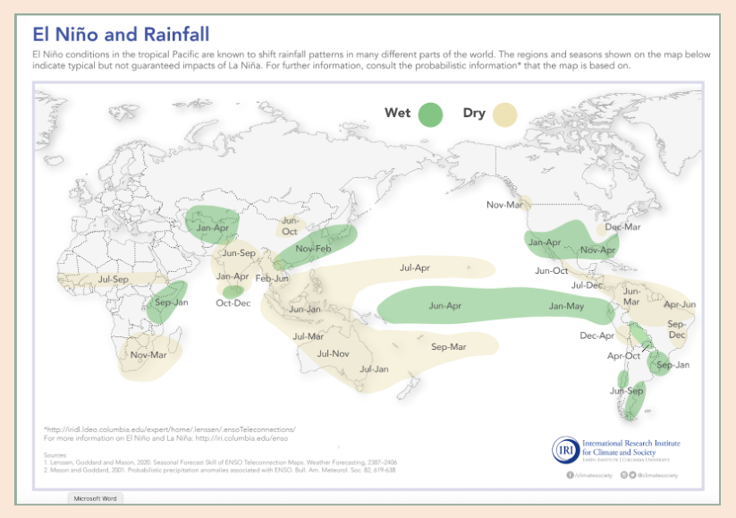
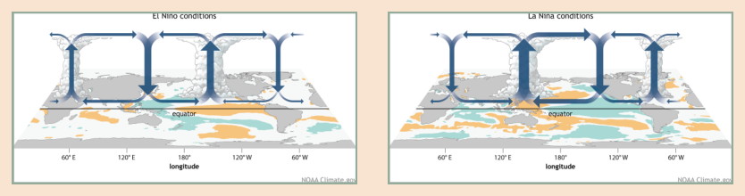
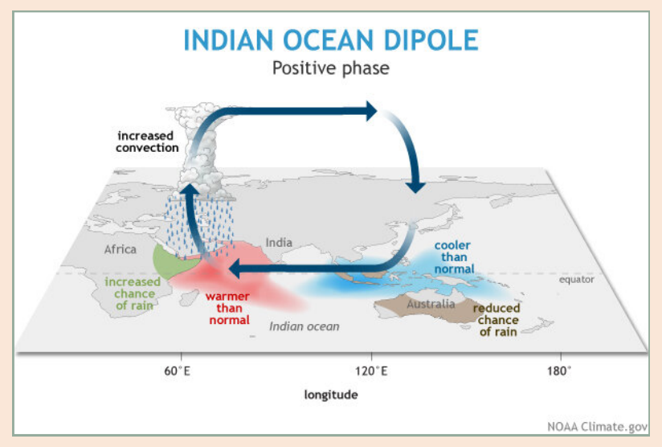
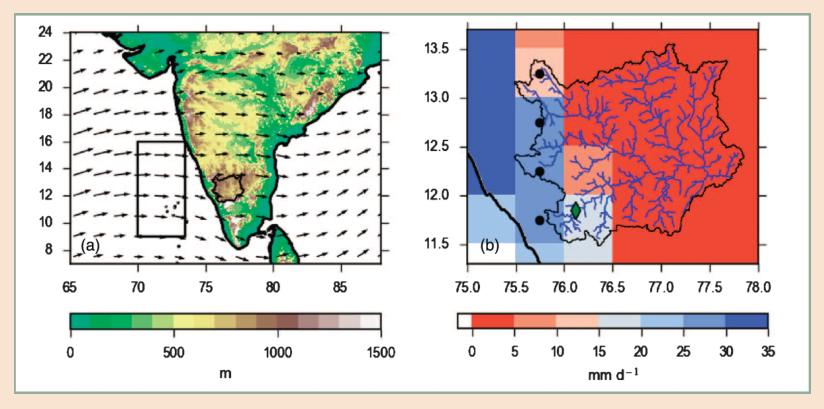

# Module 6 Using large-scale climate drivers and their teleconnections in local climate evidence

## 1. Introduction

The climate system is variable on many different timescales: local winds and pressure systems determine day-to-day weather, while greenhouse gas emissions cause a change in our climate, that is the range of possible weather conditions. At intermediate timescales between weather (days) and long-term climate change (decades to centuries), the climate we experience is influenced by large-scale climate phenomena which can remotely drive regional climate on timescales from weeks to years. We therefore call these phenomena **large-scale climate drivers.** The most famous example of such a large-scale climate driver is the El Niño Southern Oscillation (ENSO). These large-scale climate drivers can have impacts on meteorological variables such as rainfall, winds and temperature in very distant regions. The remote influences of large-scale climate drivers are called teleconnections. These **teleconnections** are specific to the seasons and regions studied: for example, the figure below shows seasonal and regional influences of El Niño events. Oftentimes, the way in which local climate changes in the future is also influenced by future changes in the relevant large-scale climate drivers: Future climate changes in Argentina, for example, can depend on how the El Niño Southern Oscillation is influenced by climate change, as we will discuss further in [Module 7](module-7.md).

<figure markdown="span">
  
  <figcaption><strong>Figure 6.1:</strong> Simplified illustration of the remote influence (teleconnections) of the El Niño Southern Oscillation on rainfall across the world in different seasons. Source: International Research Institute for Climate and Society at Columbia University, accessed under <a href="https://iri.columbia.edu/wp-content/uploads/2016/05/ElNino_Rainfall.pdf">https://iri.columbia.edu/wp-content/uploads/2016/05/ElNino_Rainfall.pdf</a>, based on: Lenssen, Goddard and Mason, 2020. Seasonal Forecast Skill of ENSO Teleconnection Maps. Weather Forecasting, 2387–2406 and Mason and Goddard, 2001. Probabilistic precipitation anomalies associated with ENSO. Bull. Am. Meteorol. Soc. 82, 619-638</figcaption>
</figure>

The impacts of these large-scale drivers are often known to and experienced by local communities, even though their influence is remote. ENSO provides a good example for this: it influences seasonal climate patterns in the tropical regions and across the globe, and is a key climate phenomenon to understand climate variability and change. The name 'El Niño', however, was given to it by fishermen along the coasts of Ecuador and Peru who observed warm waters around Christmas time (hence El Niño, the Christ child) that impacted their fisheries. Teleconnections can therefore provide a useful link between regional impacts observed by communities and global climate change discussed by scientists.

In this module, you will learn how understanding large-scale climate drivers relevant to your region or project can make climate information more interpretable and useful for local communities. We illustrate this on three case studies, explaining the different ways in which knowledge of these large-scale climate drivers can be useful. We then provide a straightforward how-to guide for incorporating knowledge on teleconnections into local climate evidence, along with an overview of the most common modes of variability in the climate system and their impacts, and links and resources to obtain further information.

!!! examples "Examples of large-scale climate drivers"

    ### Example 1: The El Niño Southern Oscillation

    **Description:** The El Niño–Southern Oscillation (ENSO) is a naturally occurring climate pattern in the tropical Pacific Ocean. It has three main phases: El Niño, La Niña, and neutral. El Niño is associated with warmer-than-average sea surface temperatures in the central and eastern Pacific, while La Niña is associated with cooler-than-average conditions. ENSO strongly influences global climate patterns at seasonal to annual timescales.

    <figure markdown="span">
      
      <figcaption><strong>Figure 6.2:</strong> Illustration of the two phases of the El Niño Southern Oscillation: El Niño Conditions (left) and La Niña conditions (right). Source: NOAA, accessed <a href="https://www.climate.gov/news-features/understanding-climate/el-nino-and-la-nina-frequently-asked-questions">https://www.climate.gov/news-features/understanding-climate/el-nino-and-la-nina-frequently-asked-questions</a>. Description: Circulation (December-February) anomaly during El Niño and La Niña events, overlaid on map of average sea surface temperature anomalies. NOAA Climate.gov drawing by Fiona Martin.</figcaption>
    </figure>

    **Teleconnections and impacts of past extreme years:** El Niño events are often associated with increased rainfall and flooding in parts of South America and East Africa, and drier conditions in Australia and Indonesia. La Niña often brings opposite impacts, such as wetter conditions in Australia and increased drought risk in parts of the Americas (see figure above). Strong ENSO events, such as those in 1997–98 and 2015–16, have caused widespread impacts on agriculture, wildfire seasons, water resources, ecosystems, and human health.

    **Predictability:** ENSO is one of the most predictable large-scale climate phenomena. Its phase and strength can often be forecast 6–9 months in advance, making it a cornerstone of seasonal climate prediction and early warning systems.

    **Possible future changes:** Climate change may influence the intensity and impacts of ENSO events, potentially increasing rainfall and temperature extremes associated with El Niño and La Niña. However, there is still uncertainty about how ENSO frequency and variability will change in the future.

    **Further information and resources:**

    - IPCC AR6 WGI Chapter 3 section 3.7.3 titled "El Niño–Southern Oscillation (ENSO)" describes ENSO, its teleconnections and possible changes under future climate change
    - Short video explaining ENSO published by the Australian Bureau of Meteorology <https://www.youtube.com/watch?v=dzat16LMtQk>
    - Historical Impact Analysis of the 2016/17 La Nina <https://assets.publishing.service.gov.uk/media/57a0895640f0b64974000028/LaNina_Historical_Impact_report_Hirons.pdf>
    - Health impacts of ENSO factsheet published by the World Health Organisation: <https://www.who.int/news-room/fact-sheets/detail/el-nino-southern-oscillation-(enso)>
    - Short explanation of ENSO published by the UK Met Office <https://www.metoffice.gov.uk/research/climate/seasonal-to-decadal/gpc-outlooks/el-nino-la-nina/enso-description>

    ### Example 2: The Indian Ocean Dipole

    **Description:** The Indian Ocean Dipole (IOD) describes changes in sea surface temperatures between the western and eastern Indian Ocean. It has two main phases: positive and negative. In a positive IOD, waters are warmer in the western Indian Ocean and cooler near Indonesia; in a negative IOD, this pattern is reversed. IOD events usually start developing around June and peak between September and October (Wang et al 2024).

    <figure markdown="span">
      
      <figcaption><strong>Figure 6.3:</strong> Illustration of the positive phase of the Indian Ocean Dipole. Source: <a href="https://www.climate.gov/news-features/blogs/enso/meet-enso%E2%80%99s-neighbor-indian-ocean-dipole">https://www.climate.gov/news-features/blogs/enso/meet-enso's-neighbor-indian-ocean-dipole</a></figcaption>
    </figure>

    **Teleconnections and impacts of past extreme years:** The IOD strongly influences rainfall patterns around the Indian Ocean. Positive IOD events are often linked to heavy rainfall and flooding in East Africa, while causing dry conditions and drought in South-East Asia and Australia. Negative IOD events tend to bring wetter conditions to Indonesia and Australia and drier conditions to East Africa. Extreme IOD events, such as the positive IOD in 2019, have led to severe droughts and floods with major impacts on agriculture, water resources, and livelihoods.

    **Predictability:** IOD events can usually be predicted a few months in advance, especially in their active phase between July and November. This makes the IOD a useful source of seasonal climate information for early warning and planning. Seasonal predictions can be accessed through the C3S seasonal charts <https://climate.copernicus.eu/charts/packages/c3s_seasonal/>, where you can find both predictions of the [IOD](https://climate.copernicus.eu/charts/packages/c3s_seasonal/products/c3s_seasonal_plume_ecmf?area=iod&base_time=202512010000&type=plume) as well as of [rainfall](https://climate.copernicus.eu/charts/packages/c3s_seasonal/products/c3s_seasonal_spatial_mm_rain_3m?area=area08&base_time=202512010000&type=tsum&valid_time=202601010000) and other variables directly.

    **Possible future changes:** The Indian Ocean is warming faster than the global Oceans are on average, with around 1°C since 1950. Future changes in the IOD are uncertain, partly because climate models have large biases in representing the IOD correctly in today's climate, and we therefore have reason to doubt their future projections. Some studies indicate that climate change is expected to increase the frequency and intensity of extreme positive IOD events. This could lead to more frequent droughts and floods in regions affected by the IOD, increasing climate risks.

    **Further information and resources:**

    - [Article in the Carbon Brief](https://www.carbonbrief.org/guest-post-why-climate-change-will-cause-more-strong-indian-ocean-dipole-events/) written by climate scientists on impacts and future changes in the IOD
    - [Information on the IOD](https://www.bom.gov.au/climate/about/?bookmark=iod) published by the Australian Bureau of Meteorology
    - IPCC AR6 WGI Chapter 3 section 3.7.4 titled "Indian Ocean Basin and Dipole Modes" describes the IOD and possible changes under future climate change

Many more modes of climate variability act on different spatial scales (from regional to global) and timescales (from weeks to annual). In the Appendix, we have included a 'dictionary' that gives you a short introduction to some of the most important large-scale climate drivers, and highlights resources to learn more if you are interested. It is by no means complete - there are many phenomena that are very important in different regional contexts that we do not introduce here. Usually, the national or regional meteorological agency or climate service providers are a good place to go for further advice on climate phenomena relevant to your region.

## 2. Applications of large-scale climate drivers and teleconnections in local climate evidence

Large-scale climate drivers and teleconnections can be used to provide useful climate evidence at local scales in different ways. Here we introduce three:

### 1. Preparedness action on the basis of seasonal forecasts and early warnings

Large-scale climate drivers - together with global climate change - shape the climate that will be experienced in the upcoming years. Some of these drivers can be predicted using seasonal forecasting models months - or even a year or two - in advance. For some large-scale climate drivers, meteorological agencies in different regions publish early warnings at the beginning of the season, based on forecasts using climate models. Resources for locating relevant early warnings of different phenomena are documented later in this section.

If you know the teleconnections relevant to your region, early action can be taken on the basis of these forecasts: early action can mean adjusting the timing of planting or the types of crops planted in the face of upcoming dry conditions, or taking preventative action in the face of upcoming extreme fire weather conditions. Forecast-based action and prevention, in general, have been shown to save human lives and livelihoods more effectively than action taken after a disaster has already occurred (Wilkinson et al 2018).

It is important to note that forecasts at seasonal or longer timescales can only show what is more (or less) likely to happen during the season, not necessarily what will happen on any individual day. Usually, the meteorological agencies publishing early warnings will give some guidance on how confident they are in the prediction this season.

### 2. Understanding future climate change: connecting experienced extreme events to possible future changes

Often, recent extreme seasons experienced by communities - an extreme hurricane or fire season, or a very hot and dry summer - occurred during extreme conditions of a large-scale climate driver. For example, the extreme wildfire season in 2019 in Australia was influenced by the Indian Ocean Dipole (Wang et al 2025), and the floods in East Africa in 2023 were influenced by El Niño (Nana et al 2025). In addition, the climate change experienced in a particular place can be strongly influenced by changes in these large-scale drivers. For example, increased drought conditions over a region might be explained by the fact that climate change causes more El Niño events, which in turn lead to drought conditions over the region.

Understanding large-scale climate drivers and their impacts can establish a connection between climate extremes already experienced and reported by the community and future climate change. This can help build trust across knowledge systems and explain future climate change projected by global climate models, which can appear as a black box otherwise. In [module 7](module-7.md), we will see how this information can be used to create climate storylines of possible future changes that can be used to develop robust adaptation solutions (Wilkinson et al 2018).

In addition, these large-scale drivers can influence the weather conditions experienced by the community in the next season or years. Because of the long timescales on which these drivers can influence the regional climate (from seasons to multiple years or even decades), understanding them is crucial to prepare for possible near-term climate change. For example, in a region with a long-term drying trend, a particular season can still be extremely wet because of the influence of a large-scale driver such as El Niño (Deser et al 2012). Because of this, preparedness action for the next season, or even multiple years, can be more effective if the influence of these large-scale drivers is considered and well communicated.

### 3. Process-understanding to looking beyond global climate models

Sometimes, understanding a large-scale climate driver can even provide additional information on future changes beyond what global climate models can provide. This is because global climate models that are used to project what could happen under future climate change can sometimes misrepresent these teleconnections. In those cases, physical process understanding or local models that represent the teleconnections well can provide additional information. An example of this will be illustrated below for the cases of two projects supported in BASE's first grantmaking scheme in Indonesia and Costa Rica. However, accessing this additional knowledge will often require involving physical climate researchers specialised in the region, as the information is, in many cases, not produced by the Meteorological Agencies or climate service providers.

## How-To guide: Integrating teleconnections into climate information { #how-to }

!!! howto "How-To guide"

    **Step 1: Based on the local climatic impact-drivers identified in [module 4](module-4.md) of this toolkit, find the most important large-scale climate drivers that can influence the project of interest.**

    To find the most relevant large-scale climate drivers, you draw from a range of resources.

    In the examples listed here, as well as the additional material of this toolkit, we have summarised brief information on important modes of variability for you to get a first idea. Below each large-scale driver listed below, there are a few bullet points pointing you to videos or short articles describing the teleconnections. The UK Met Office also assembled an overview of large-scale modes of climate predictability here: <https://www.metoffice.gov.uk/services/government/contingency-planners/seasonal-forecasts-and-climate-drivers-resources>

    In the IPCC, Chapter 3 in AR5 WG1, Section 3.7 titled "Human Influence on Modes of Climate Variability" gives a useful, if text-heavy, introduction to relevant modes of variability. <https://www.ipcc.ch/report/ar6/wg1/downloads/report/IPCC_AR6_WGI_Chapter03.pdf>

    Local meteorological agencies or climate service providers usually have very good knowledge of relevant teleconnections. It can therefore be useful to reach out to them and ask for advice, especially if you are not sure which teleconnections are the most relevant to consider. However, depending on the country, they are often limited in their resources and time and do not always publish all relevant information. However, contacting them is a useful step, as they might still be able to point you to relevant resources. Meteorological agencies and climate service providers that are part of the WMO's Climate Services Information System are listed here: <https://wmo.int/activities/csis>; <https://wmo.int/activities/csis/rcc>.

    Further information published by ECMWF: <https://ecmwfcode4earth.github.io/sketchbook-earth/06_climate_oscillations/06_climate_oscillations.html>

    **Step 2: Document the impacts of different conditions of the large-scale driver and research information on recent extreme seasons and their impacts.**

    For this step, you can use the resources summarised for step 1. As mentioned above, there are often many teleconnections influencing a region. Focus on the most important ones to start with, guided by your judgment on their usefulness for the different applications outlined above, for example, whether they relate to recent extreme events and can support the communication of future changes, or based on consultation with a local meteorological agency or climate service provider.

    **Step 3: Investigate forecasts of the selected large-scale climate driver.**

    In this step, you investigate whether a meteorological or government agency published information on forecasts of this large-scale climate driver that could be used for local decision-making. Resources to access the webpages of meteorological agencies and climate service providers are listed under step 1. Look at the webpages of those in your region, and pay attention not only to their forecasts, but also read their guidance on the trustworthiness of this forecast and whether the information is available in real time.

    **Step 4: Document possible future changes in the large-scale driver**

    Reliable information on this can be found in the IPCC (see the Chapter linked above), on the websites of meteorological agencies or climate service providers, or by contacting climate scientists in your region (see, for example, this database of climate scientists in the Global South published by the Carbon Brief: <https://interactive.carbonbrief.org/gscd/index.html>) or other trusted sources.

    **Step 5: Summarise the information and use it in your climate evidence**

    If we take the example of rainfall during the summer months over Costa Rica described in the example below, the information could be summarised in the following way:

    | Large-scale climate driver | Caribbean Low-Level Jet |
    |---|---|
    | Impacts | Stronger jet suppressed convection over Central America, reducing the amount of rainfall during the summer months, June to August. |
    | Forecast information | The meteorological agency of Costa Rica publishes seasonal forecasts on their website, which can be accessed here <https://www.imn.ac.cr/en/web/imn/pronostico-climatico> |
    | Future changes | Global climate models do not represent this jet very well. However, other lines of evidence described in the example above indicate that it is plausible for the jet to strengthen in the future due to a warmer Atlantic Ocean (e.g. García-Martínez & Bollasina, 2020) |

    Now you are ready to use this information in the climate evidence processes in one of the three ways outlined above: 1) Identifying preparedness actions that can be taken based on seasonal predictions of the large-scale drivers; 2) Understanding future climate change based on changes in the large-scale drivers; 3) Using the large-scale drivers as an additional line of evidence on future changes. The following three examples illustrate these three options.

## 3. Example applications of large-scale drivers in local climate information

Each of the following examples illustrates one of the three ways in which large-scale climate drivers can be used to improve the climate evidence:

!!! examples "Example 1: The impact of the Indian Ocean Dipole on drought conditions in Indonesia"

    In BASE's first track of grants, a project was supported in Sumba, Indonesia. There, the community mentioned droughts as a climate driver that they were vulnerable to, highlighting the 2019 drought as particularly impactful for their livelihoods and agriculture. This drought was caused by a number of factors, among them a phenomenon in the Indian Ocean called the Indian Ocean Dipole (introduced in the example above) that shifts rainfall patterns around the Indian Ocean. In 2019, for only the third time on record, the Indian Ocean Dipole was in a positive state without an associated strong El Niño event, causing widespread drought in the region, as well as flooding in East Africa, and an extreme fire season in Australia. Resources for finding information on the Indian Ocean Dipole and its impacts are described in the example above.

    In particular, forecasts of extreme IODs are often available a couple of months in advance. Following the extreme 2019 event, IOD early warning systems have been developed by different meteorological agencies across the region (for example, the Australian Bureau of Meteorology, see resources in the example above) for extreme IOD events (with predictive skill up to 6 months) that could be used by the local government or communities to take early action. In addition, positive IOD events are also projected to increase in the future (Wang et al 2024). This information could be used to develop scenarios of future changes in drought, and experience from past extreme drought years could be used to guide future adaptation action, which will be described in more detail in [Module 7](module-7.md).

!!! examples "Example 2: Identifying drivers of precipitation over the Cauvery River Basin in Karnataka, Southern India"

    A key question in this module is: "How to find the most relevant large-scale drivers of precipitation in my region?" In the example shown here, this question was answered based on expert elicitation (see the How-To guide in Module 2), for the case study of precipitation over the Cauvery River Basin in Karnataka in Southern India. In this study, experts were asked in a workshop to gather knowledge on how future precipitation could evolve. By applying the qualitative parts of the Sheffield elicitation framework (SHELF) protocol, they identified the key large-scale drivers of moisture convergence and precipitation in the region. A description of how expert elicitation is carried out can be found in the Expert Elicitation seminar and Module 2.

    <figure markdown="span">
      
      <figcaption><strong>Figure 6.4:</strong> Study region and climatological context of the catchment (adapted from Dessai et al. 2018) (a) Topography (m) and the location of the Cauvery River Basin in Karnataka (CRBK; black outline). Arrows indicate the average low-level winds during the peak southwest monsoon season (July–August, 1979–2013), and the black box shows the area used to analyse moisture flux over the Arabian Sea. (b) Mean July–August precipitation for 1979–2013 (shading) based on GPCC data, with the river network shown in blue. Black dots indicate the grid cells used to extract precipitation data along the Western Ghats within the basin, and the streamflow gauging station at Muthankera is marked with a green diamond.</figcaption>
    </figure>

    In this study, experts agreed that the most important driver of precipitation was the flow of moisture over the Western Ghats. This is dependent on (1) the moisture availability in the Arabian Sea and (2) the strength of the flow perpendicular to the Western Ghats. We will return to this example in [Module 7](module-7.md) to see how these large-scale drivers can be used to identify possible scenarios of future change.

!!! examples "Example 3: The influence of the Caribbean Low-Level Jet on rainfall over Costa Rica"

    In the case of rainfall over Costa Rica, the Caribbean Low-Level Jet (a strong wind blowing from the tropical Atlantic to Central America) is one of the key large-scale climate drivers that influences the amount of rainfall received, in particular during the summer months. In the project in Costa Rica in BASE's first track of grants, dry spells during the summer months came up as an important climatic impact-driver. A strengthening of this jet leads to a suppression of convection and a reduction of rainfall during those months (termed the mid-summer dry spell). Future projections of rainfall over Costa Rica are uncertain because, among other things, global climate models do not represent this jet well.

## References

Wang, Shanshan, Jianping Huang, Yiwei Pang, Xiaoping Li, Yuanyuan Hu, and Yongli He. 2025. 'Intensifying Climatic Effects of the Indian Ocean Dipole Exaggerates Australia Bushfires Risk'. Journal of Geophysical Research: Atmospheres 130 (18): e2025JD043936. <https://doi.org/10.1029/2025JD043936>.

Deser, Clara, Reto Knutti, Susan Solomon, and Adam S. Phillips. 2012. 'Communication of the Role of Natural Variability in Future North American Climate'. Nature Climate Change 2 (11): 11. <https://doi.org/10.1038/nclimate1562>.

Nana, Hermann N., Masilin Gudoshava, Roméo S. Tanessong, Alain T. Tamoffo, and Derbetini A. Vondou. 2025. 'Diverse Causes of Extreme Rainfall in November 2023 over Equatorial Africa'. Weather and Climate Dynamics 6 (3): 741–56. <https://doi.org/10.5194/wcd-6-741-2025>.

García-Martínez, Ivonne Mariela and Massimo Alberto Bollasina. 2020. 'Sub-Monthly Evolution of the Caribbean Low-Level Jet and Its Relationship with Regional Precipitation and Atmospheric Circulation'. Climate Dynamics 54 (9): 4423–40. <https://doi.org/10.1007/s00382-020-05237-y>.

Huguenin, Caroline N., Katherine A. Serafin, and Peter R. Waylen. 2023. 'A Spatio-Temporal Analysis of the Role of Climatic Drivers Influencing Extreme Precipitation Events in a Costa Rican Basin'. Weather and Climate Extremes 42 (December): 100602. <https://doi.org/10.1016/j.wace.2023.100602>.

Vichot-Llano, A., Martinez-Castro, D., Bezanilla-Morlot, A., Centella-Artola, A., Gil-Reyes, L., Torres-Alavez, J. A., Corrales-Suastegui, A., & Giorgi, F. (2022). Caribbean Low-Level Jet future projections using a multiparameter ensemble of RegCM4 configurations. International Journal of Climatology, 42(3), 1544–1559. <https://doi.org/10.1002/joc.7319>

Kidston, Joseph, Adam A. Scaife, Steven C. Hardiman, et al. 2015. 'Stratospheric Influence on Tropospheric Jet Streams, Storm Tracks and Surface Weather'. Nature Geoscience 8 (6): 433–40. <https://doi.org/10.1038/ngeo2424>.

Wang, Guojian, Wenju Cai, Agus Santoso, et al. 2024. 'The Indian Ocean Dipole in a Warming World'. Nature Reviews Earth & Environment 5 (8): 588–604. <https://doi.org/10.1038/s43017-024-00573-7>.

Wilkinson, E., Weingatner, L., Choularton, R., Bailey, M., Todd, M., Kniveton, D. and Cabot Venton, C., 2018. Forecasting hazards, averting disasters: implementing forecast-based early action at scale. Overseas Development Institute (ODI).

