# Module 7 Making sense of future climate projections

This module provides you with the knowledge and methods to critically evaluate future climate projections. With this, we will understand which are the different sources of uncertainty that affect future climate projections and how they can be addressed to incorporate them as meaningful information in your climate evidence process. We outline several approaches to access documents where these projections are analyzed but also provide a guide to access the data yourself, together with methods to decompose uncertainty and present it, visually and narratively. All of this is organized in three approaches which are complementary:

1. [Reviewing regional results on climate projections in the IPCC](#option-a) (accessible).
2. [Analyzing climate projections using the Copernicus Interactive Climate Atlas](#option-b) (medium difficulty) or using a Google Colab notebook (advanced).
3. [Integrating the information in the form of storylines of climate change](#option-c) (accessible to advanced).

The spatial focus is on regional scales, and the temporal focus is on the mid-term (mid-21st century). We begin this module explaining how climate projections are produced and how they are used in the IPCC reports, as this is crucial to use them in a meaningful way and communicate their results to other stakeholders.

## 1. Background

Most information on future regional climate change comes from climate models. Global climate models simulate the Earth's climate system and are essential for understanding large-scale patterns of climate change and overall warming, but their low resolution limits how well they capture local features. In some regions, higher-resolution regional models are used to add detail, but these are not available everywhere (Figure 1). For this reason, this toolkit mainly relies on global model simulations, which provide consistent coverage and a wide range of possible futures.

<figure markdown="span">
  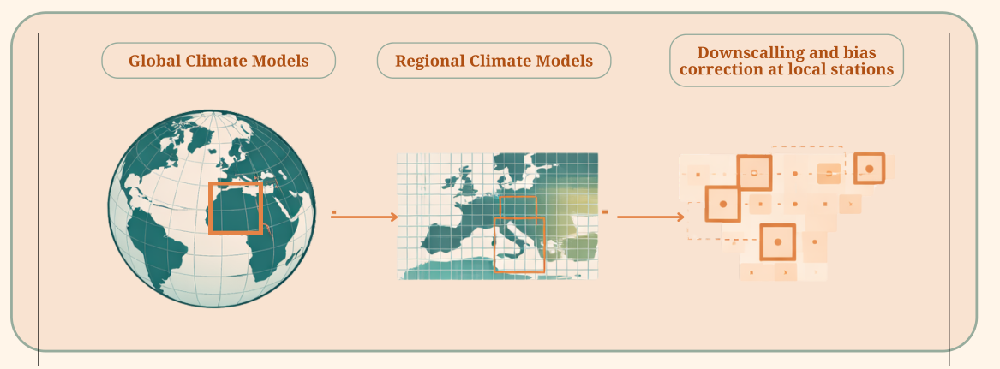
  <figcaption><strong>Figure 7.1.</strong> Schematic of Global and Regional Climate Models. GCMs have coarse resolution (approx. 100 km) and RCMs have much finer resolution (approx. 20 km). Bias correction and downscaling can be done at the local scale, for this, in-situ data or high-quality local information is needed. Adapted from Iratxe GONZALEZ APARICIO, Andreas ZUCKER; Meteorological data for RES-E integration studies - State of the art review; EUR 27587; 10.2790/349276</figcaption>
</figure>

Climate model outputs are not perfect and often differ from observations. To make them more useful, results are commonly analysed as changes relative to the past or statistically adjusted to better match observed conditions (this is usually called bias adjustment). These steps improve usability but also introduce additional assumptions, which should be kept in mind when interpreting results. In addition to these adjustments, sophisticated statistical methods to represent local processes from global climate model output, which is called downscaling.

Because no single model can fully represent the climate system, climate scientists use and compare projections made with many models through coordinated international efforts such as the [Coupled Model Intercomparison Project (CMIP)](https://wcrp-cmip.org/). Many modelling centres contribute to this project and together produce the widely used set of future climate projections, which you will learn how to access and evaluate in this toolkit. The results from this model intercomparison project are the main source of future climate information used in the IPCC assessments and by practitioners, and comparing results across models helps identify robust trends and better understand uncertainty. We focus on a clear, narrative-based approach that you can apply to interpret and communicate regional climate information. Rather than treating projections as precise predictions, the goal is for you to understand the uncertainties inherent to making projections, which will allow you to describe plausible future conditions in a transparent way that supports planning, risk management, and robust adaptation decisions.

!!! definitions "Definitions"

    **Climate projections** are scientific estimates of how Earth's climate may evolve in the future, produced with global climate models (Figure 1) developed at public research institutions around the world. These models are complex numerical representations of the physical processes of the atmosphere, ocean, land, and ice that can be used to simulate the evolution of climate in time. To project the future climate to anthropogenic emissions, we would need to know what the future socio-economic system will be like. As we do not know this, scientists speculate on different possible emission scenarios and explore the climate response under each possible future. This requires huge computational power, and this is why there is a limited number of institutions capable of producing the simulations.

    **Emission scenarios** describe possible socio-economic decisions which could shape greenhouse gas emissions in the next century, based on different choices about development, energy use, and land use. In the IPCC's latest assessments, these futures are represented by Shared Socioeconomic Pathways (SSPs), which combine simple storylines (such as sustainability or fossil-fuel–driven growth) with levels of anthropogenic emissions that lead to different climate forcings (how much more radiation does the atmosphere absorb); they are meant to illustrate a range of plausible outcomes and their climate implications, not to predict exactly what will happen (Figure 2).

    <figure markdown="span">
      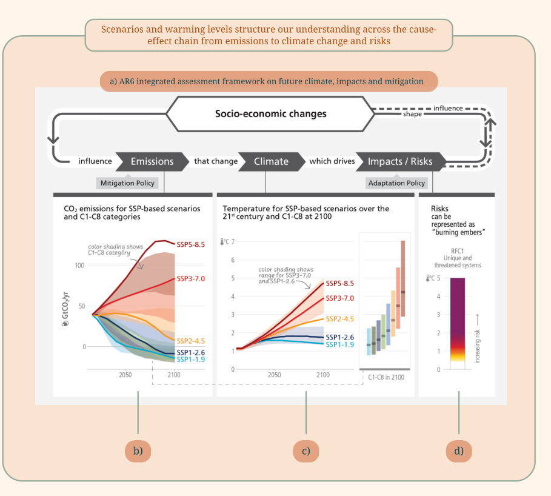
      <figcaption><strong>Figure 7.2.</strong> Emission scenarios and warming levels structure our understanding across the cause-effect chain from emissions to climate change and risks. The top figure illustrates the framework used to define climate scenarios. The bottom left panel shows the evolution of CO2 emissions in time, associated with each SSP. The bottom right panel shows the evolution of global mean surface temperatures over the 21st century. Adapted from the IPCC AR6 WGI.</figcaption>
    </figure>

    **Global warming levels** describe how much the Earth's average surface temperature has increased compared to a past reference period, usually 1850–1900, which represents pre-industrial conditions. Because climate models cannot predict exactly how fast the warming will occur, the IPCC uses global warming levels (such as +1.5°C or +2°C) to describe how the climate will change according to the model experiments. This is more robust than using specific years tied to specific emission scenarios to describe climate change, and stresses that the levels describe "if–then" changes meant to help plan for a range of possible futures, not exact forecasts.

!!! faq "Frequently Asked Questions about communicating future climate projections"

    **What makes projecting future climate so difficult?** Projecting future climate involves an extremely complex system influenced by natural variability, human decisions, and scientific limitations under conditions that have never been observed in the past. While we have a very robust understanding of some variables, such as global mean temperature, changes in other variables, such as local precipitation, are much more uncertain. Because of this complexity, scepticism about long-term climate projections in these dynamic variables (see [module 5](module-5.md)) is reasonable and should be openly acknowledged.

    **Why isn't future climate prediction like a weather forecast?** Weather forecasts use probabilities to represent short-term uncertainty in a chaotic system (e.g., a 30% or 70% chance of rain). While climate projections share some of this natural variability, they involve making statements about the climate system as we have never observed it before and at much longer timescales, leading to additional sources of uncertainty that make simple probabilistic statements misleading.

    **What types of uncertainty affect climate projections?** There are three main types of uncertainty, described in detail in [module 1](module-1.md). 1. Aleatoric uncertainty comes from natural variability such as volcanic eruptions or ocean cycles. 2. Political uncertainty arises because the future climate depends on which emission pathway society chooses. 3. Epistemic (model) uncertainty reflects limits in scientific knowledge and the models used to represent complex Earth system processes.

    **Why do emission scenarios add uncertainty?** Climate projections depend on assumptions about future greenhouse gas emissions, which are shaped by social, economic, and political choices. Because these choices cannot be predicted, scenarios represent alternative "what-if" pathways rather than expected outcomes.

    **Why do climate models differ in their projections?** Models simulate the atmosphere, oceans, land, and ecosystems using imperfect representations of real-world processes. Differences in how models represent these processes lead to varying outcomes, contributing to model (epistemic) uncertainty. This is why the comparison of different models is important to identify robust responses and be transparent about uncertainties in scientific knowledge.

    **How is the scientific community addressing these uncertainties?** Recognizing the limits of probabilistic approaches for long-term projections, climate science is increasingly using storylines or narrative-based descriptions of future climate. This approach communicates uncertainty more transparently and helps stakeholders understand climate risks without treating projections as precise predictions.

<figure markdown="span">
  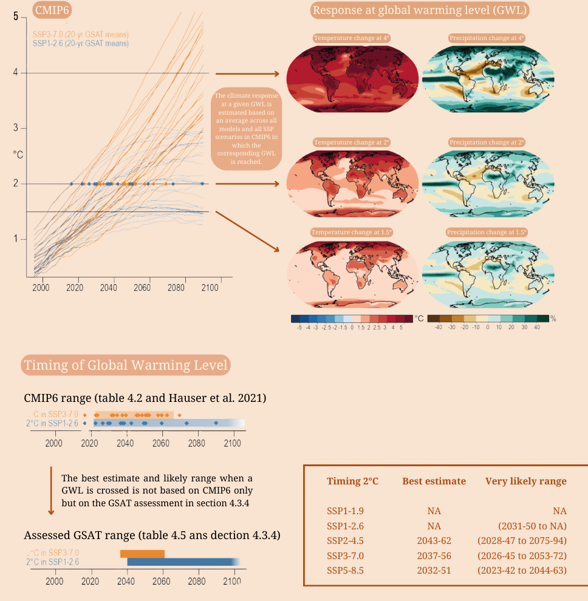
  <figcaption><strong>Figure 7.3.</strong> (a) Shows the global warming level (y-axis) against time (x-axis). Each line shows one model. This figure shows that models disagree on how fast the climate warms. The orange lines show the warming under the SSP3-7.0 and the blue lines SSP1-2.6. (b) shows global temperature and precipitation changes projected at each warming level. It is the mean of all the simulations, at the time when such a level is reached. How do we interpret this? Despite the epistemic uncertainty (the lines of the same color do not warm equally fast) and the scenario uncertainty (different trajectories between colors), we can be very certain that 2° of warming is reached between 2020 and 2070. This uncertainty can be reduced with additional physical knowledge and constraints of the models. The bottom row shows the best estimate of the IPCC report. If we follow SSP3-7.0 we will reach 2 degrees of warming between 2040 and 2060; if we follow SSP1-2.6, this might happen in 2040 or in the next century. The recovery in scenarios with reduced emissions is much higher because the physical processes of recovery are harder to simulate. Adapted from the IPCC AR6 WGI Technical Summary.</figcaption>
</figure>

### Analyzing climate projections by studying changes in Climatic Impact-Drivers

In [module 4](module-4.md), you learned how to use Climatic Impact Drivers (CIDs), which are directly linked with impacts, to characterize climate changes. As explained in [Module 5](module-5.md), changes in some CIDs are directly related to thermodynamic changes: the change in these CIDs depends primarily on the change in global mean temperature and is often more similar across regions. Other CIDs, such as precipitation, depend on large-scale dynamics that control moisture transport, and can be very different across regions. The following table gives you a few examples of this difference.

| Relation with local community | Associated CIDs | Expected response and drivers |
|---|---|---|
| Changing seasonal patterns in temperature and precipitation, it is not possible to follow planting calendar anymore | Seasonal cycle Amount of mean seasonal rain | Depends very much on the region and large-scale dynamical changes |
| Heatwaves affecting health | Maximum temperatures | Scales with global mean temperatures |
| Drought periods leading to loss of crops and water scarcity | Drought indices SPI or SPEI - Standardized Precipitation (Evapotranspiration) Index | Depends very much on the region and large-scale dynamical changes |
| Drying rivers and water shortages | Changes in mean precipitation | Depends very much on the region and large-scale changes |
| Heavy rain leading to flooding and drastic changes in river levels | Heavy rainfall leading to flooding | Increases linearly with global mean surface temperature as the atmosphere can hold more moisture at warmer temperatures. |

**Table 7.1.** Examples of climate changes plausibly observed by the local community, associated CIDs and the expected response of the CIDs under anthropogenic climate change.

## 2. Reviewing regional results on climate projections in the IPCC (Option A) { #option-a }

Searching for the available information for your region of interest is always a necessary starting point. Comprehensive assessments of regional climate change projections across many parts of the world are available in IPCC reports and the scientific literature cited there, which provide a consistent, authoritative synthesis of current scientific knowledge. National assessments of climate changes or reports from national weather services or institutions are also great starting points. In addition, identifying regional climate scientists and the work of their research groups is always a good way to understand state-of-the-art scientific understanding. While this offers the benefit of comparability and robustness across regions, reliance on IPCC regional information alone has limitations: not all regions are equally represented, and the predefined regional groupings can be large, meaning that important local or sector-relevant changes may be averaged out (as explained in [module 5](module-5.md)).

As an example, Figures 4 and 5 show a summary of the annual temperature and precipitation changes (x-axis) at different global warming levels (y-axis). This is shown for winter (December - March; DJFM) and summer (June - September; JJAS) averaged over different regional boxes in the Mediterranean (MED), Sahara (SAH), and Northeast of Africa (NEAF). For example, the projections show a precipitation decrease in the Mediterranean for both seasons, with larger changes from June to September. The changes get larger as the climate warms (i.e. going up in the y-axis). These figures are usually very dense and hard to interpret, but they contain a lot of information!

<figure markdown="span">
  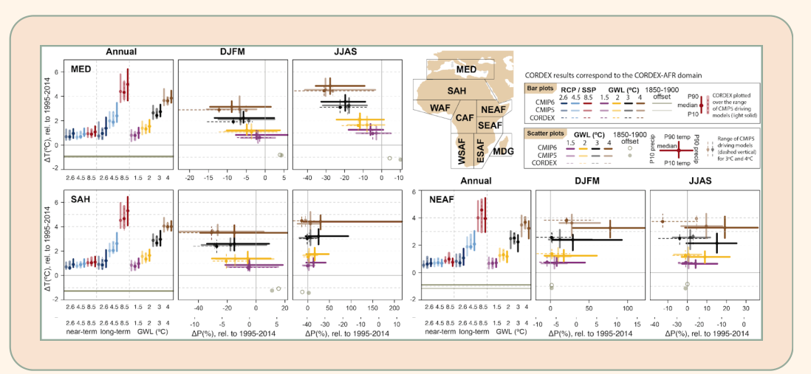
  <figcaption><strong>Figure 7.4.</strong> Regional changes over land in annual mean surface air temperature and precipitation relative to the 1995–2014 baseline for the reference regions in Africa (warming since the 1850–1900 pre-industrial baseline is also provided as an offset). Adapted from Figure Atlas.16 from IPCC WG1 Atlas.</figcaption>
</figure>

As a second example, below you can find a summary of the projected changes in different CIDs and all the IPCC regions (Figure 5). If you see a CID symbol in a box, that means that there is high confidence in that change. The color of the symbol indicates if the CID is increasing or decreasing.

<figure markdown="span">
  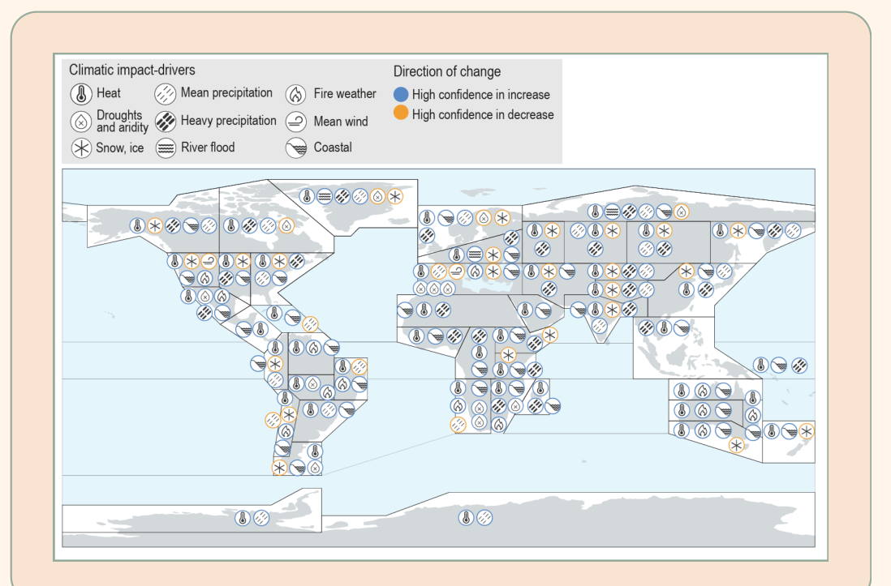
  <figcaption><strong>Figure 7.5.</strong> Synthesis of the climatic impact-driver (CID) changes projected by 2050 (2041–2060) with high confidence, relative to the reference period (1995–2014), together with the sign (direction) of change. Information is taken from the CID tables in Section 12.4. Some CIDs are grouped in order to streamline the information in order to fit all information in the figure. Figure 12.11 from the IPCC WG1 Chapter 12.</figcaption>
</figure>

## 3. Analyzing climate projections (Option B) { #option-b }

After revising the available information in scientific literature or IPCC reports, you can look at the model data yourself. The IPCC AR6-WGI Atlas and the Copernicus Data Store provide a platform to analyze model output yourself. This information is extremely valuable and useful for a first glance at the observations. By navigating the platform you can explore projections of different emission scenarios and models. In the following guide, we illustrate a simple exploration of the Copernicus Data Store and the type of figures that you can produce. In addition, you can watch the illustrative video, going through this process.

!!! howto "How-To guide 1: Copernicus Interactive Climate Atlas and simple exploration of climate projections"

    In this guide, you will learn how to navigate the Copernicus Interactive Climate Atlas to visualize and perform a simple interpretation of climate projections for Southern India. This region is the study area of Example 1 in this same module and we hope this allows you to understand that there are multiple ways of addressing the problem of future projections.

**Step 1.** Go to the Copernicus atlas at <https://atlas.climate.copernicus.eu/atlas>. The tool has a column with Option box on the left and Data Panel that starts with a globe on the right.

<figure markdown="span">
  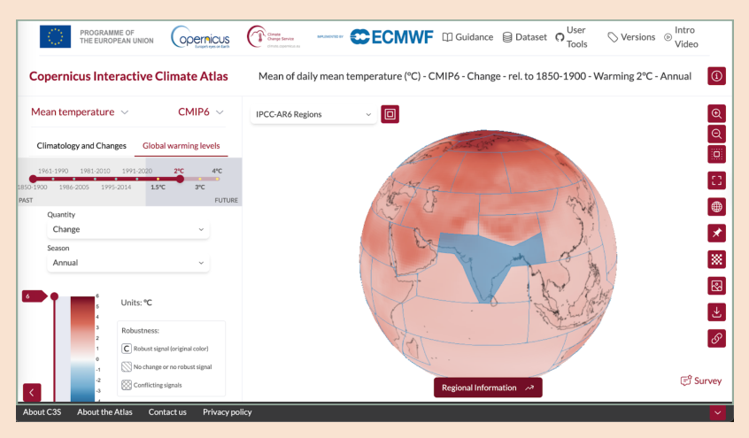
</figure>

**Step 2: Region.** In the upper left corner of the panel on the right, there is a drop-down menu. Select IPCC-AR6 Regions. Select your region (you can click on the map directly in your region) and click the "Regional Information" button at the bottom.

**Step 3: Data.** In the top left of the Options box you can select the CID. The variables are organized by CID categories. Select mean daily temperature. On the top right of the Options box you can select the data. It is organized in Projections, Reanalysis and Observations. Select **Projections/CMIP6**.

**Step 4: Climatology and Changes/Warming levels.** Next in the Options box is the selection of exploring projections in time or warming levels. As explained above, if we analyze projections in time, different SSP scenarios will differ in their projections. If we explore warming levels, we can combine projections from different scenarios and analyze the regional change associated with a global warming level (independently of when that might happen!). Select Warming levels.

**Step 5: Climatology/Change and Season.** Next, you can select to plot the climatology or the change, as well as the season (or individual month). Select Change and Annual.

<figure markdown="span">
  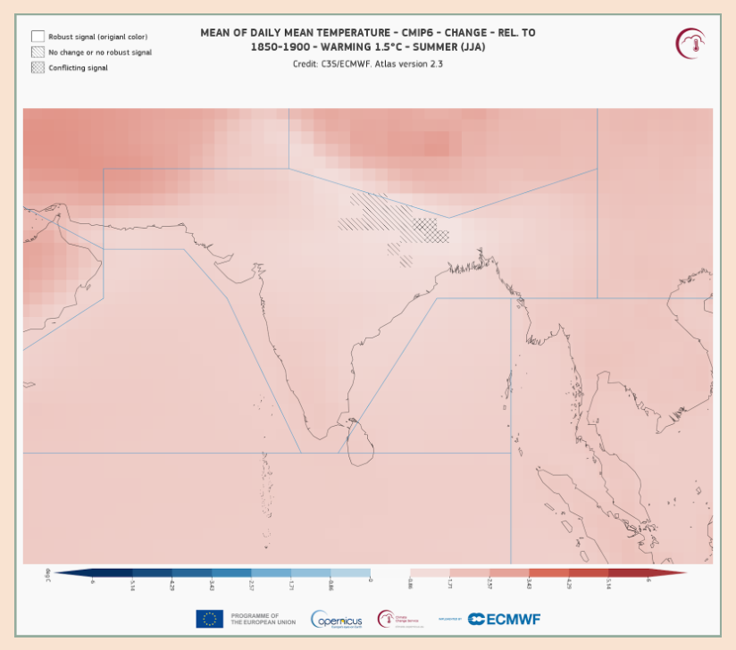
  <figcaption>You can download the maps for the region as well as the time series.</figcaption>
</figure>

**Step 6: Regional information.** Click on regional information. The data panel shows a time series (spaghetti plot), with one ensemble member (simulation) per model. On the upper panel, you can choose to see the annual cycle, the same information, but as climate stripes (where each model is one row) and seasonal stripes (which show the mean of the models for each year and each month). In all the plots, the light box is the reference period or baseline, and the dark box is the period in which the mean of the models reach the selected warming level.

<figure markdown="span">
  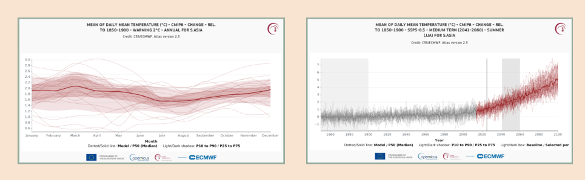
</figure>

**Step 7: Download figures.** Download the figures and document your choices.

## 4. Building storylines and narrative scenarios of climate change (Option C) { #option-c }

Narratives are one of the most powerful ways of delivering comprehensible messages, and they allow us humans to imagine the future and creatively think of possible transformations (Veland et al., 2018). In climate science, narratives (also called storylines) can deal with **aleatoric, political and model sources of uncertainty** inherent to future climate projections by describing the uncertain future with a limited set of meaningful storylines that describe what is scientifically possible, in a conditional manner (Shepherd, 2019). On the one hand, storylines are the narrative form of the political and technological decisions behind socio-economic pathways that are used to propose emission scenarios. However, they can also be used to narrate the perception of climate change and climate risk of the different actors in the community, allowing you to understand the multiple starting points and values of those who will use the information that you produce (Baulenas et al., 2023; Fossa Riglos et al., 2024).

In this section, we provide three examples of how to produce information on future regional climate using storylines.

In the first example, we will use the Copernicus Atlas to assess possible high and low impact scenarios, without further exploring the reasons that these different models simulate these different responses. However, beyond climate projections directly, an additional and more advanced step is to use large-scale climate drivers and teleconnections introduced in [Module 6](module-6.md) as a tool to interpret and refine regional climate information.

In the second example, we show how large-scale drivers identified using expert elicitation can be used to develop scenarios of future changes.

The third example goes one step further and uses these large-scale drivers to understand why models disagree, and to explicitly link regional outcomes to the behaviour of large-scale drivers in different simulations or models using so-called dynamical storylines. By framing projections as conditional, physically consistent storylines (for example, "if ENSO variability strengthens, then seasonal rainfall variability increases"), this approach helps translate complex model uncertainty into clearer, more interpretable information - if there is an explanation as to why the models disagree, the uncertainty becomes interpretable and easier to communicate. A more detailed description of how different storyline approaches are used in climate science can be found in the **[Storylines seminar](https://www.youtube.com/playlist?list=PLWG8W4XYZ38IX8bsfeebtJsy9Y-pRctdb)**.

!!! howto "How-To guide 2: Practical ways of presenting projections using a scenario (narrative/storylines) thinking approach"

    **1. Scenario-based storylines:** Emission scenarios (e.g. different socio-economic pathways) as narratives that describe how political, economic, and technological choices lead to distinct climate futures. These storylines frame climate outcomes as conditional ("if this pathway is followed/if this model is trusted, then…") rather than as predictions. We go back to **Step 4** in How-To guide #1 in the Option box select Climatology and Changes.

    **a) Step 5 (scenario uncertainty):** In the Option box you will see an additional drop-down menu "Scenario". Select SSP 1-2.6. Repeat Steps 5-7 in How-to guide 1 with different scenarios and explore different plots. This way, you are exploring and understanding the uncertainty in the future of the region associated with **scenario uncertainty.**

    <figure markdown="span">
      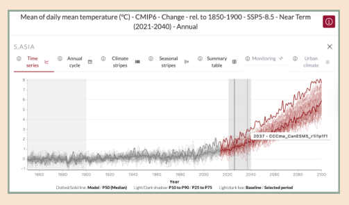{ width="360" }
    </figure>

    **b) Step 6 (storylines):** Select SSP 5-8.5 in the Option box and generate the time series plot. Move your mouse over the time series until the warmest model is highlighted. Write down the name of the model (as in the screenshot). Do the same with the coldest models. Now in the drop-down menu below "Select model" find the two models and select them. The area shaded between the two models shows the spread in the models. This shows **model uncertainty** alongside internal variability (aleatoric uncertainty).

    <figure markdown="span">
      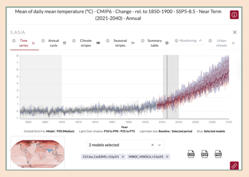{ width="360" }
    </figure>

    Although this is a very first order assessment of model uncertainty, with only one simulation per model. It provides an idea of how large this uncertainty is and allows you to better understand the data. There are statistical methods to assess internal variability, scenario and model uncertainty properly, which require access to the full dataset (Hawkins and Sutton, 2009).

    To learn how to further explore this data, we invite you to use this python code, which downloads data directly from the Copernicus Data Store and analyzes different CIDs for the Amazon region ([Example 1](https://colab.research.google.com/drive/1Ijw6n3swz4jW2B5RKgIDQH79gP649euv?usp=drive_link)) and the Maritime continent ([Example 2](https://colab.research.google.com/drive/1s7X4ngXv-KlOb9h6o69qJwkl9TAORrl9?usp=sharing)).

    **2. Driver-based storylines (Example 1):** Link regional climate responses to changes in large-scale drivers or teleconnections (such as ENSO or circulation patterns).

    **3. Model-spread storylines (Example 2):** When climate models disagree on regional outcomes (e.g. drying versus wetting), translate these differences into alternative storylines. Each storyline represents a scientifically plausible future, helping users understand the range of possible regional changes rather than focusing on a single average outcome.

!!! examples "Example 1: Storylines of future regional precipitation in the Cauvery River Basin in Karnataka, Southern India"

    Here, we take up the example introduced in [Module 6](module-6.md). Based on expert elicitation, validated with observational data (Dessai et al 2018), it was found that the main drivers of precipitation over the Cauvery River Basin in Karnataka, Southern India, were the moisture flow from the Indian Ocean, determined by the availability of moisture and the strength of the flow. These two drivers lead to four different possible scenarios of future change: a decrease/increase in the moisture availability in the Arabian Sea combined with either the strengthening or weakening of the flow, illustrated in Figure 6.

    <figure markdown="span">
      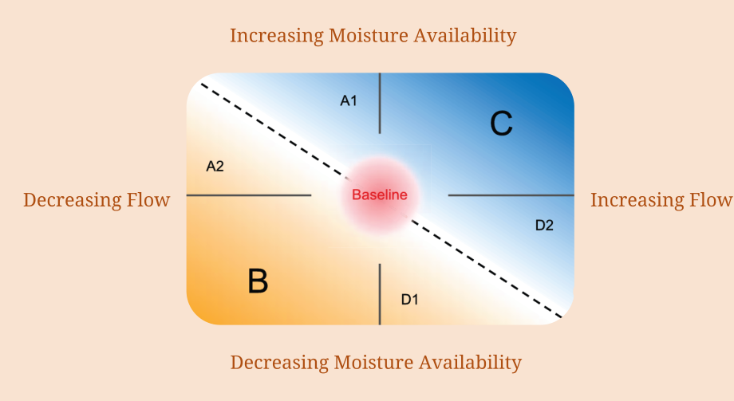
      <figcaption><strong>Figure 7.6.</strong> Elicited climate narratives for the CRBK, associated changes in key processes and precipitation. (a) Expert elicited climate narratives for the Cauvery River Basin in Karnataka for the 2050s as a function of two climate drivers: moisture availability over the Arabian Sea (y-axis) and strength of flow perpendicular to the Western Ghats (x-axis). The red circle in the centre indicates current baseline conditions. The black dashed line divides the narratives into two areas where the experts expected precipitation to increase (blue areas covering narratives C, A1 and D2) and decrease (yellow areas covering narratives B, A2 and D1). Adapted from Dessai et al. (2018).</figcaption>
    </figure>

    Possible futures, which include changes in 23 other relevant drivers assessed, were then described in a narrative form:

    **Narrative B:** Decreasing moisture availability and decreasing strength of flow coming towards southern India. Under these conditions, rainfall is expected to decrease due to the underlying plausible processes of cooling of sea surface temperatures of the Arabian Sea and weakening of the Westerly Jet, increase in anthropogenic aerosol forcing in the northern hemisphere (particularly in northern India), increase in irrigation in the Indo-Gangetic Plain which cools the land surface and decreases overall monsoon circulation, and greater influence of the El Niño and Equatorial Indian Ocean Oscillation teleconnections. Land use change and its effect on soil moisture content and evapotranspiration are expected to impact the spatio-temporal distribution of precipitation, which, although uncertain, is expected to be different compared to current conditions.

    **Narrative C:** Increasing moisture availability and increasing strength of flow coming towards southern India. Under these conditions, rainfall is expected to increase due to underlying plausible processes of global atmospheric moisture increase and intensification of the tropospheric temperature gradient, greater northward shift of the Intertropical Convergence Zone and greater influence of the La Niña teleconnection. Precipitation is expected to increase in a non-linear manner, while impacts on interannual variability, spatial distribution of precipitation and effects of orography are uncertain.

!!! examples "Example 2: Storylines of changing climates and crops vineyards in Southern South America"

    To illustrate how a set of CIDs can be used to assess potential climate risks and opportunities using climate projections and storylines, we introduce an example based on viticulture in Patagonia and the central Andes region (Figure 8) from Mindlin et al. (2024). Agricultural production is increasingly affected by climate change, and viticulture is among the sectors that are particularly sensitive to changes in climate conditions (Hannah et al., 2013). The development of grapevines and the quality of wines depend on a combination of climatic impact drivers, including temperature during the growing season, winter cold extremes, and precipitation at key stages such as flowering or harvest. Many management decisions in vineyards—such as harvest timing, pest and disease control, and phytosanitary treatments—are closely linked to these conditions (Cabré & Nuñez, 2020; Mihailescu & Bruno Soares, 2020). Here, we analyse two wine-growing regions in Chile and Argentina: Cafayate and Sarmiento.

    <figure markdown="span">
      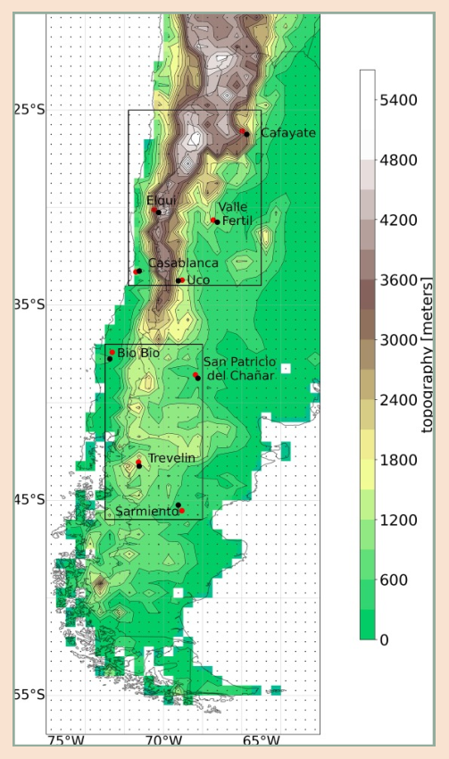{ width="300" }
      <figcaption><strong>Figure 7.8.</strong> Study region and vineyard locations used in the example analysis. Red dots indicate vineyard locations and black dots represent the nearest climate data grid points from the CRU TS v4.06 dataset used to evaluate the climate impact-drivers. Background shading shows topography. The two black boxes highlight the northern and southern sectors of the region, which exhibit different climate responses associated with large-scale atmospheric circulation patterns.</figcaption>
    </figure>

    As introduced in [module 4](module-4.md), we first select CIDs that are relevant to viticulture in the region. The most important CIDs include:

    - Growing degree days (GDDs), defined as days with a temperature >10°C in the growing season between October and April.
    - Maximum growing season temperature (maxGST), defined as daily maximum temperatures in summer (December - January) exceeding 35°C, which influences photosynthesis and leads to quality loss and increased water demand.
    - Harvest precipitation anomaly, defined as the precipitation anomaly in March and April, which influences ripening and can lead to harvest difficulty.
    - Growing season precipitation (GSP), defined as accumulated precipitation from October to April, which affects water stress and disease risk of the plants

    To build dynamical storylines of changes in these CIDs, we use scientific literature to identify the large-scale drivers relevant to the region, and assess their future changes in climate models. Specifically, future warming in the tropical Pacific (the region of the El Niño Southern Oscillation) has a large influence on future conditions for viticulture in this region. We can use this knowledge to develop two storylines of future viticulture conditions, conditional on how the tropical Pacific evolves in the future.

    <figure markdown="span">
      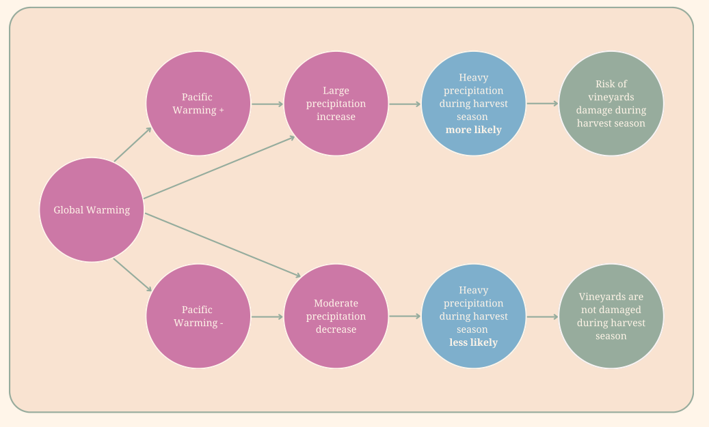
      <figcaption><strong>Figure 7.9:</strong> Storylines of changes in valleys with wine production in Chile and Argentina. These storylines illustrate how the severity of the hazard and potential impact depends on the degree of global warming and how the level of warming in the Pacific affects the impacts. Model and scenario uncertainty are addressed by evaluating plausible climate changes in terms of global mean warming levels with respect to a 1950-1979 baseline.</figcaption>
    </figure>

    We now visualise future conditions of the CIDs under these different storylines:

    <figure markdown="span">
      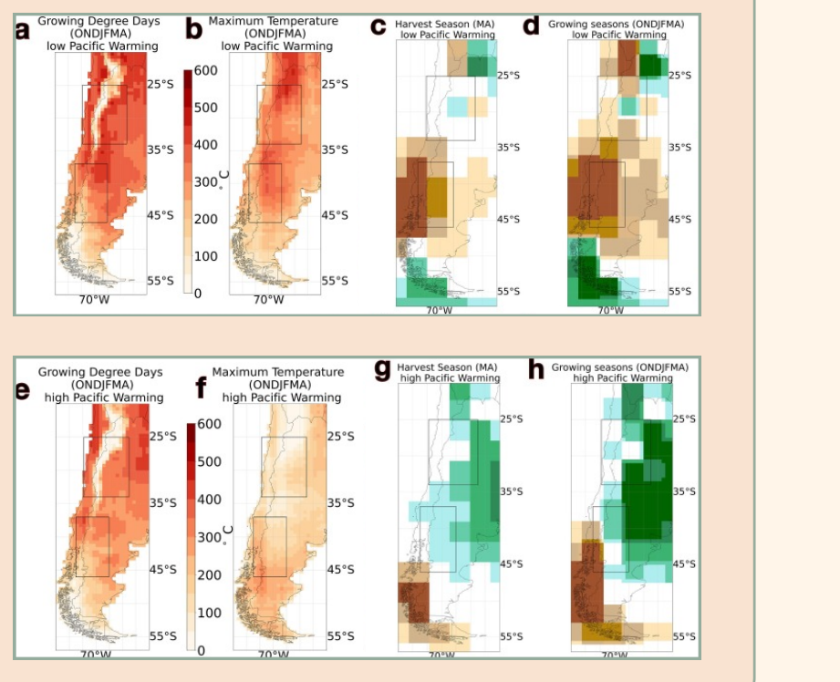
      <figcaption><strong>Figure 7.10.</strong> CID responses under high tropical Pacific warming (a-d) and low tropical Pacific warming (e-h) storylines in a world with a 2 degree global warming level. Adapted from Mindlin et al (2024)</figcaption>
    </figure>

    **Summarising results for the two regions:** Under warming scenarios, Cafayate (see location in Figure 8) is projected to experience large increases in growing degree days and mean growing season temperature, potentially exceeding suitability thresholds for some grape varieties. At the same time, precipitation changes depend strongly on the circulation storyline, with possible drying or wetting during the growing season, implying very different risks for water availability and disease pressure. In contrast, Sarmiento (see location in Figure 8) currently lies near the cool limit of viticulture and is projected to see increases in GDDs and milder winters, improving climatic suitability for grape production. Precipitation changes remain relatively small, but differences between storylines still influence the balance between slightly wetter or drier growing seasons.

    **Overall assessment:** The strong storyline is associated with wetting in the northmost valley (Cafayate), which could be problematic in the harvest season due to the favoring of pests and no changes in the southmost (Sarmiento), while the opposite storyline can lead to mild drying up to 4° warming. In temperature, this is a clear example of how the increase in growing degree days (CID related to accumulated temperatures in growing season) can be a hazard for wine production in Cafayate, where it can exceed the viable thresholds in a 2° warmer world and a boon for Sarmiento, where more varieties of wine can become viable in a 2° warmer world.

## References and resources

Baulenas, E. et al (2023). Assembling the climate story Global Challenges, 7(7), 2200183 <https://doi.org/10.1002/gch2.202200183>

Dessai et al. (2018) Building narratives to characterise uncertainty in regional climate change through expert elicitation Environ. Res. Lett. 13 074005 [10.1088/1748-9326/aabcdd](https://iopscience.iop.org/article/10.1088/1748-9326/aabcdd)

E. Mihailescu, M. Bruno Soares The influence of climate on agricultural decisions for three european crops: a systematic review Front. Sustainable Food Syst., 4 (2020), p. 64, [10.3389/fsufs.2020.00064](https://doi.org/10.3389/fsufs.2020.00064)

F. Cabré, M. Nuñez Impacts of climate change on viticulture in Argentina Reg. Environ. Chang., 20 (1) (2020), [10.1007/s10113-020-01607-8](https://doi.org/10.1007/s10113-020-01607-8)

Fossa Riglos, M. F. et al. (2024). Climate storylines as a tool for interdisciplinary dialogue on risk decision-making: Analyzing a severe drought in southeastern South America. Environmental Science & Policy, 160, 103848. <https://doi.org/10.1016/j.envsci.2024.103848>

H.R. Schultz, G.V. Jones Climate Induced Historic and Future Changes in Viticulture J. Wine Res., 21 (2–3) (2010), pp. 137-145, [10.1080/09571264.2010.530098](https://doi.org/10.1080/09571264.2010.530098)

Hawkins, E., and R. Sutton, 2009: The Potential to Narrow Uncertainty in Regional Climate Predictions. Bull. Amer. Meteor. Soc., **90**, 1095–1108, <https://doi.org/10.1175/2009BAMS2607.1>.

Implications of a Climate-Changed Atmosphere on Cool-Climate Viticulture J. Appl. Meteorol. Climatol., 58 (5) (2019), pp. 1141-1153, [10.1175/JAMC-D-18-0183.1](https://doi.org/10.1175/JAMC-D-18-0183.1)

J. Mindlin et al. Assessment of plausible changes in Climatic Impact-Drivers relevant for the viticulture sector: A storyline approach with a climate service perspective Climate Services 34 (2024), <https://doi.org/10.1016/j.cliser.2024.100480>

L. Hannah, et al. Climate change, wine, and conservation Proc. Natl. Acad. Sci., 110 (17) (2013), pp. 6907-6912, [10.1073/pnas.1210127110](https://doi.org/10.1073/pnas.1210127110)

Oakley J E and O'Hagan A 2016 SHELF: the Sheffield elicitation framework (version 3.0) ([www.tonyohagan.co.uk/shelf/](http://www.tonyohagan.co.uk/shelf/))

Shepherd, T. G. (2019). Storyline approach to the construction of regional climate change information. Proceedings of the Royal Society A: Mathematical, Physical and Engineering Sciences, 475(2225), 20190013. <https://doi.org/10.1098/rspa.2019.0013>

Veland, S., et al. (2018). Narrative matters for sustainability: The transformative role of storytelling in realizing 1.5°C futures. Current Opinion in Environmental Sustainability, 31, 41–47. <https://doi.org/10.1016/j.cosust.2017.12.005>

The latest IPCC reports can be found here <https://www.ipcc.ch/report/ar6/wg1/> (Working Group 1 - The Physical Science Basis) and here <https://www.ipcc.ch/report/ar6/wg2/> (Working Group 2 - Impacts, Adaptation and Vulnerability).

Two useful chapters from the Working Group 1 report were already introduced in [Module 5](module-5.md): Chapter 12 on "Climate Change Information for Regional Impact and for Risk Assessment" <https://www.ipcc.ch/report/ar6/wg1/downloads/report/IPCC_AR6_WGI_Chapter12.pdf> and Chapter 11 on "Weather and Climate Extreme Events in a Changing Climate" <https://www.ipcc.ch/report/ar6/wg1/downloads/report/IPCC_AR6_WGI_Chapter11.pdf>. Have a look at Module 5 for the introduction to these two chapters and the information you can draw from it.

In addition, for each region, the IPCC WG1 AR6 provides an Atlas with a summary of the available information per region: <https://www.ipcc.ch/report/ar6/wg1/chapter/atlas/>
