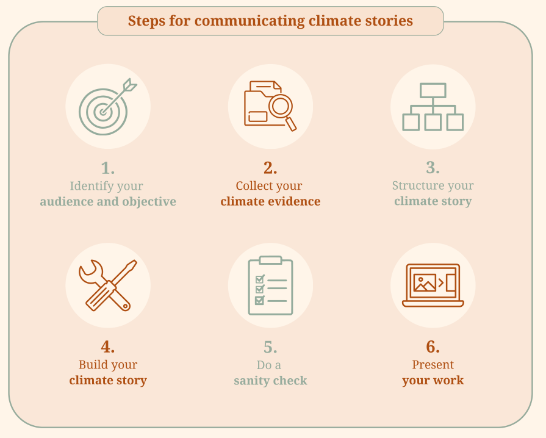
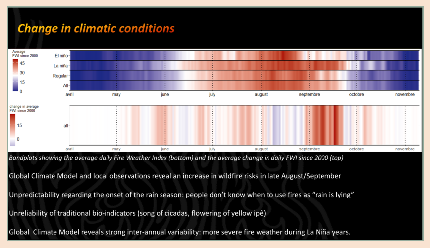
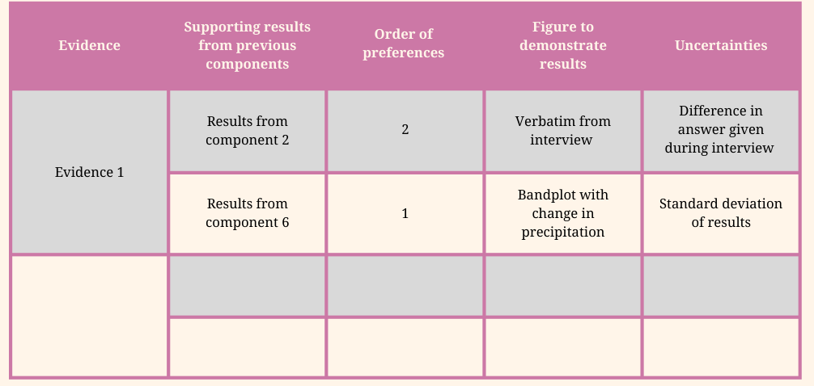
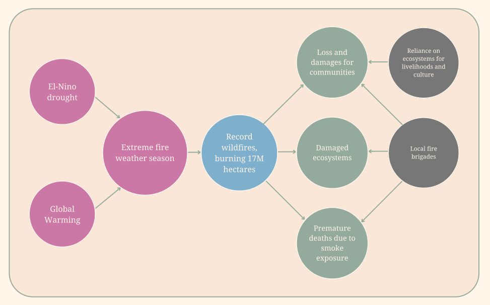
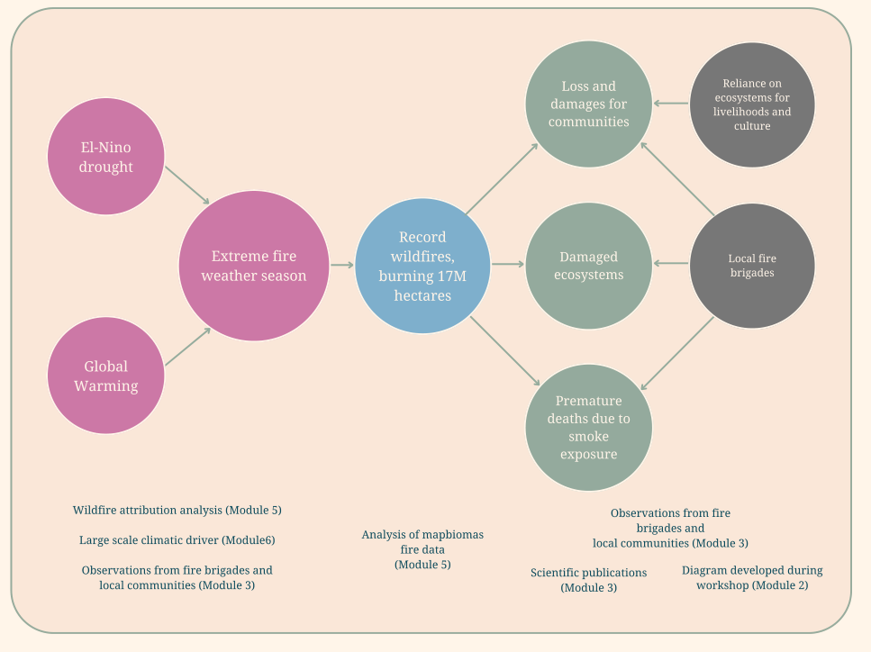
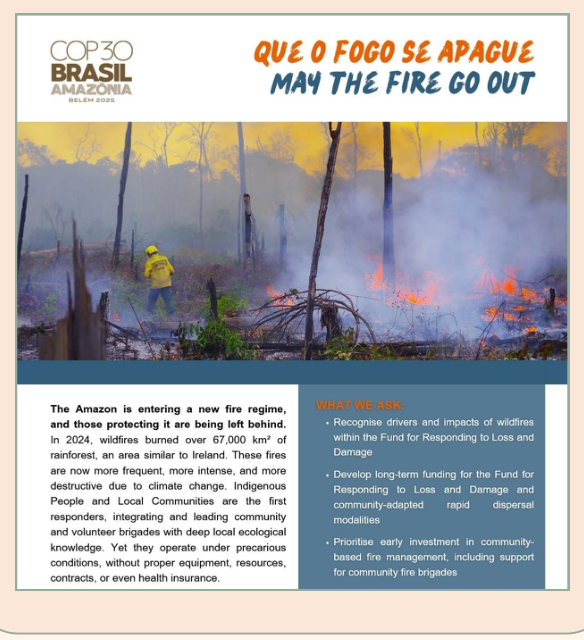

# Module 8 Building and communicating climate stories

This module proposes an approach to summarise the different pieces of information collected through modules 2 to 7 into coherent climate storylines, as well as how to communicate them effectively to support decision-making of the end-users.

## 1. Background and definitions

Producing reliable climatic information is not sufficient to ensure that it will be used to support decision-making: it must be credible, salient, legitimate and timely (Jebeile and Roussos 2023). These principles have guided previous steps of the bottom-up climate evidence process, from the identification of critical information for the local community to the use of inclusive methodology and credible data sources. However, this work may have a limited impact if it is not embedded in an effective communication strategy targeting actors involved in, or interested in, the bottom-up climate evidence process.

A key challenge in communicating useful climatic information is that it often brings insights from multiple disciplines and knowledge systems, each with distinct communication conventions and levels of perceived credibility. This is particularly relevant in bottom-up climate evidence processes, which combine information from local communities ([module 3](module-3.md)), historical observations ([module 5](module-5.md)) and future climatic projections ([module 7](module-7.md)). Scenarios and climate storylines provide a way to integrate quantitative and qualitative evidence and to explore plausible futures that can support collective action and decision-making (Baulenas et al. 2023, Harcourt et al 2021; see module 7 for definition of climate storyline). Integrating knowledge systems raises ethical challenges, as different actors may place greater trust in different sources of information, such as local ecological knowledge or climate models (Roue and Nakashima 2018). Exploring complementarity and synergies across knowledge systems can help build a more comprehensive understanding of climate change and its local impacts (Tengö et al. 2014).

This module provides guidance for synthesising information from previous modules into climate storylines and communicating them effectively to diverse actors engaged in or interested in the bottom-up climate evidence process. We first propose guidelines structured around six key steps.

!!! definitions "Definitions"

    **Credibility:** degree of trust other actors have in the information you produce and communicate to them (Cash et al. 2002). This is strongly related to your scientific rigour and choices of appropriate methods, but can also be linked to the perceived credibility of different knowledge systems.

    **Salience:** relevance of the information for supporting the decision-making needs of intended users (Cash et al 2002). For example, a farmer might need to know not only overall precipitation predicted, but also its seasonality and droughts risks to adapt farming practices.

    **Legitimacy:** perceived fairness of the bottom-up climate evidence process by external stakeholders (Cash et al. 2002). This could be related to engagement with ethical questions, the inclusivity of the process and who has been involved in the study, or evidence types that have been discarded.

    **Timely:** The relevance of the timing of information release to support decision making is closely related to salience (Lemos et al. 2012). This is linked to the daily and seasonal schedule of the target audience: they might need information before an important political decision.

## 2. Develop and communicate a climate story { #how-to }

!!! howto "How-To guide"

    In the following section, we propose guidelines for using information from previous steps to build a climate story for communication with diverse actors involved in or interested in the bottom-up climate-evidence process. We break this process into six key steps (Figure 8.1). We also provide a slide template attached to this module to guide you through this process.

    You will likely need to develop several climate stories for different actors and/or communication objectives: while there will be overlaps, you will communicate differently when presenting results back to participants, discussing your case study with researchers or convincing a policymaker to financially support specific adaptation policies.

<figure markdown="span">
  
  <figcaption><strong>Figure 8.1.</strong> Six key steps for developing your climate story</figcaption>
</figure>

### Step 1. Identify your audience and communication objective

For effective communication, it is important to adjust your climate story to the target audience and communication objectives. This will guide important decisions such as the communication media you should use, the type of evidence to prioritise, and the level of detail to provide. Give brief answers, in a few words or sentences, to the following four questions:

- **What is the main objective of the climate story?** For example, it could be to inform about future climatic conditions to support adaptation strategies, to diffuse successful practices from another community, or to secure financial support for a specific project.
- **Who is your target audience?** For example, there could be the leaders of neighbouring communities, participants in your research project, staff from local NGOs, or high-level employees of governmental or international institutions.
- **What is the best format to present your climate story?** For example, it could be a poster that can be easily carried to different communities, a video that will be uploaded online, a PowerPoint presentation or a technical report.
- **When is the best time to present the climate story?** For example, it could be just before planting season for a project related to agriculture and climate change, or before annual budget decisions in a governmental institution.

Ask yourself how this audience and objective should shape your presentation. Your audience may prefer specific communication formats, give more credibility to particular knowledge systems, and need tailored information to support their decision-making.

**Bonus:** If possible, talk to peers who have already worked with your target audience to learn about effective communication strategies.

### Step 2. Collection of climate evidences

Before thinking about the structure of the climate story, it would be beneficial to gather all of the information we collected during the process about different climatic impact-drivers and their impact on the local community.

Use the list of climatic impact-drivers developed in [module 4](module-4.md) to create multiple slides or documents (see Figure 8.2 for an example). Gather in each of these documents all of the information that you have collected through the bottom-up climate evidence process. Once you have finished, go back to the causal diagram that you have developed in [module 2](module-2.md) and ensure that for each climatic impact-driver, you include all information available on the drivers themselves, factors of exposure and vulnerability, as well as adaptive responses.

For each of the slide/documents that you have developed, think about the complementarity of the information collected. When you have two pieces of information about the same phenomenon, do they indicate similar trends? If that's not the case, is this due to the limitation of one method or uncertainty about a specific phenomenon? When information is about different parts of the process, are they complementary to each other? Answering this information will help you to adjust the climate story to your audience and ensure you're leveraging the benefits of bottom-up approaches to climate evidence.

<figure markdown="span">
  
  <figcaption><strong>Figure 8.2.</strong> Examples of a slide including different lines of evidence regarding the impact of climate change on precipitations and associated wildfire risk.</figcaption>
</figure>

### Step 3. Structure your climate story

Before deciding which evidence to present, define the structure of your climate story to ensure a clear flow across its elements. This helps ensure you communicate effectively and use evidence to support your arguments, rather than creating a story that simply reflects all elements of the bottom-up climate evidence process.

One generic structure is to start with climate-related issues identified by the local community, then present insights from previous modules, and finally propose a call to action aligned with the communication objectives. Starting with community-defined problems can strengthen the legitimacy of your project by emphasising its bottom-up approach and inclusion of community priorities. Subsequent insights can improve salience by focusing on action-relevant information, while the call to action allows the audience to ask follow-up questions and identify remaining information needs. However, alternative structures may be more appropriate depending on your objectives. For each of the modules, identify the relevant results from previous modules.

If you plan to discuss future climatic projections, consider at least two scenarios at this stage:

- **Pessimistic scenario:** climate change and compounding disturbances intensify, with no support for adaptation
- **Optimistic scenario:** strong mitigation and adaptation actions are implemented, with substantial support for communities

Draft the structure of your climate story, including the objective of each section and the evidence required to support it. As a starting point, fill the table below with section, objective and evidence from previous modules which will be included.

| Section | Objective | Evidence from previous components |
|---|---|---|
| &nbsp; | | |
| &nbsp; | | |
| &nbsp; | | |

**Table 8.1.** Template table for structuring your climate story

At this stage, you should refer to the causal diagram developed in [module 2](module-2.md) to assess how sections are linked and ensure there is a logical flow from one section to the next. Correct the table if necessary.

### Step 4. Build your climate story

With the structure defined, you need to define which evidence you will present for each section and objective of your climate story. In some cases, you will have enough time and space to present all of the evidence that you already compiled in step 2. However, in many cases, you will need to make some strategic choices to limit the length of your climate story. Consider which information will be most relevant for your target audience from what was developed in the previous modules (you can use Table 8.2 to help you in this process). When multiple sources of information describe the same phenomenon, assess whether they can be presented together to reinforce credibility or highlight complementary perspectives.

<figure markdown="span">
  
  <figcaption><strong>Table 8.2.</strong> Template table for prioritizing results to present in the climate story</figcaption>
</figure>

You should also plan how to communicate uncertainty so it can be considered in decision-making. Be transparent about confidence levels and about which elements of your climate story remain uncertain. For future climatic projections, presenting multiple scenarios covering a range of plausible futures can be effective. Transparency about uncertainty is essential for strengthening the credibility of bottom-up climate evidence.

After developing all individual sections, review the transitions between them to ensure a clear and logical progression that is easy for the audience to follow. The process of building your climate story needs to be adapted depending on your initial communication objectives and audience: you can try to be comprehensive when you have a 45-minute presentation to an academic audience, but you will need to be extremely concise and choose the most salient information if you only have 5 minutes of presentation with policy-makers.

### Step 5. Doing a sanity check

After developing a first version of the climate story, review each module by asking the following questions:

- Does it reach the objectives defined during step 1?
- Is it supported by sufficient evidence?
- Is uncertainty clearly communicated to the audience?
- Is the presentation visually clear and easy to understand?

Then refer back to the causal diagram developed in [module 2](module-2.md) and assess whether your climate story can be explained using this diagram. This helps ensure that elements are coherent and well connected.

Present the climate story in a low-stakes setting, such as to colleagues or peers, to gather early feedback. This can help identify weak transitions, unclear arguments, or claims requiring additional evidence. This step functions as quality control and should be iterative: revisit it whenever you adapt the climate story for a new audience, format, or set of objectives.

### Step 6. Present your work

Even if your climate story does not require live presentation, such as a video, it is important to organise opportunities to present it to your intended audience. Consider the most appropriate timing and setting, ideally aligning with the timing identified in Step 1 and choosing a space where participants feel comfortable providing feedback.

Presentations allow you to collect feedback, respond to questions, and situate the climate story within the broader bottom-up climate evidence process. Some audience members may wish to follow up for additional information. Climate stories help capture initial interest, but usually present only part of the available evidence. Follow-up interactions allow you to share additional details, such as supplementary analyses that strengthen credibility or contextual information that supports a broader understanding of the case.

## 3. Example

!!! examples "Example of climate story: A leaflet about the loss and damages of 2024 wildfires in the Amazon and Pantanal during the COP30 in Belem, Brazil"

    We will outline an example of a climate story developed after a workshop organised by BASE about the loss and damage of the 2024 wildfires in the Amazon and Pantanal. This workshop gathered participants from diverse sectors of society in Brasilia during three days to discuss multiple lines of evidence, linking climate change, the 2024 wildfires and local experiences. After the workshop, it was decided to create a short document that could help to advocate for increased climate funding dedicated to fire management initiatives during the upcoming COP30 in Belem, Brazil.

    **Audience:** Media covering the COP30, academics and representatives of the civil society attending COP30, public following COP30 negotiation online. Need to be short as it is a very fast-pace event.

    **Communication objectives:** provide clear evidence of the link between climate change, the 2024 record wildfires and their impact on local communities, advocate for funding to local fire brigades and integrated fire management initiatives.

    To design the structure of the climate story, we followed a simple narrative: link climate change to 2024 wildfires, compare 2024 wildfires to previous seasons, describe the impact on local and regional populations, and highlight the role of volunteer fire brigades in preventing these damages (Figure 8.3).

    <figure markdown="span">
      
      <figcaption><strong>Figure 8.3.</strong> Structure of the climate story for loss and damages of 2024 wildfires in the Amazon and Pantanal</figcaption>
    </figure>

    Then, we added different lines of evidence that were discussed during the workshop to support the different parts of the climate story (see Figure 8.4). During the workshop, lines of evidence from activities similar to the one described through the toolkit were discussed:

    - Wildfires attribution analysis establishing causality between climate change and the 2024 wildfires season ([module 5](module-5.md)), including the role of large-scale climatic drivers ([module 6](module-6.md))
    - Observations and testimony of representatives from local fire brigades and communities, as well as a workshop organised in an Indigenous territory beforehand ([module 3](module-3.md)).
    - Analysis of historical burned areas and land use data for the 1985-2024 period ([module 5](module-5.md))
    - Diagram developed by some participants after the workshop, based on the discussion transcripts ([module 2](module-2.md))
    - Additional scientific literature ([module 3](module-3.md))

    <figure markdown="span">
      
      <figcaption><strong>Figure 8.4</strong> Structure of the climate story lines with the multiple lines of evidence added to it</figcaption>
    </figure>

    Based on this structure, a first draft was developed, which included references to published scientific evidence, key figures, and testimony of the local communities. A sanity check was done by sharing these documents with the whole team of researchers who attended the workshop for feedback. The final document (Figure 8.5) was distributed in English and Portuguese through several channels, such as the [BASE website](https://baseinitiative.net/communities-from-brazil-present-key-messages-on-wildfires-ahead-of-cop30/), WhatsApp channels, online PDF version and print-out held during COP30 events.

    <figure markdown="span">
      { width="280" }
      <figcaption><strong>Figure 8.5.</strong> First page of the leaflet developed to present the loss and damage of the 2024 wildfires in the Amazon and Pantanal.</figcaption>
    </figure>

## References and resources

**Examples of climate stories for loss and damages of 2024 wildfires in the Amazon and Pantanal:**

- Leaflet: <https://baseinitiative.net/communities-from-brazil-present-key-messages-on-wildfires-ahead-of-cop30/>
- Policy brief: <https://baseinitiative.net/wp-content/uploads/2025/10/LR-Eng_Policy-brief-wildfires-loss-damage_FRLD.pdf>
- Comment on academic journal: <https://doi.org/10.1038/s43247-025-02968-w>
- Power point presentation with a climate story: [Google Drive folder](https://drive.google.com/drive/folders/1xhes_v6NbMJ-loJe17Yrcy6wfbSImE74?usp=drive_link)

Baulenas, E., G. Versteeg, M. Terrado, J. Mindlin, and D. Bojovic. 2023. Assembling the climate story: use of storyline approaches in climate‐related science. Global Challenges 7: 2200183. doi:10.1002/gch2.202200183.

Cash, D., W. C. Clark, F. Alcock, N. Dickson, N. Eckley, and J. Jager. 2003. Salience, Credibility, Legitimacy and Boundaries: Linking Research, Assessment and Decision Making. SSRN Electronic Journal. doi:10.2139/ssrn.372280.

Harcourt, R., W. Bruine De Bruin, S. Dessai, and A. Taylor. 2021. Envisioning Climate Change Adaptation Futures Using Storytelling Workshops. Sustainability 13: 6630. doi:10.3390/su13126630.

Jebeile, J., and J. Roussos. 2023. Usability of climate information: Toward a new scientific framework. WIREs Climate Change 14: e833. doi:10.1002/wcc.833.

Lemos, M. C., C. J. Kirchhoff, and V. Ramprasad. 2012. Narrowing the climate information usability gap. Nature Climate Change 2: 789–794. doi:10.1038/nclimate1614.

Roue, M., and D. Nakashima. 2018. Indigenous and Local Knowledge and Science: From Validation to Knowledge Coproduction. In The International Encyclopedia of Anthropology, ed. H. Callan, 1st ed., 1–11. Wiley. doi:10.1002/9781118924396.wbiea2215.

Tengö, M., E. S. Brondizio, T. Elmqvist, P. Malmer, and M. Spierenburg. 2014. Connecting Diverse Knowledge Systems for Enhanced Ecosystem Governance: The Multiple Evidence Base Approach. AMBIO 43: 579–591. doi:10.1007/s13280-014-0501-3.

